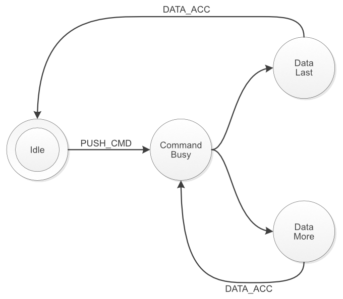

Command Interface
_________________

+-------------------------------------------+

All work Copyright © 2013 by

Gideon’s Logic Architectures

All rights reserved.

Introduction
============

Context
-------

The ‘Ultimate-II command interface’ feature is a feature for the
1541 Ultimate-II module. It implements a way to communicate to the 1541 Ultimate-II programmatically from the Commodore 64, through the cartridge port I/O registers. This 'Ultimate-II command Interface' is also abveviated as 'UCI'. It is also implemented on the Ultimate-II+ and Ultimate-64 products.

The ‘Ultimate-II command interface’ is the communication layer between the C64 on one side and functional modules of the 1541 Ultimate-II / Ultimate-II+ / Ultimate 64 on the other side. Such a functional module takes a command, and returns data and status back to the user program on the C64.

There are a few functional modules, which are described in their own separate documents:

* "Ultimate DOS"; meant to open, read and write files and directories
* "Control Interface"; a collection of useful routines and calls to access U2/U2+/U64 features
* "Network Target"; an interface to directly access the TCP/IP network stack.

Purpose of this document
------------------------

The ‘Ultimate-II command interface’ feature is accessible from the cartridge I/O range. In this manual, the programming API is described.

Transport Layer
===============

Overview
--------

The transport layer of the Ultimate-II Command Interface makes use of a register interface which is accessible through the cartridge port of the C64. The registers are mapped into I/O space, at the address $DF1C up to $DF1F, masking the last four registers of the RAM Expansion Unit (REU).
Mapping this small 4-byte block into the I/O space is optional, and
needs to be turned on in the ‘Command Interface’ configuration menu.

Register Overview
-----------------

The following table shows the four registers and their meaning.

+-----------+--------------------------------------+-----------+
| Address   | Description                          | Default   |
+===========+======================================+===========+
| $DF1C     | Control register (Write)             |           |
+-----------+--------------------------------------+-----------+
| $DF1C     | Status register (Read)               | $00       |
+-----------+--------------------------------------+-----------+
| $DF1D     | Command data register (Write)        |           |
+-----------+--------------------------------------+-----------+
| $DF1D     | Identification register (Read)       | $C9       |
+-----------+--------------------------------------+-----------+
| $DF1E     | Response Data register (Read only)   |           |
+-----------+--------------------------------------+-----------+
| $DF1F     | Status Data register (Read only)     |           |
+-----------+--------------------------------------+-----------+

Communication Protocol Basics
-----------------------------

The communication protocol is based on a state machine with four states:

-  Idle

-  Command Busy

-  Data Last (last block)

-  Data More (more data pending)

The transition through these states takes place in an interaction between the C64 user software and the software running on the Ultimate-II. The state that the communication protocol is in can be read from the Status register at $DF1C.

Transfer command
~~~~~~~~~~~~~~~~

When the protocol is in idle state (see paragraph 2.4.2 for the state encoding), the Ultimate-II is ready to receive a new command. This is done by writing the command byte by byte into the command data register at $DF1D. Then, the command is pushed into the Ultimate-II by writing a ‘1’ to the control bit ‘PUSH\_CMD’, in the control register. This will cause a state transition to “Command Busy”.

Ultimate-II processes command
~~~~~~~~~~~~~~~~~~~~~~~~~~~~~

As soon as the Ultimate-II has decided how to respond to this command, it will prepare the data and status reply, and cause the state machine to move to one of the two data states: ‘Data Last’, or ‘Data More’.

Reading the reply
~~~~~~~~~~~~~~~~~

The user software can now read both data and status from the respective registers $DF1E and $DF1F. Whether there is data or status available can be seen from the upper two bits of the status register. These bits will be ‘1’ when there is still more data to be read, and ‘0’ otherwise.

Release: Accept data
~~~~~~~~~~~~~~~~~~~~

As soon as the software has read all the data (or decides not to do so), the C64 should write a ‘1’ to the register bit ‘DATA\_ACC’, to indicate that all data was accepted. If this was the last data block, this causes the state machine to go back to the idle state, or else, the state returns to “Command Busy”.

State machine
~~~~~~~~~~~~~

The following diagram shows the state machine:

Figure 1: Basic Protocol State Machine

Note: Setting the ‘ABORT’ bit, does not directly influence the state machine. It is handled by the Ultimate-II software, which will in turn reset the state machine to idle eventually.

Register Details
================

Control Register
----------------

The control register contains the following bits:

+------------------+------------+---------+-------------+-------------+---------+----------+----------+
| Bit 7            | Bit 6      | Bit 5   | Bit 4       | Bit 3       | Bit 2   | Bit 1    | Bit 0    |
+==================+============+=========+=============+=============+=========+==========+==========+
| ***reserved***                                        | CLR\_ERR    | ABORT   | DATA\_ACC| PUSH\_CMD|
+------------------+------------+---------+-------------+-------------+---------+----------+----------+

PUSH\_CMD: Writing a ‘1’ to this register bit causes the command that was written to the command data register to be pushed into the software of the Ultimate-II.

DATA\_ACC: Writing a ‘1’ to this register bit tells the communication layer that all data from the Ultimate-II was accepted. This is automatically ignored when the communication controller is not in one of the two data states. Writing to this bit also causes the transfer of the data/status queues to be aborted and reset. Thus, the data response and status response queues will be empty after writing this bit.

ABORT: Writing a ‘1’ to this register sets the ‘abort’ flag in the communication controller. This bit is polled by the Ultimate-II software. When it finds this bit set, the current communication is aborted, and the state machine is forced back to the idle state.

CLR\_ERR: Pushing a command to the Ultimate-II when the communication layer is not in idle mode, causes a state error flag to be set. See status register. Write a ‘1’ to CLR\_ERR to clear this error condition.

Status register
~~~~~~~~~~~~~~~

The status register contains the following bits:

+------------+------------+-----------+---------+------------+-------------+-------------+-----------+
| Bit 7      | Bit 6      | Bit 5     | Bit 4   | Bit 3      | Bit 2       | Bit 1       | Bit 0     |
+============+============+===========+=========+============+=============+=============+===========+
| DATA\_AV   | STAT\_AV   | *STATE*             | ERROR      | ABORT\_P    | DATA\_ACC   | CMD\_BUSY |  
+------------+------------+-----------+---------+------------+-------------+-------------+-----------+

CMD\_BUSY: This bit indicates that there is a pending command in the command memory.

DATA\_ACC: This bit reflects the condition that the user has told the Ultimate-II that it accepted the data.

ABORT\_P: This bit reflects the state of the internal abort flag. When this bit is ‘1’, the Ultimate-II still has to handle the abort request.

ERROR: When this bit is ‘1’, the user tried to send a command to the Ultimate-II while it was not in idle state.

STATE: These two bits encode the protocol state:

00: Idle

01: Command Busy

10: Data Last

11: Data More

STAT\_AV: When this bit is ‘1’, there is status data available from the status queue, accessible through the status data register ($DF1F).

DATA\_AV: When this bit is ‘1’, there is response data available from the data queue, accessible through the response data register ($DF1E).

Queues
------

As previously described, there are three byte-queues that the Ultimate-II Command Interface uses:

-  Command queue

-  Response Data queue

-  Status queue

The sizes of these queues are important to note, since they define the maximum transfer size per command. The command queue size is 896 bytes ($380), the response data queue is also 896 bytes ($380), and the status queue is 256 bytes ($100).

Dispatch Layer 
===============

On top of the transport layer, there is light weight dispatcher. This dispatcher sends the command from the user software to a functional module in the 1541 Ultimate-II. The first byte of the command is determines the destination. Such a destination is called a ‘target’.

Initially, in version 2.6 of the Ultimate-II firmware, there is only one functional target: “Ultimate-DOS”. Two instances of this DOS are located at targets 1 and 2. See the documentation of this target to obtain more information on the commands this target implements.
