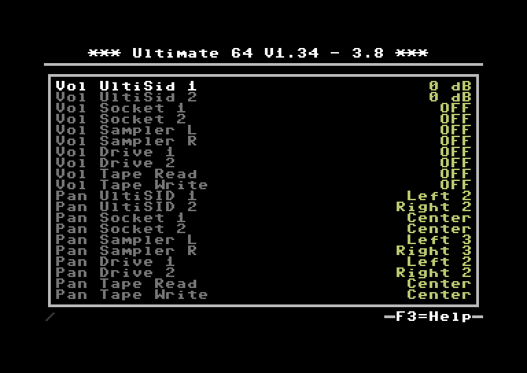

Turbo mode settings
===================

Volume & panning for various sources can be configured in this menu.

Volume options: OFF, -42 ~ +6 dB
Panning options: Left 5~1, Center, Right 1~5
   
   
Vol UltiSid 2
............. 
   
Set Volume for UltiSid 2.

:Authors: Ultimate 64
:Supported Firmware: >= 1.33
