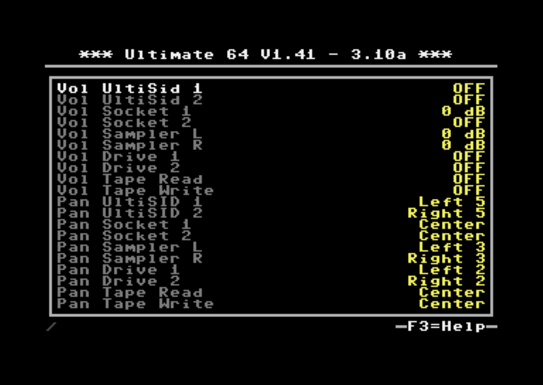

Audio Mixer settings
====================

Volume and panning for various sources can be configured in this menu.

Note that these settings affect the HDMI and AV outputs only. They have no effect on the levels of the SID-TAP header which takes signals directly from the SID sockets.

Also note that if you have enabled the **SID Player Autoconfig** option in **U64 Specific Settings** menu, using the built-in SID player will override the SID settings you have configured in the audio mixer.

The volume level of the optional internal speaker can be adjusted in **U64 Specific Settings** menu with option **Speaker Volume (SpkDat)**.

Volume options: OFF, -42 dB - +6 dB (0 dB is normal level, OFF is disabled)

Panning options: Left 5-1, Center, Right 1-5
   
+----------------+-----------------------------------------------------------------+---------------+
| Menu name      | Explanation                                                     | Default value |
+================+=================================================================+===============+
| Vol UltiSid 1  | Set volume for UltiSID 1                                        | 0 dB          |
+----------------+-----------------------------------------------------------------+---------------+
| Vol UltiSid 2  | Set volume for UltiSID 2                                        | 0 dB          |
+----------------+-----------------------------------------------------------------+---------------+
| Vol Socket 1   | Set volume for SID in socket 1                                  | 0 dB          |
+----------------+-----------------------------------------------------------------+---------------+
| Vol Socket 2   | Set volume for SID in socket 2                                  | 0 dB          |
+----------------+-----------------------------------------------------------------+---------------+
| Vol Sampler L  | Set volume for left channel of Ultimate Audio module            | 0 dB          |
+----------------+-----------------------------------------------------------------+---------------+
| Vol Sampler R  | Set volume for right channel of Ultimate Audio module           | 0 dB          |
+----------------+-----------------------------------------------------------------+---------------+
| Vol Drive 1    | Set volume for drive 1 (A) sounds                               | -4 dB         |
+----------------+-----------------------------------------------------------------+---------------+
| Vol Drive 2    | Set volume for drive 2 (B) sounds                               | -4 dB         |
+----------------+-----------------------------------------------------------------+---------------+
| Vol Tape Read  | Set volume for tape read sounds                                 | -36 dB        |
+----------------+-----------------------------------------------------------------+---------------+
| Vol Tape Write | Set volume for tape write sounds                                | -36 dB        |
+----------------+-----------------------------------------------------------------+---------------+
| Pan UltiSID 1  | Set panning for UltiSID 1                                       | Center        |
+----------------+-----------------------------------------------------------------+---------------+
| Pan UltiSID 2  | Set panning for UltiSID 2                                       | Center        |
+----------------+-----------------------------------------------------------------+---------------+
| Pan Socket 1   | Set panning for SID in socket 1                                 | Left 3        |
+----------------+-----------------------------------------------------------------+---------------+
| Pan Socket 2   | Set panning for SID in socket 2                                 | Right 3       |
+----------------+-----------------------------------------------------------------+---------------+
| Pan Sampler L  | Set panning for left channel of Ultimate Audio module           | Left 3        |
+----------------+-----------------------------------------------------------------+---------------+
| Pan Sampler R  | Set panning for right channel of Ultimate Audio module          | Right 3       |
+----------------+-----------------------------------------------------------------+---------------+
| Pan Drive 1    | Set panning for drive 1 (A) sounds                              | Left 2        |
+----------------+-----------------------------------------------------------------+---------------+
| Pan Drive 2    | Set panning for drive 2 (B) sounds                              | Right 2       |
+----------------+-----------------------------------------------------------------+---------------+
| Pan Tape Read  | Set panning for tape read sounds                                | Center        |
+----------------+-----------------------------------------------------------------+---------------+
| Pan Tape Write | Set panning for tape write sounds                               | Center        |
+----------------+-----------------------------------------------------------------+---------------+

For example, if you want to make sure that you only hear the SID in socket 1 and no other real or emulated SIDs, you might adjust the mixer settings like this.

In this example the drive and tape sounds are also disabled, panning for both SID sockets is set to center and the UltiSIDs are panned hard left and right. Of course those panning settings don't matter here because you can only hear the sources where volume is not set to OFF.