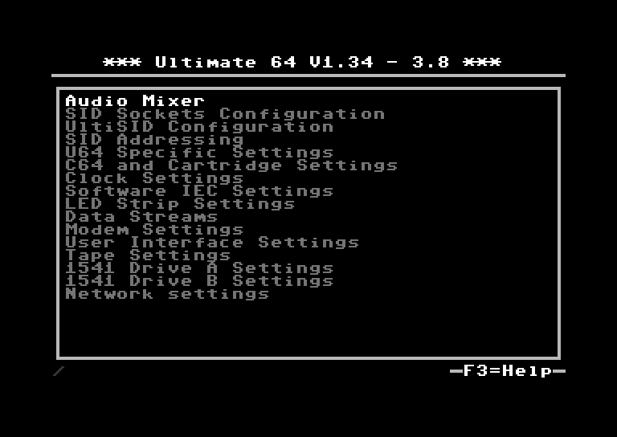

Configuration menu
==================

Within this menu the U64 settings can be customized.

- Audio Mixer
- SID Sockets Configuration 
- UltiSID Configuration
- SID Addressing
- U64 Specific Settings
- C64 and Cartridge Settings
- Clock Settings
- Software IEC Settings
- LED Strip Settings
- Data Streams
- Modem Settings
- User Interface Settings
- Tape Settings
- 1541 Drive A Settings
- 1541 Drive B Settings
- Network settings

.. toctree::
  :maxdepth: 2

  Turbo mode <turbo_mode>
  RealTime Clock (RTC) <rtc>
  Setting up 4 and 8 UltiSIDs <multi_sid>