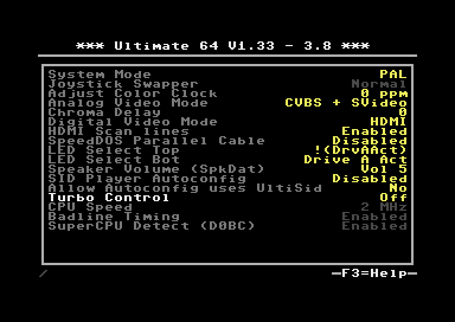
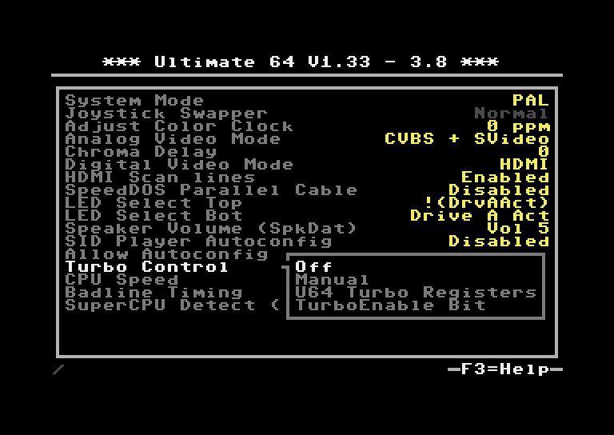
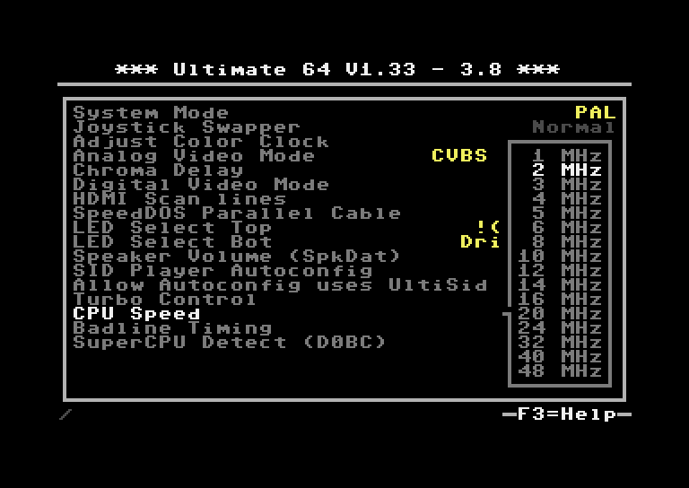
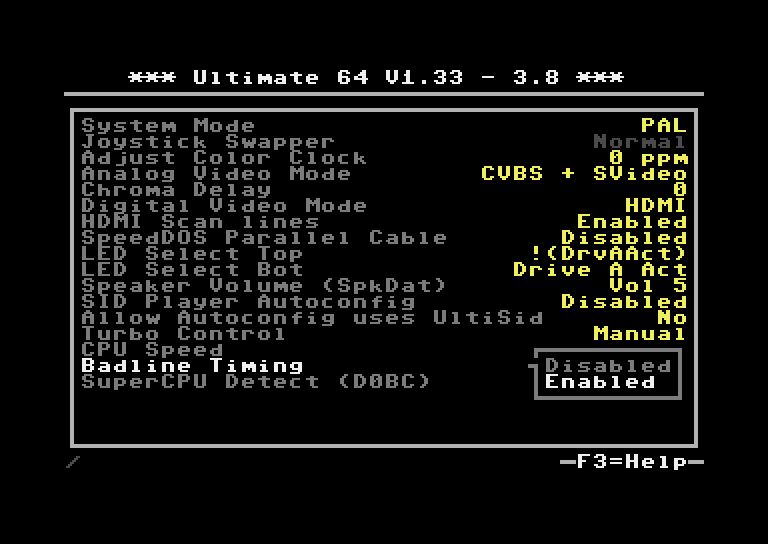
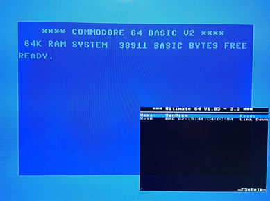

Turbo mode settings
===================

Interface Type
.............. 

**Turbo control**

**CPU Speed**

**Badline Timing**

   
   
**SuperCPU Detect ($D0BC)**

Applies to: Ultimate 64

\*) Setting is only available on the Ultimate 64, firmware >= 1.33*
