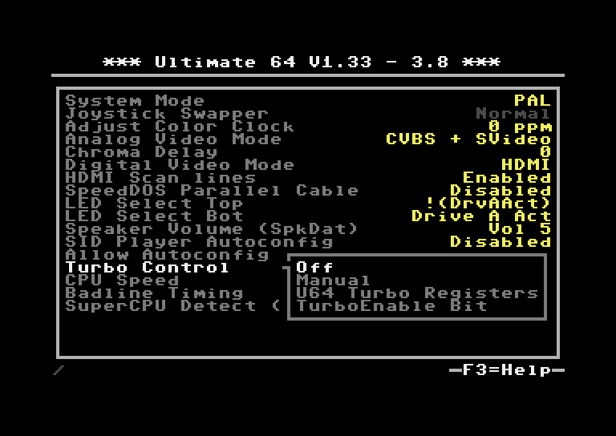
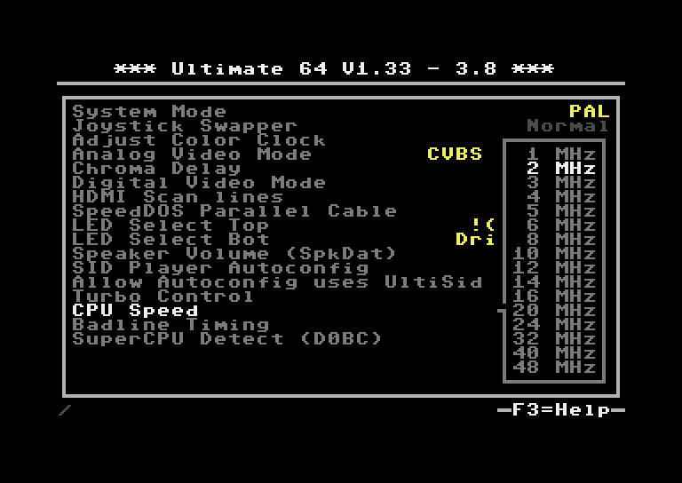
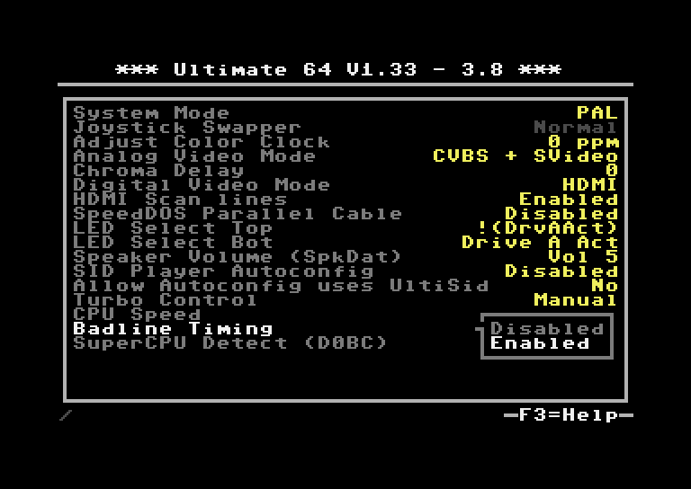

Turbo mode settings
===================

Turbo control
............. 

   
+----------------------+----------------------------------------------------------------+
| Option               | Description                                                    |
+======================+================================================================+
| Off                  | Turbo control is off                                           |
+----------------------+----------------------------------------------------------------+
| Manual               | Turbo control uses settings from U64.                          |
|                      |                                                                |
|                      | Settings **CANNOT** be altered with registers.                 |
+----------------------+----------------------------------------------------------------+
| U64 Turbo Registers  | Turbo control uses settings from U64.                          |
|                      |                                                                |
|                      | Settings **CAN** be altered with registers.                    |
|                      |                                                                |
|                      | *See Turbo Control registers.*                                 |
+----------------------+----------------------------------------------------------------+
| TurboEnable Bit      | Turbo control uses settings from U64.                          |
|                      |                                                                |
|                      | Settings **CAN** be altered with registers.                    |
|                      |                                                                |
|                      | *See Turbo Control registers.*                                 |
+----------------------+----------------------------------------------------------------+

CPU Speed
......... 

   
   
| **Set CPU Speed.**
| 
| Default C64/U64 speed: **1MHz (1x)**
| Maximum speed: **48MHz (48x)** for the U64, and **64 MHz (64x)** for the U64 Elite-II.
   

Badline Timing
..............

| **Enabled/disable badline timing.**
| 
| Turn off badlines to get more CPU cycles.
| *This can be controlled with registers programmable. See Turbo Control registers.*

   
SuperCPU Detect ($D0BC)
.......................

| **SuperCPU Mode Detect Register**
| 
| More information: https://www.c64-wiki.com/wiki/SuperCPU

Turbo Control registers
=======================

+-------------+----------------------------------------------------------------+
| Address     | Description                                                    |
+=============+================================================================+
| 53297/$D031 |	**U64 Turbo Control**                                          |
|             |                                                                |
|             | This register is only available when the Turbo Mode selector   |
|             | is set to 'U64 Turbo Registers' or 'Turbo Enable Bit'.         |
|             | Otherwise it simply reads $FF.                                 |
|             |                                                                |
|             | * bit 0-3: CPU Speed (index)                                   |
|             | * bit 7: Badline timing, 0 = Enabled, 1 = Disabled             |
|             |                                                                |
|             | Note that the CPU and memory subsystem run at 48 MHz (U64) or  |
|             | 64 MHz (U64E2), and that this turbo setting determines how     |
|             | many of the available time slots are assigned to the CPU. When |
|             | the VIC is enabled, it will still steal cycles from these      |
|             | available time slots. Note that the badline timing setting     |
|             | does not have influence on the BA signal on the cartridge port.|
|             | This means that when accesses to external devices are made,    |
|             | you will still run into the badline limitations. This also     |
|             | applies to having the SID sockets enabled and doing accesses   |
|             | to the SID registers.                                          |
|             +-----------------------------+----------------------------------+
|             | CPU Speed (index) - U64     | CPU Speed (index) - U64E2        |
|             |                             |                                  |
|             | * 0  = 1 MHz                | * 0  = 1 MHz                     |
|             | * 1  = 2 MHz                | * 1  = 2 MHz                     |
|             | * 2  = 3 MHz                | * 2  = 3 MHz                     |
|             | * 3  = 4 MHz                | * 3  = 4 MHz                     |
|             | * 4  = 5 MHz                | * 4  = 6 MHz                     |
|             | * 5  = 6 MHz                | * 5  = 8 MHz                     |
|             | * 6  = 8 MHz                | * 6  = 10 MHz                    |
|             | * 7  = 10 MHz               | * 7  = 12 MHz                    |
|             | * 8  = 12 MHz               | * 8  = 14 MHz                    |
|             | * 9  = 14 MHz               | * 9  = 16 MHz                    |
|             | * 10 = 16 MHz               | * 10 = 20 MHz                    |
|             | * 11 = 20 MHz               | * 11 = 24 MHz                    |
|             | * 12 = 24 MHz               | * 12 = 32 MHz                    |
|             | * 13 = 32 MHz               | * 13 = 40 MHz                    |
|             | * 14 = 40 MHz               | * 14 = 48 MHz                    |
|             | * 15 = 48 MHz               | * 15 = 64 MHz                    |
+-------------+-----------------------------+----------------------------------+
| 53296/$D030 | **Turbo Enable Bit**                                           |
|             |                                                                |
|             | This register is only available when the Turbo Mode selector   |
|             | is set to 'Turbo Enable Bit'.                                  |
|             | Otherwise it simply reads $FF.                                 |
|             |                                                                |
|             | * bit 0 (Write):                                               |
|             |                                                                |
|             |   0 = 1 MHz + Badlines                                         |
|             |                                                                |
|             |   1 = Use settings from menu                                   |
|             |                                                                |
|             | * bit 0 (Read):                                                |
|             |                                                                |
|             |   0 = Turbo Off                                                |
|             |                                                                |
|             |   1 = Turbo On                                                 |
+-------------+----------------------------------------------------------------+
| 53370/$D07A |	**SuperCPU compatible enable/disable registers**               |
|             |                                                                |
|             | This register is only available when the Turbo Mode selector   |
|             | is set to 'U64 Turbo Registers' or 'Turbo Enable Bit'.         |
|             | This register is **write only**                                |
|             |                                                                |
|             | * Software Speed Select - Normal                               |
|             |	                                                               |
|             |	More information: https://www.c64-wiki.com/wiki/SuperCPU       |
+-------------+----------------------------------------------------------------+
| 53371/$D07B |	**SuperCPU compatible enable/disable registers**               |
|             |                                                                |
|             | This register is only available when the Turbo Mode selector   |
|             | is set to 'U64 Turbo Registers' or 'Turbo Enable Bit'.         |
|             | This register is **write only**                                |
|             |                                                                |
|             | * Software Speed Select - Turbo (20 MHz)($079)                 |
|             |	                                                               |
|             |	More information: https://www.c64-wiki.com/wiki/SuperCPU       |
+-------------+----------------------------------------------------------------+
| 53436/$D0BC |	**SuperCPU Detect ($D0BC)**                                    |
|             |                                                                |
|             | * SuperCPU Mode Detect Register                                |
|             |	                                                               |
|             | This register is only available when it is separately enabled. |
|             | This register is **read only**                                 |
|             |                                                                |
|             |	More information: https://www.c64-wiki.com/wiki/SuperCPU       |
+-------------+----------------------------------------------------------------+

Applies to: Ultimate 64 and Ultimate 64 Elite-II

\*) Setting are only available on the Ultimate 64, firmware >= 1.33*
