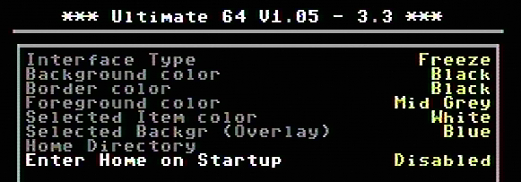
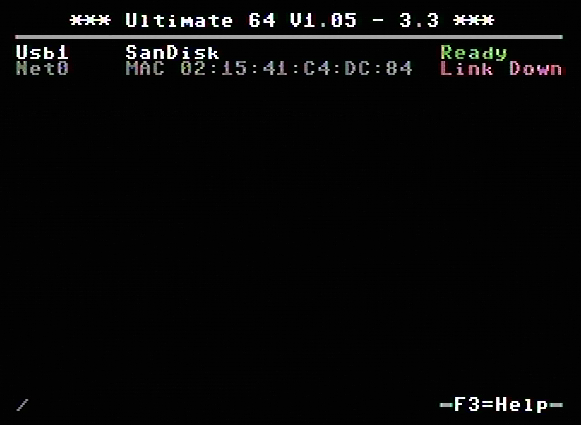

User Interface Settings
=======================

+------------------------------+--------------------------------------------------------------------------------+-------------------+
| Menu name                    | Explanation                                                                    | Options           |
|                              |                                                                                | (bold default)    |
+==============================+================================================================================+===================+
| Interface Type (¹)           | Set interface type, see images below.                                          | **Freeze**        |
+------------------------------+--------------------------------------------------------------------------------+-------------------+
|                              |                                                                                | Overlay on HDMI   |
+------------------------------+--------------------------------------------------------------------------------+-------------------+
| Background color             | Set background color of the user interface.                                    | **Black**         |
+------------------------------+--------------------------------------------------------------------------------+-------------------+
|                              |                                                                                | Various colors    |
+------------------------------+--------------------------------------------------------------------------------+-------------------+
| Border color                 | Set border color of the user interface.                                        | **Black**         |
+------------------------------+--------------------------------------------------------------------------------+-------------------+
|                              |                                                                                | Various colors    |
+------------------------------+--------------------------------------------------------------------------------+-------------------+
| Foreground color             | Set foreground color of the user interface.                                    | **Mid Grey**      |
+------------------------------+--------------------------------------------------------------------------------+-------------------+
|                              |                                                                                | Various colors    |
+------------------------------+--------------------------------------------------------------------------------+-------------------+
| Selected item color          | Set foreground color of the user interface.                                    | **White**         |
+------------------------------+--------------------------------------------------------------------------------+-------------------+
|                              |                                                                                | Various colors    |
+------------------------------+--------------------------------------------------------------------------------+-------------------+
| Selected Backgr (Overlay) (¹)| Set selected background color for overlay screen.                              | **Blue**          |
+------------------------------+--------------------------------------------------------------------------------+-------------------+
|                              |                                                                                | Various colors    |
+------------------------------+--------------------------------------------------------------------------------+-------------------+
| Home Directory               | For example use path like: **/Usb1/games**                                     | Inputbox          |
+------------------------------+--------------------------------------------------------------------------------+-------------------+
|                              | Each USB port on the Ultimate has his own number, so the home directory        |                   |
+------------------------------+--------------------------------------------------------------------------------+-------------------+
|                              | assignment will only work if the USB stick is in the same port.                |                   |
+------------------------------+--------------------------------------------------------------------------------+-------------------+
| Enter Home on Startup        | Enable this option to open the Home Directory directly on startup.             | **Disabled**      |
+------------------------------+--------------------------------------------------------------------------------+-------------------+
|                              |                                                                                | Enabled           |
+------------------------------+--------------------------------------------------------------------------------+-------------------+

Interface Type
.............. 

**Interface Type: Freeze**

   
**Interface Type: Overlay on HDMI** (¹)

This interface is **ONLY** visible on HDMI output. 

.. image:: ../media/config/config_user_interface_02.png
   :alt: Interface Type Overlay on HMDI
   :align: left

Applies to: Ultimate 1541-II, Ultimate 1541-II+, Ultimate 64

*¹) Setting is only available on the Ultimate 64, firmware >= 1.06*
