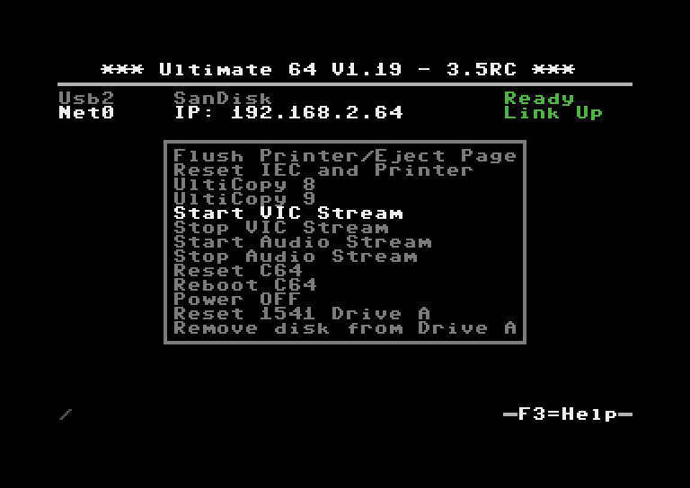
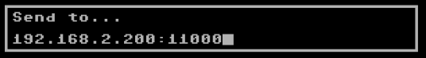

Data Streams
____________

Introduction
============

Context
-------

The Ultimate-64 is capable of streaming real time data over its built-in Ethernet port. Currently,
there are two different types of streams that the machine can output:

* VIC Video Stream
* Audio Stream

This page describes these features in more detail.
 
Goal
----

This feature is intended for debugging, regression testing and analysis. However, there are more
uses for it; such as making pixel-perfect recordings of a demo, or a digital audio recording without
conversion to analog first and sampling it on a PC. Or, even a real time share over the internet
to a friend!

Networking Background
=====================

The network streams are based on UDP. This means that they are connection-less, and can be captured
off the network by the addressed node. UDP does not guarantee delivery, so it may be possible that
packets get lost. However, on a local network this usually does not happen.

Aside from its simplicity, UDP has another advantage: it can be used to send data to multiple
receivers at once. This is called 'multicast'.  The Ultimate is capable of sending the datastreams
in unicast mode (to one specific IP address), in multicast mode (to a multicast IP address), or
in broadcast mode. When the stream is transmitted in multicast mode, the receiver needs to 'join'
the multicast group. Note that this will only work when the switch supports IGMP snooping, otherwise
the switch will broadcast the data over all of its network ports; thus treating the packets as
broadcast packets.

When the switch supports IGMP snooping, it will 'see' the network packet that is generated by the
client who wants to receive the stream when it joins the multicast group. Such a request is sent
using the IGMP protocol. Once the switch 'sees' this packet, it will enable the transmission of
the requested stream to the physical port on the switch that requested the data (the port the PC
is connected to). No other ports will receive the data, so the network is not flooded. 

Unicast Example
---------------

When your switch does not support IGMP snooping, the use of unicast is recommended. Especially when
there are other users of your local network, that are behind WiFi links, it is not recommended to
flood the network and get angry looks from everyone else in your household.

Unicast is the simplest form. Let's say your PC is at 192.168.0.100; either statically configured or
obtained by DHCP, and your Ultimate has the IP address 192.168.0.64; again either statically
configured or obtained from the DHCP server. You can then simply instruct the ultimate to stream
the data to IP address 192.168.0.100.

The receiving software will open a socket, listening to a specific UDP port number. It is necessary
to send the stream to this specific UDP port number, otherwise the stream cannot be received.
 

Multicast Example
-----------------

When using multicast, a specific range of IP addresses is used for transmission: 224.0.0.0 to
239.255.255.255. Some of these addresses are reserved for a specific type of communication, like
IGMP, MDNS, and such.

Let's say the Ultimate is configured to send the stream to 239.0.1.64. This is in the free range
for multicast on the local network (LAN). The PC application starts by telling the network
infrastructure and its own routing tables that it wants to listen to 239.0.1.64. From that moment on,
the stream is 'seen' by the PC and the application receives the data. Once the PC application is
done, it 'leaves' the multicast group, and the PC ceases to receive the data.

Note that the IGMP switching is based on IP address. Therefore it is not possible to use the UDP
port number to differentiate which stream to receive and which not. Use different multicast IP
addresses if you like to receive more than one stream.

Starting and Stopping Streams
=============================
The available streams can be started and stopped in different ways. When the machine is turned on,
it does not transmit any stream.

Using the menu
--------------

A stream can be started and stopped from the "action menu", which is brought up by pressing 'F5'.
The start/stop options appear in that menu. When selected, the Ultimate will ask for the IP address
to send the stream to. The default IP address is configured in the configuration screen
"Data Streams". Note that changing the IP address in the configuration screen *does not* start or
stop a stream; it is only the place where the last entered data is kept for later reuse.

The format of the destination is either an IP address, or a valid DNS name. The port number can be
given as well, by adding it after a colon (:).

Examples:

+--------------------+---------------------------------------------------------+
|Destination string  | Meaning                                                 |
+====================+=========================================================+
|192.168.0.119:11000 | unicast address on the local network, port number 11000 |
+--------------------+---------------------------------------------------------+
|myserver.com        | unicast address, using DNS and default port number      |
+--------------------+---------------------------------------------------------+
|myserver.com:4567   | unicast address, using DNS and specific port number     |
+--------------------+---------------------------------------------------------+
|239.0.1.64          | multicast address, using default port number            |
+--------------------+---------------------------------------------------------+
|239.0.2.77:64738    | multicast address with port number specified            |
+--------------------+---------------------------------------------------------+

Using the TCP command interface
-------------------------------
Using the TCP socket '64', the following commands have been added to start and stop streams.

* Enable output stream: FF2n
* Disable output stream: FF3n

whereby 'n' is the stream number (see below)
 
The generic command structure is:

* <command word, little endian>
* <command parameter length, little endian>
* <command parameters>.

The Disable command does not take any parameters. The enable command can have two parameters;
neither of them are required.

* Parameter 1: Duration of the stream enable (0 = forever)
* Parameter 2: Destination (string).

The duration is given in system ticks, which come at an interval of 5 ms.

So to elaborate on the commands:

To enable stream 0 for one second (200 ticks), to the pre-configured destination address,
the bytes sent over the TCP control port are:

``20 FF 02 00 00 C8``
 
To enable stream 0 indefinitely to '192.168.0.119', you'd send:

``20 FF 0F 00 00 00 192.168.0.119``  (the latter part being ASCII)

-> Command length = string length + 2 bytes.

To disable stream 0, you send:

``30 FF 00 00`` (length of parameters is 0)

Available streams
=================

VIC Video Stream (ID 0)
-----------------------
The VIC Video Stream is the stream that presents the active part of the video output of the VIC.
The ID of this stream is 0.

Each UDP datagram contains a header and pixel data. The header is as follows:

- Sequence number (16 bit LE)
- Frame number (16 bit LE)
- Line number (16 bit LE). If this is the last packet of the frame, bit 15 will be set.
- Pixels per line (16 bit LE), always 384
- Lines per packet (8 bit), always 4
- Bits per pixel (8 bit), always 4
- Encoding type (16 bit), always 0 for now. May be '1' later for RLE encoded data.

*Example packet:*

The following packet contains data of the third frame, line 100 - 103, starting with dark blue::

  A1 00 02 00 64 00 80 01 04 04 00 00 66 66 66 66 66 66 66 ...
  seq #|frm #|line#|width|lp|bp|-enc-|data....................

So in total, the pixel data is preceded with 12 bytes of header data. The
header is followed by pixel data, coded in 4-bit VIC colors, little endian,
thus nibble 3..0 first. 4 lines of 384 pixels, equals 768 bytes of pixel
data. Total UDP datagram = 780 bytes.

To capture an entire frame, you first wait for a packet with bit 15 set of
the line number, then capture until you get another packet with bit 15 set
of the line number. You should then have 68 packets of 4 lines (totaling
272 lines). Note that the video is cropped to 384 x 272, and aligned with
the reference images of the VICE test suite. The actual output to the
screen is 400 x 288 in PAL mode.

In NTSC mode, the output stream carries 384 x 240 pixels. The actual output to the screen is
400 x 240.

Audio Stream (ID 1)
-------------------
The Audio stream is taken from the output of the audio mixer. Thus, the stream received over the
network contains the same data as the data sent over HDMI and back to the audio codec for conversion
to the analog signal that is available on the DIN connector. The ID of this stream is 1.

The format of the audio stream is simpler than the video stream. The only two bytes that are sent
as a header in front of the raw audio data is the sequence number of the packet, since the stream
was enabled. This allows for detection of missing packets.

The sequence number is followed by 192 stereo samples in 16-bit signed, little endian format; left
and right interleaved, starting with the left channel. Thus, the total UDP packet size is 770 bytes:
2 header bytes, and 192 times 4 bytes per sample::

  00 00 fe ff 02 00 ff ff 03 00 fd ff 00 00 ...
  -seq- left--right-left--right-left--right-... 

  01 00 ff ff 03 00 fd ff 00 00 03 00 ff ff ...
  -seq- left--right-left--right-left--right-... 

  02 00 fd ff 03 00 fd ff 00 00 fe ff 02 00 ...
  -seq- left--right-left--right-left--right-... 

The sample rate of the stream is close to 48000 Hz. It depends on the video mode. The actual sample
rate for PAL is: 

(Fc * 16/9 * 15 / 77 / 32) = 47983 Hz  (Fc = 4433618.75 Hz)  (48kHz: -356 ppm)

For NTSC, the audio clock is derived as follows:

(Fc * 16/7 * 15 / 80 / 32) = 47940 Hz  (Fc = 3579545.45 Hz)  (48kHz: -1243 ppm) 

Viewing and recording
=====================

Windows
-------
Thanks to Martijn Wieland (TSB), there is a viewer for the stream for Windows. This tool can be
obtained here:  `TSB U64 Streamer`_

.. _TSB U64 Streamer: https://www.tsb.space/projects/u64-streamer

Linux/Mac
---------
Jimmy (DusteDdk) made a Linux viewer, more info check: `u64view`_

.. _u64view: https://github.com/DusteDdk/u64view

See |location_link|.

.. |location_link| raw:: html

   <a href="https://github.com/DusteDdk/u64view" target="_blank">u64view</a>
   

This version can also be compiled on Mac OS.

Python script
-------------
Also there is an example script in the 'python' directory of the ultimate repository to show how
grabbing of video data is done. This example script can be seen here: `grab.py`_

.. _grab.py: https://github.com/GideonZ/1541ultimate/blob/master/python/grab.py

