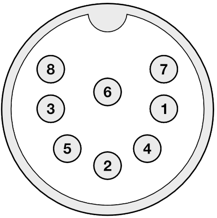

Audio/Video Connector
=====================

   
The 8-pin DIN ( audio/video ) connector can output several different video signals, for each type you need a special assembled cable.   

**Output signals**
- Composite ( CVBS ) ( PAL )
- S-Video ( PAL )
- RGB ( PAL )

*The Composite and S-Video cables are the same as you use for the original Commodore 64.*

**Pinout**  

===  ===============  ========
Pin  Modulated Color  RGB Mode
===  ===============  ========
 1   Luma (Y)         Green
 2   Ground           Ground
 3   Audio Out Left   Audio Out Left
 4   Composite (Y+C)  Red
 5   Audio Out Right  Audio Out Right
 6   Chroma (C)       Blue
 7   Not used         CSync
 8   Not used         Fast Switching
===  ===============  ========

Audio
-----
The audio outputs have consumer electronic line levels (Line Out) and need to be connected
to an external amplifier.

Video
-----
The video signals on pin 1, 4 and 6 have a source impedance of 75 Ohms, with standard 1V-peak video levels.
In the modulated color mode, Luma and Composite contain sync information (-0.3V), while Chroma does not.
The video blanking of the VIC output has been corrected, and is now in accordance with specification.

The PAL output is non-interlaced, with a field rate of 50.2 Hz, and line rate of 15.639 kHz.

The Fast Switching output is a 1.5V fixed 'high' output signal (when terminated with 75 Ohms), that is used on SCART to enable RGB mode.
The CSYNC output is a sync-only output that is needed on the SCART signal as a replacement of the composite video or luma signal.
In RGB mode, there is *no* sync information in either R, G or B; i.e. no 'sync-on-green'.