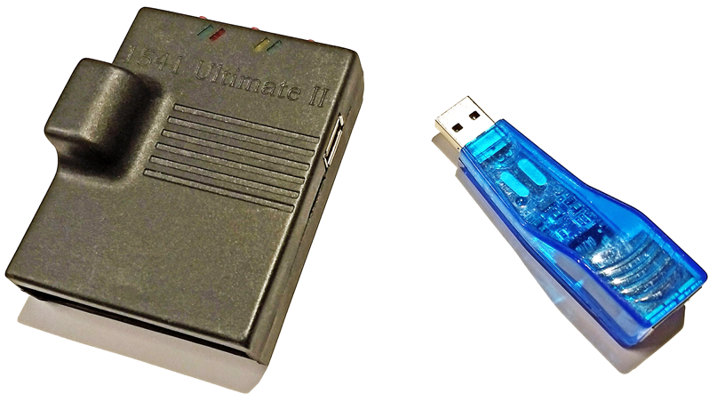
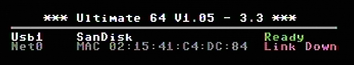

Ethernet port
=============

.. image:: ../media/hardware/hardware_ethernet_01.png
   :alt: Ultimate 64 ethernet Port
   :align: left

   
The ethernet port can be connected to a switch ( or hub ) to communicate with your Ultimate over your own local network.

The Ultimate 1541-II+ and Ultimate 64 have an integrated ethernet port.

*Ultimate 1541-II and compatible usb ethernet adaptor*

The Ultimate 1541-II needs a compatible USB Ethernet adaptor that is connected to the USB port of the Ultimate 1541-II.

   
If your Ultimate product has an ethernet port, you can see this when entering the Ultimate menu.
The picture above shows a **Net0** port, this indicates ethernet is accessible.

Network settings
................

Within the network settings menu the ethernet port can be configured as needed, so it matches with your local network settings.

*The Network settings menu is only visible if a ethernet port is available.*

.. image:: ../media/hardware/hardware_ethernet_02.png
   :alt: Ethernet Port settings
   :align: left
   
   
+------------------------------+--------------------------------------------------------------------------------+-------------------+
| Menu name                    | Explanation                                                                    | Options           |
|                              |                                                                                | (bold default)    |
+==============================+================================================================================+===================+
| Use DHCP                     | Get IP settings from local DHCP Server on your network.                        | Disabled          |
|                              | Most home routers provide these settings by DHCP.                              | **Enabled**       |
|                              | If this is not the case please consult your internet/network provider.         |                   |
+------------------------------+--------------------------------------------------------------------------------+-------------------+
| Static IP                    | Set custom IP settings, DHCP has to be disabled.                               | Inputbox          |
|                              | *This field can be left empty if DHCP is enabled*.                             |                   |
+------------------------------+--------------------------------------------------------------------------------+-------------------+
| Static Networkmask           | Set custom networkmask, DHCP has to be disabled.                               | Inputbox          |
|                              | *This field can be left empty if DHCP is enabled*.                             |                   |
+------------------------------+--------------------------------------------------------------------------------+-------------------+
| Static Gateway               | Set custom Gateway, DHCP has to be disabled.                                   | Inputbox          |
|                              | *This field can be left empty if DHCP is enabled*.                             |                   |
+------------------------------+--------------------------------------------------------------------------------+-------------------+
| Hostname                     | Set unique network hostname to identify your Ultimate product.                 | Inputbox          |
+------------------------------+--------------------------------------------------------------------------------+-------------------+
   
   
RR-net compatibility
....................

Some of you may be familiar with the RR-net solution that brings Ethernet to the C-64. Currently, the built-in Ethernet port does not provide RR-net compatibility.

The Ethernet port is used natively by the firmware 
..................................................

There is some primitive support for file-transfer using FTP (needs improvement), and it is possible to connect to the Ultimate using a VT-100 terminal 
program on the Telnet port (port 23). This gives the possibility to control the machine remotely, and swap disks without actually interrupting the program 
running on the C-64.

*Applies to: Ultimate 1541-II, Ultimate 1541-II+, Ultimate 64*
