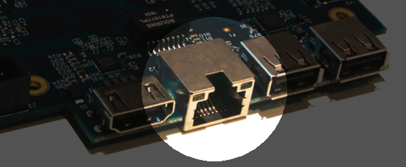
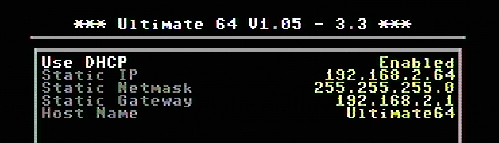

Ethernet port
=============

	
The ethernet port can be connected to a switch ( or hub ) to communicate with the Ultimate-64 over your own network.

Network settings
................

Within the network settings menu the ethernet port can be configured as needed, so it can communicate with your local network.

   
   
+------------------------------+--------------------------------------------------------------------------------+-------------------+
| Menu name                    | Explanation                                                                    | Options           |
|                              |                                                                                | (bold default)    |
+==============================+================================================================================+===================+
| Use DHCP                     | Get IP settings from local DHCP Server on your network.                        | Disabled          |
|                              | Most home routers provide settings, if not consult you network provider.       | **Enabled**       |
+------------------------------+--------------------------------------------------------------------------------+-------------------+
| Static IP                    | Set custom IP settings, DHCP has to be disabled.                               | Inputbox          |
+------------------------------+--------------------------------------------------------------------------------+-------------------+
| Static Networkmask           | Set custom networkmask, DHCP has to be disabled.                               | Inputbox          |
+------------------------------+--------------------------------------------------------------------------------+-------------------+
| Static Gateway               | Set custom Gateway, DHCP has to be disabled.                                   | Inputbox          |
+------------------------------+--------------------------------------------------------------------------------+-------------------+
| Hostname                     | Set unique network hostname to identify your Ultimate product.                  | Inputbox          |
+------------------------------+--------------------------------------------------------------------------------+-------------------+
   
   
RR-net compatibility
....................

Some of you may be familiar with the RR-net solution that brings Ethernet to the C-64. Currently, the built-in Ethernet port does not provide RR-net compatibility. However:

The Ethernet port is used natively by the firmware 
..................................................

There is some primitive support for file-transfer using FTP (needs improvement), and it is possible to connect to the Ultimate-II+ using a VT-100 terminal 
program on the Telnet port (port 23). This gives the possibility to control the machine remotely, and swap disks without actually interrupting the program 
running on the C-64.