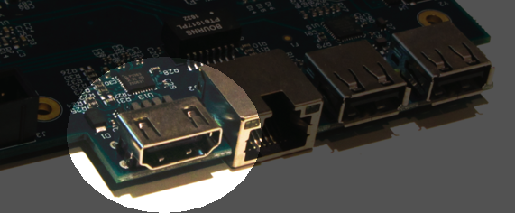

HDMI port
---------

	
The HDMI port can be connected to a modern display ( eg. television ), so you can use the Ultimate-64 in the future.

Resolution of the HDMI output
.............................
The output resolution is 720 x 576 at 50 Hz (for the PAL version), also noted as 576p50. This is a standard resolution that all HDMI capable screens are supposed to support, according to the CEA-861 standard. However, to meet the exact timing of a C64, the timing parameters of this video mode are slightly modified. I have not come across screens that do not accept the generated HDMI signal.

Frame delays of the digital HDMI port
.....................................
None. There is no frame buffer, so there is no need to worry. Some screens, tho, especially non-gaming screens may introduce some latency. I observed this with a 4K screen that actually resampled the output to just 30Hz. I am pretty sure displays do not have this problem.
Because there is no frame buffer, scrollers and such are perfectly smooth. If the TV renders the image at the speed it is sent over the HDMI link everything will be smooth.
If HDMI is used for output, there is also output generated on the PAL output ( display connector ).

In the configuration menu you can change several setting regarding this port.

- U64 Specific Settings
	- HDMI Scan lines
- User Interface Settings
	- Interface Type ( overlay mode )