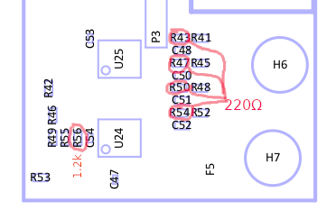

Joystick Ports
==============

Pinout  
------

===  ============
Pin  Description
===  ============
1    Up
2    Down
3    Left
4    Right
5    POT Y
6    Fire
7    +5V
8    GND (0V)
9    POT X
===  ============

--> Although the U64 can handle 5V signals on the joystick port, it is *NOT RECOMMENDED* to pull any digital pin (up, down... ) to +5V directly. Be careful with some Sega controllers that do this. It might cause latchup in the Xilinx PLD, or a filter component to break.

Joystick Swap
--------------

With the introduction of the Elite boards, the pins are no longer directly attached to the same 6526 CIA pins as the keyboard, like on a C64.
Instead, these signals are combined in the Xilinx PLD. This makes it possible to switch the joystick ports from software.

To switch the joystick ports, enter the menu and press C= + J.

Paddle Support
--------------

The POT-X and POT-Y pins support reading analog values from a controller, like a paddle. The original paddles are simply potentiometers with a knob
and can function as a simple control for a race game steering wheel or paddle control in Pong.

On the original C64, the paddle ports are sampled by the SID chip. Because the Ultimate 64 does not require a real SID chip to operate, the POT-X
and POT-Y signals are handled locally on the board itself and are therefore NOT connected to the SID sockets.

How does the paddle sampling work?
~~~~~~~~~~~~~~~~~~~~~~~~~~~~~~~~~~

This aforementioned potentiometer (variable resistor) of a paddle controller connects between the +5V and the POT-X or POT-Y input pins.
This external resistor charges a capacitor. This capacitor is discharged by the SID for 256 machine cycles and is allowed to charge during another 256 cycles by the external resistor.
Once the voltage on the POT-X pin crosses a certain threshold, the counter value is latched. Then, at the end of the 256 'charge cycles', the capacitor is again discharged for 256 cycles. This delivers a readout value every 512 machine cycles (PHI2) (~2 kSPS).

Because of a large leakage current in the original SID from these pins, the voltage observed on the POT pins raises relatively fast for the first volt or so. Above this voltage, the potentiometer becomes dominant in charging the capacitor. The latch-threshold is about 2.25V. 

KoalaPad on the U64
~~~~~~~~~~~~~~~~~~~

On te U64, the charge on the capacitor depends predominantly on the external resistor in the paddle. To get a reasonable match of the readout values,
a lower threshold was chosen, a bit less than 1.6V. However, this gives issues with external devices like Koalapad, because it uses the POT pins differently. It does not use a resistor to allow a capacitor to charge, but it makes use of how the conversion works. Koalapad lets the POT-X and POT-Y pins sit just below the threshold (of a SID), and pulls it over the threshold when it 'knows' that the counter in the SID contains the intended value to send, depending on where the drawing pen presses the pad.

Because the threshold in the U64 is much lower, it does not read the Koalapad position but it just reads a low value instead; the comparator trips too early; way before the Koalapad tries to pull the voltage over the threshold.

In order to fix this, some resistors need to be changed on the U64 board near the keyboard connector, on the very lower right (before serial number ~3000):

This patch causes a better discharge during the discharge phase (R43, R47, R50, R54), and raises the threshold to almost 1.8V (R56). If Koalapad still doesn't work for you with this patch, you can experiment by increasing R56 to 1.5kΩ even, setting the threshold at 2.0V. Just be aware that real paddles will have a smaller active range, as the port will read 255 sooner, with lower resistor values.

Newer U64 boards have the threshold set to 1.85V, which provides a safe margin for the Koalapad (R55 = 5.6 kΩ, R56 = 3.3 kΩ).
