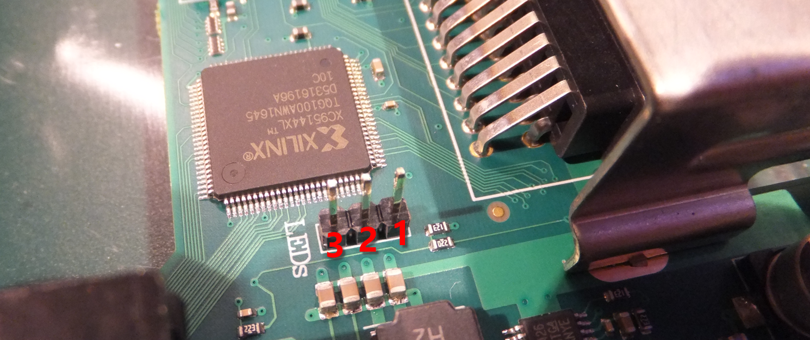
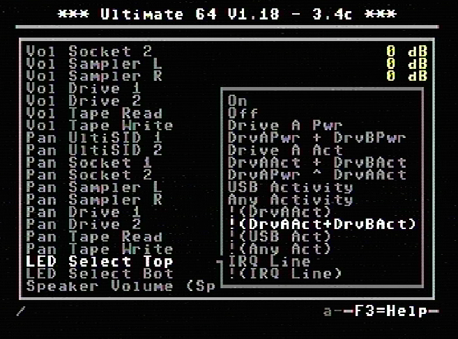
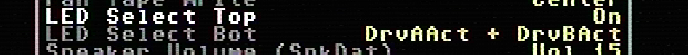
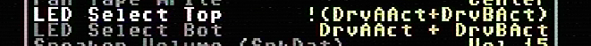

LED Header
==========

Pinout  
------

===  ============
Pin  Description
===  ============
1    Power
2    Ground
3    Drive activity
===  ============

*With firmware 1.18 (and above) the pin assignment is not static any more.*

LED options
-----------

.. csv-table:: Frozen Delights!
   :header: "Treat", "Quantity", "Description"
   :widths: 15, 10, 30

   "Albatross", 2.99, "On a stick!"
   "Crunchy Frog", 1.49, "If we took the bones out, it wouldn't be
   crunchy, now would it?"
   "Gannet Ripple", 1.99, "On a stick!"

   
With the introduction of firmware 1.18 the behaviour of the LED can be changed.

+---------------------+---------------------------------------------------------------------------------------+
|Option               |Description                                                                            |
+=====================+=======================================================================================+
|On                   |LED always ON                                                                          |
+---------------------+---------------------------------------------------------------------------------------+
|Off                  |LED always OFF                                                                         |
+---------------------+---------------------------------------------------------------------------------------+
|Drive A Pwr          |Power indicator of drive A                                                             |
+---------------------+---------------------------------------------------------------------------------------+
|DrvAPwr + DrvBPwr    |Power indicator of drive A and drive B combined                                        |
+---------------------+---------------------------------------------------------------------------------------+
|Drive A Act          |LED ON when there is activity on drive A                                               |
+---------------------+---------------------------------------------------------------------------------------+
|DrvAAct + DrvBAct    |LED ON, on activity of drive A and B combined                                          |
+---------------------+---------------------------------------------------------------------------------------+
|DrvAPwr ^ DrvAAct    |Drive power LED XOR drive activity. This results in an "inverse" drive activity,       |
|                     |with similar dimming as the power LED has                                              |
+---------------------+---------------------------------------------------------------------------------------+
|USB Activity         |LED ON, on USB activity                                                                |
+---------------------+---------------------------------------------------------------------------------------+
|Any Activity         |LED ON, on any activity (excluding tape)                                               |
+---------------------+---------------------------------------------------------------------------------------+
|!(DrvAAct)           |Inverse of drive A activity, so the LED will turn OFF on drive activity instead of ON  |
+---------------------+---------------------------------------------------------------------------------------+
|!(DrvAAct+DrvBAct)   |Inverse of drive A and B combined, so LED will turn OFF on activity instead of ON      |
+---------------------+---------------------------------------------------------------------------------------+
|!(USB Act)           |Inverse of USB Activity, so the LED will turn OFF on USB activity instead of ON        |
+---------------------+---------------------------------------------------------------------------------------+
|!(Any Act)           |Inverse of Any Activity, so the LED will turn OFF on any activity instead of ON        |
+---------------------+---------------------------------------------------------------------------------------+
|IRQ Line             |LED is ON when IRQ line is high (inactive)                                             |
+---------------------+---------------------------------------------------------------------------------------+
|!(IRQ Line)          |Inverse of IRQ Line, so the LED is ON when IRQ line is low (active)                    |
+---------------------+---------------------------------------------------------------------------------------+

What does !(option) mean?
-------------------------
As we can see in the table above, there are setting options (functions) that are noted as !(function).
!(function) means it is an inverse outcome of a function.

We take a closer look at the function **DrvAAct+DrvBAct**.
This means when there is drive A or drive B activity (combined) the LED will turn ON.
So **!(DrvAAct+DrvBAct)** will do the opposite (inverse) of the function **DrvAAct+DrvBAct**, so the LED will turn OFF 
when there is activity on drive A or drive B.

Example with two separate LED's
-------------------------------
We are using a red and green LED, red will be the power LED (power) and green will be drive activity (drive).
The power wire to the red led is connected to the Top pin (1) and the green led is connected to the Bottom pin (3), 
and of course the ground of both LED's is connected to the ground pin (2).

Because there are two separate LED's we want that the power is always ON, and the drive will only turn ON when there is activity.

So we use the following setting:

Power => LED Select Top: **On**

Drive => LED Select Bottom: **DrvAAct+DrvBAct**

To swap the color assignment, just swap the settings between Top and Bottom.

Example with duo led
--------------------
We are using a duo that has red and green combined in one package, red will be the power LED (power) and green will be drive activity (drive).
The power wire to the red led is connected to the Top pin (1) and the green led is connected to the Bottom pin (3), 
and of course the ground of both LED's is connected to the ground pin (2).

Because there is only "one" LED package we want that power will turn OFF when there is drive activity, or else the two colors will be mixed to yellow (red+green).

So we use the following setting:

Power => LED Select Top: **!(DrvAAct+DrvBAct)**

Drive => LED Select Bottom: **DrvAAct+DrvBAct**

To swap the color assignment, just swap the settings between Top and Bottom.

Technical information
---------------------

**Power LED**

The power pin is provided with a 260KHz PWM signal, the PWM signal makes the LED less bright.
The U64 has an on-board resistor to lower the current.

**Drive activity LED**

===  ==========================================
PWM  Description
===  ==========================================
Off  Drive Off
1/3  Drive On
2/3  Drive On + Floppy Mounted
3/3  Drive On + Floppy Mounted + Motor running	
===  ==========================================
*PWM = pulse width of the pwm signal.*

