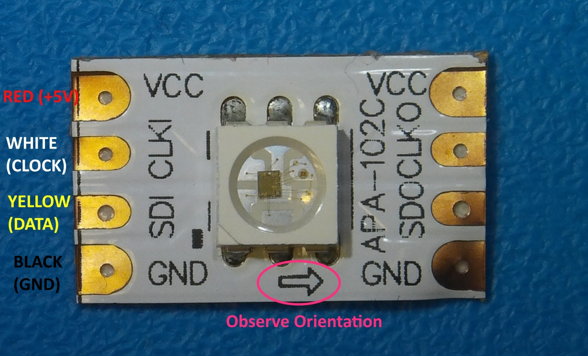
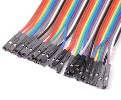
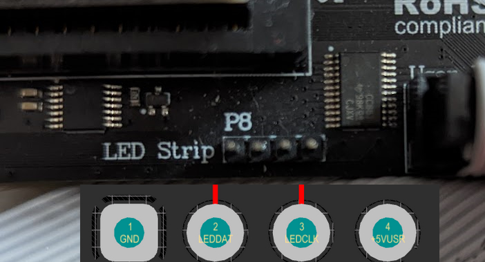
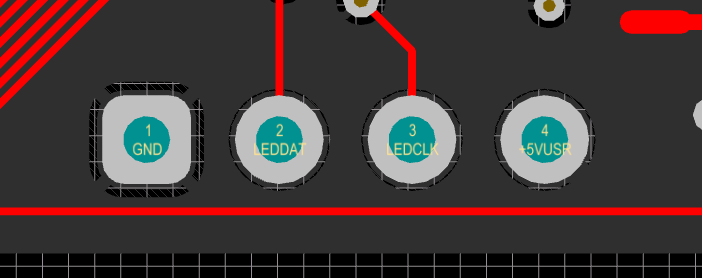

W A R N I N G ! Please always use extreme caution! 

Please be extremly careful not to shorten the 5V to ground! It will burn a ferrite bead on your board! 
Also shorting 5V to pin 3 or any other FPGA pin will likely damage the FPGA!

LED Strip
---------

**Attaching a LED Strip**

Using `firmware version 1.10 and later <https://ultimate64.com/Firmware>`_, it is possible to attach a programmable LED strip to your Ultimate 64 board.
The supported LED type is APA102C, with is a 5V only device with built-in PWM controller for each color, red, green and blue.
At the time of writing, the firmware supports up to 64 LEDs, of which 24 are currently used. On a strip with 60 LEDs (IP30) per meter, this corresponds to 40 cm of length, which is roughly the width of the machine. Alternative are SK9822 strips.

For an easy connection of the LED strip, it is recommended to connect four wires / leads to it, with a single pin socket, like the ones shown below.
These wires can be obtained anywhere, and are sold -for example- as Raspberry PI jumper cables.

The following connections need to be made:

=== ========= ======================== ===============
Pin Name      Description              User Port
=== ========= ======================== ===============
  1 GND (0V)  Black wire               Pin 1, 12, or N
  2 SDI       Yellow wire, Data input  Pin P
  3 CLKI      White wire, Clock input  Pin 13
  4 VCC (+5V) Red wire                 Pin 2
=== ========= ======================== ===============
	
Note, the wire colors are just suggestions. Obviously it will work with other colors as well. But for the sake of not making mistakes, please at least use black and red for ground and +5V respectively.

Please refer to the drawing of the user port header, in order to see where to connect your wire leads. :ref:`userport_pinout`. 

**LED pinheader P8**

Beginning with hardware revision 1.4 you'll find the new LEDstrip pin header P8 to the left under the User Port. This can be used to attach an APA102C LED strip and simultaneously use the User Port for other purposes. 

The pin header is defined as follows:

Pin Header P8:

Pin 1 -> GND

Pin 2 -> DAT

Pin 3 -> CLK

Pin 4 -> +5V
      

W A R N I N G ! Please always use extreme caution! 

Please be extremly careful not to shorten the 5V to ground! It will burn a ferrite bead on your board! 
Also shorting 5V to pin 3 or any other FPGA pin will likely damage the FPGA!
