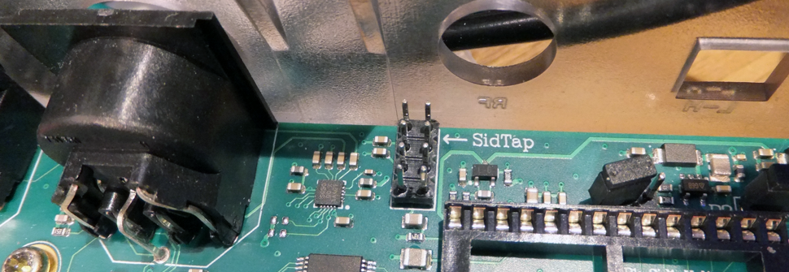
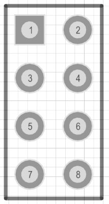

SID-TAP header
==============

   

   
=========  ===  ===  ========  
Function   Pin  Pin  Function  
=========  ===  ===  ========  
SID 2 OUT   1    2   Ground         
Ground      3    4   SID 2 IN           
Ground      5    6   SID 1 IN   
SID 1 OUT   7    8   Ground  
=========  ===  ===  ========  

The SID-TAP header provides a direct (analog) output from the installed SID chips.
This header is meant for the purists, who do not want the SID signals to be processed by the U64 board.
It is possible to attach a 3.5mm jack plug directly to the SID OUT signals (left column of the header) and use it as a line-out source.

The SID inputs are not often used. However, if you like to use them, you can use the same trick, and attach a 3.5mm jack plug to the right
side of the header. This connection provides a line-in connection to your SIDs. This has *not* been functionally verified!

Note that the arrow on the board points at pin 2. In other words, the image and table above are the top view of the header.
