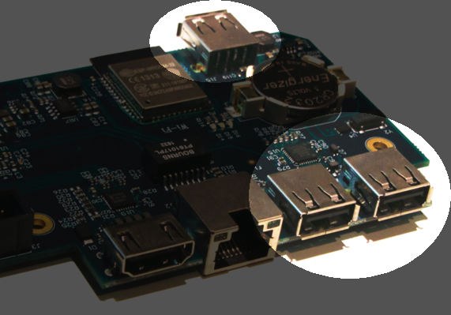

USB ports
---------

	
The Ultimate-64 supports most USB sticks and Flash card readers out of the box. 
It also supports USB 2.0 Hubs. It is recommended to use powered USB hubs only (with an external power supply). 

USB 1.1 Hubs are not supported.

There are three USB 2.0 ( no USB 3!! ) ports available on the board; two on the back and one on the "internal" side of the board/case.
