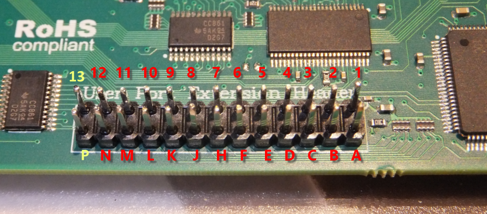

USER PORT
---------

	
**User Port Extension Header**

=== ======= ===================================================================== ===============
Pin Name    Description                                                           Special Purpose  
=== ======= ===================================================================== ===============
  1 GND     Ground
  2 +5V     +5 VDC (200 mA max)
  3 /RESET  Reset, will force a Cold Start. Also a reset output for devices.
  4 CNT1    Counter 1, from CIA #1
  5 SP1     Serial Port 1, from CIA #1
  6 CNT2    Counter 2, from CIA #2
  7 SP2     Serial Port 2, from CIA #2
  8 /PC2    Handshaking line, from CIA #2
  9 ATN     Serial Attention
 10 12VDC   12VDC (Max 500mA)
 11 12VDC   12VDC (Max 500mA)
 12 GND     Ground
 13 USRCTL0 FPGA Pin, *NOT* 5V tolerant!                                          LED Clock  
  A GND     Ground (RS232: GND)
  B /FLAG2  Flag 2 (RS232: RxD=Both B+C) 
  C PB0     Data 0 (RS232: RxD=Both B+C)
  D PB1     Data 1 (RS232: RTS)
  E PB2     Data 2 (RS232: DTR)
  F PB3     Data 3 (RS232: RI)
  H PB4     Data 4 (RS232: DCD)
  J PB5     Data 5 
  K PB6     Data 6 (RS232: CTS)
  L PB7     Data 7 (RS232: DSR)
  M PA2     PA2    (RS232: TxD)
  N GND     Ground (RS232: GND) 
  P USRCTL1 FPGA Pin, *NOT* 5V tolerant!                                          LED Data
=== ======= ===================================================================== ===============
	
*Applies to: Ultimate 64*

Note that the row 1-12 corresponds to the upper row of the User Port card edge fingers on a C64, and that the row A-N
corresponds to the bottom row of the User Port card edge fingers.

Pin 13 and P, the two left most pins on the header, are added for add features to the user port. One of the intended usages of these two pins is
the generation of the "9 V~" on the user port extension board.

There is one other use in a special firmware version at the moment of pin 13 and P, which is the control of a LED Strip.
In this case, pin 13 the LED Clock and pin P is the LED Data, assuming a LED strip that is based on APA102C.
