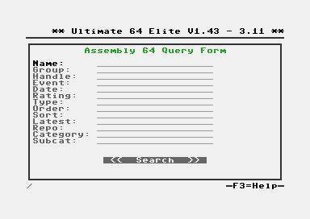
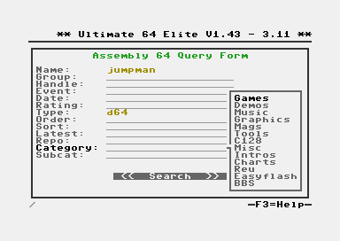
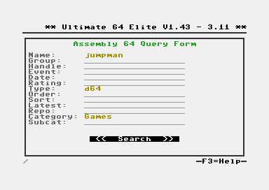
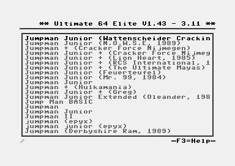
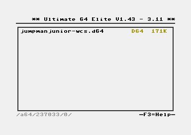
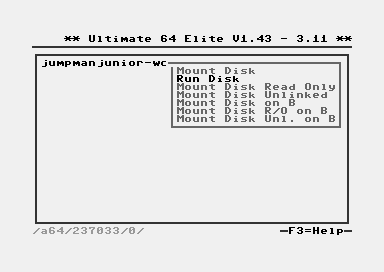
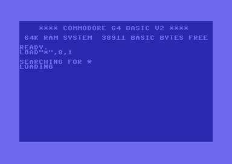
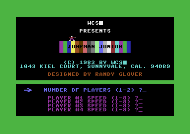

Assembly 64 Integration
-----------------------

Starting from firmware 3.11, the Ultimate integrates support for the Assembly64 online database. Because this
database is very large, finding titles would be difficult if it was organized as a directory structure. Therefore,
the available software can be found using a database search query.

In the main screen, press F6 to open the search query; OR, press F5 and choose "New Search" from the action menu.
If a valid network link exists, the following screen appears:

Filling out the Query Form
~~~~~~~~~~~~~~~~~~~~~~~~~~
This screen allows you to enter the query in an effective manner. The first four lines are string fields. You can
simply start typing when the line is selected. A cursor will appear and the current line will become an edit field.
When done, simply press return.

The subsequent lines are the so called 'presets'. These presets are dynamic and are part of the database structure.
It might therefore happen that the screen or options will change over time without a firmware update. The presets
can be chosen from the context menu. Hit RETURN, or type the first letter of an item in the drop down list. Press
RETURN to select.

Once you have filled out the query form to your liking, move down to the search button and press RETURN:

First Results Page
~~~~~~~~~~~~~~~~~~
The first page lists the first 20 results from the query. At this point (firmware V3.11) it is not possible to
scroll to obtain more results. You'd have to narrow down your search query instead.

The results on this page are called "entries". Entires are a collection of one or more files that make up this
title. For example, games or demos could consist of multiple "D64" disk images. In this case, all these disk
images are part of an entry. In this screen, the entry is shown as one single line.

To see the indiviual files of an entry, navigate to it and press CRSR-RIGHT or RETURN.

Second Results Page
~~~~~~~~~~~~~~~~~~~
Once an entry has been selected, the second page with results show the individual files that belong to the
entry. In this example, the title consists of just one disk:

This screen works somewhat like a directory on a USB stick. The file types are recognized and the context menus
show the operations that can be done on such a file.

When 'Run Disk' is selected, as in this example, the D64 file will be downloaded and cached in the /Temp folder of the
virtual file system of the Ultimate. From there, it will be mounted as usual. The download will take a few seconds,
during which you will have to wait patiently. Once the title has been loaded, the title will be loaded:

From there: Enjoy the game!

*Note: With the introduction of firmware V3.11, the /Temp folder is not automatically cleaned up. This means that
after repeatingly downloading titles, it is possible that the /Temp folder is full and further downloads will fail.
This needs to be fixed at some point.*

Contribution
~~~~~~~~~~~~
Assembly64 is hosted on a server in Sweden. Note that there are costs incurred with hosting; the servers, the network
connection and power are not free. When you like Assembly64, please consider donating through Paypal, using this link:

`Donate to Assembly64 <https://paypal.me/assembly64>`_

