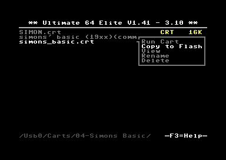
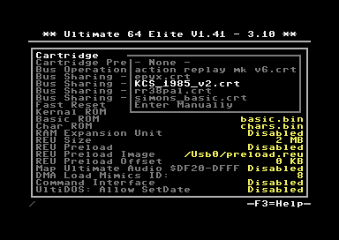
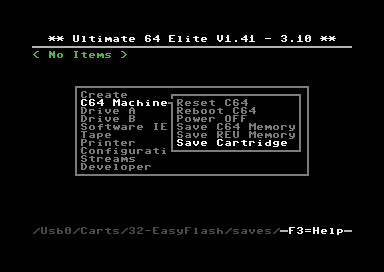
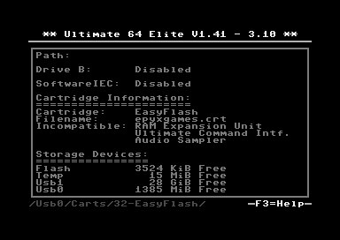

Cartridge Emulation
-------------------

Since firmware version 3.10, the way cartidges are emulated in the Ultimate has changed. While previously there were built-in cartridges, all cart roms are now optional. These previously built-in cartridges were stored in a flash chip on the board. These ROMs were taking up a lot of space; especially because nobody used all built-in cartridges much of that space was wasted. These built-in ROMs have been removed and the freed space was reassigned to the *flash drive*. The *flash drive* is now a permanent entry in the root of the file system and therefore always accessible. As a consequence, you can now use this space for your own cartridge of your liking, or one that is patched for your own needs. This chapter describes how to run and install your own cartridge roms, and how to switch between them.

Cartridge File Format
=====================
The file format that is used by the Ultimate is the standardized '.crt' format. This file format is defined and maintained by the VICE team. ".crt"-files do not only contain the raw ROM data, but also some meta data which is required to know how the ROM data needs to be interpreted. One of the important fields in this meta data is the "Hardware Type" field, which describes what type of cartridge it is. There is a long list of hardware types. Note that not all of them have been implemented in the Ultimate hardware.

Running a Cartridge ROM
=======================
At times, you may want to simply run a cartridge ROM temporarily, e.g. when you want to play a game. In this case, the cartridge can be started by simply navigating to the .CRT file and select "Run Cartridge" from the context menu. The cartridge will be loaded and 'attached' to the C64, and the machine is reset to start the cartridge. Resetting the machine will restart the cartridge again, just like what would happen with a real cartridge. To disable the cartridge, press the Task Menu key (F5), and select "C64 Machine" and then "Reboot". A reboot will install the permanently selected cartridge, if any, and reset the machine.

Installing a Cartridge ROM
==========================
For utility cartridges that need to start when the machine is turned on, the CRT file should be loaded at boot. This can be done by placing the CRT file onto the *flash drive*, in the **/flash/carts** directory. Note that this directory is hard coded and cannot be changed. There are two ways to get your CRT file in that directory:

1) Browse to the .crt file on your USB stick, and open the context menu by pressing RETURN. Then select 'Copy to Flash'. This will copy the ROM file to **/flash/carts** *and* automatically set the filename in the configuration. When the filename is too long, it will be truncated (prior to copying) to fit in the configuration field.

2) Copy the .crt file on your USB stick manually to **/flash/carts**, by selecting it (press SPACE), then CTRL-C, navigate to **/flash/carts**, and then paste it there using CTRL-V. Then, go to the configuration menu (F2), go to *C64 and Cartridge Settings*, and use the drop-down context menu on the line 'Cartridge'. It will show you the files with the .crt extension that are currently in the **/flash/carts** directory.

*Note that the size of the internal flash is very limited. On the 1541U2, the usable space is about 700 KiB, on the U2+ the size is roughly 1500 KiB, and on the U64 the usable size of the internal flash is about 3500 KiB. This may limit the use of the flash to utility cartridges, roms and some small configuration data, and maybe a disk image that you may use often.*

Supported C64 Cartridge Types
=============================

===== ================================= ====== === ===
Type# Description                       1541U2 U2+ U64
===== ================================= ====== === ===
  0   Normal Cartridge (8K, 16K, UMAX)    ●     ●   ●
  1   Action Replay                       ●     ●   ●
  2   KCS Power Cartridge                 ●     ●   ●
  3   Final Cartridge III                 ●     ●   ●
  4   Simons Basic                        ●     ●   ●
  5   Ocean type 1                        ●     ●   ●
  6   Expert Cartridge                    
  7   Fun Play                          
  8   Super Games                         ●     ●   ●
  9   Atomic Power                        ●     ●   ●
 10   Epyx Fastload                       ●     ●   ●
 11   Westermann                          ●     ●   ●
 12   Rex                               
 13   Final Cartridge I                   ●     ●   ●
 14   Magic Formel                        ●     ●   ●
 15   C64 Game System                     ●     ●   ●
 16   Warpspeed                         
 17   Dinamic                           
 18   Zaxxon                              ●     ●   ●
 19   Magic Desk, Domark, HES Australia   ●     ●   ●
 20   Super Snapshot 5                    ●     ●   ●
 21   COMAL 80                            ●     ●   ●
 32   EasyFlash                           ●     ●   ●
 33   EasyFlash X-Bank                  
 34   Capture                           
 35   Action Replay 3                   
 36   Retro Replay                        ●     ●   ●
 37   MMC64                             
 38   MMC Replay                        
 39   IDE64                             
 40   Super Snapshot V4                 
 41   IEEE 488                          
 42   Game Killer                       
 43   Prophet 64                        
 44   EXOS                                ●     ●   ●
 45   Freeze Frame                      
 46   Freeze Machine                    
 47   Snapshot64                        
 48   Super Explode V5                  
 49   Magic Voice                       
 50   Action Replay 2                   
 51   MACH 5                            
 52   Diashow Maker                     
 53   Pagefox                             ●     ●   ●
 54   Kingsoft Business Basic             ●     ●   ●
 55   Silver Rock 128                   
 56   Formel 64                         
 57   RGCD                              
 58   RR-Net MK3                        
 59   Easy Calc                         
 60   GMod2                               †     ●   ●
 61   MAX Basic                         
 62   GMod3                             
 63   ZIPP-CODE 48                      
 64   Blackbox V8                         ●     ●   ●
 65   Blackbox V3                         ●     ●   ●
 66   Blackbox V4                         ●     ●   ●
 67   REX RAM-Floppy                    
 68   BIS-Plus                          
 69   SD-BOX                            
 70   MultiMAX                          
 71   Blackbox V9                       
 72   Lt. Kernal Host Adaptor           
 73   RAMLink                           
 74   H.E.R.O.                          
===== ================================= ====== === ===

Supported C128 Cartridge Types
==============================

===== ================================= ====== === ===
Type# Description                       1541U2 U2+ U64
===== ================================= ====== === ===
  0   C128 Cartridge $8000-$FFFF          ●     ●    
  1   C128 Cartridge with I/O mirror      ●     ●    
===== ================================= ====== === ===

Hardware Sub-Types
==================
In one of the latest refinements of the .CRT file format, a field has been defined that specifies the "sub type" of a cartridge. The Ultimate uses this field in some cases to know whether the ROM has been made compatible with other I/O functions, such as the RAM Expansion Unit. The following table shows these cases. For other cartridge types, this field has no effect. Note, this field is one byte at CRT header offset 0x1A.

======= ==== ======================================================
Type#   Sub  Description                      
======= ==== ======================================================
C64:3     0  Standard FC-III cart (not compatible with REU)
C64:3     1  Patched FC-III ROM, free $DF00-$DF1F area for REU
------- ---- ------------------------------------------------------
C64:32    0  Standard EasyFlash Cart ROM (uses ROM at $DF00-DF1F)
C64:32    1  REU-aware EasyFlash Cart ROM ($DF00-$DF1F not used)
------- ---- ------------------------------------------------------
C128:1    0  Standard C128 cartridge with I/O mirror ($DE00-$DFFF)
C128:1    1  REU-aware C128 cartridge; with UCI preferred
======= ==== ======================================================

EasyFlash
=========
EasyFlash cartridges have a Flash chip that can be written from the C64 side. Games that are released on EasyFlash cartridge use the Flash to save settings and high scores to. The EasyFlash system is conceptually very advanced; as it supplies the 'driver' software to write to the ROM as part of the ROM data. This driver is called "EasyFlash API", or short 'EAPI'. The Ultimate supports these writes to the ROM by patching the EAPI code area with its own driver. This way, all titles that use the EAPI to write data to the flash will use the Ultimate code to do so. This way, the Flash chip itself does not need to be emulated. More background information about the EAPI can be found here: `EasyFlash API <http://skoe.de/easyflash/files/devdocs/EasyFlash-ProgRef.pdf>`_.

It is required to manually save the EasyFlash title back to your storage device after it has been modified. To do so, press F5 inside of a writable directory and select C64 Machine --> Save Cartridge. This command will create a new CRT file with all ROM data.

GMod2
=====
Also GMod2 cartridges have a chip to store data in; an M93C86 EEPROM chip. This chip is fully emulated in the Ultimate [*]_. The GMod2 software can 'see' this EEPROM chip, and use it in the standard way. If the contents are part of the CRT file, modified contents of this EEPROM can also be saved. To do this, follow the same procedure as with EasyFlash. *Note that when the EEPROM data is _not_ part of the original CRT, it will be initialized with 'FF' bytes, and it will _not_ be saved with the Save Cartridge method, even when new data was written to it.*

.. [*] There is one special version of the 1541U2 that supports GMod2, at the cost of other features.

Compatibility with I/O features
===============================
Unfortunately the Commodore 64 was never fully 'plug and play', as there was no configuraiton managment and dynamic allocation of memory and I/O resources like on modern PCs. This means that cartridges may be incompatible with some software, but also that enabling different features on the cartridge port may cause conflicts. In version 3.10 of the firmware, an attempt has been made to automatically 'fix' compatibility issues, by disabling features that conflict with the selected cartridge.

In order to find out what features were automatically disabled (or even enabled in a few cases), you can open up the System Info page with F4. An example is shown here:

As can be seen from the image, the EasyFlash cartridge that was loaded is not compatible with the RAM Expansion Unit (REU), nor with the Ultimate Command Interface (UCI) and with the Ultimate Audio Sampler module. All these reside in the $DF00-$DFFF area, which is also used by the EasyFlash cartridge. This means that the priority has been given to a correct functioning of the EF cartridge.
