Machine Code Monitor
====================

The Machine Code Monitor is a keyboard-driven tool for inspecting and editing live or frozen C64 memory.

It supports hexadecimal, ASCII, screen-code, binary, and assembly views, plus inline editing, bulk memory operations, file load/save, execution from a selected address, and a debugger that steps the C64's own 6510 and stops it at breakpoints.

Almost every command is a single keypress, and the monitor stays open until you exit it, so you can move freely between views and operations. If you forget a key, press ``F3`` for the on-screen help.

*Applies to: Ultimate 1541-II, Ultimate-II+, Ultimate 64*

Entry and Exit
--------------

``C=`` denotes the Commodore key. For example, ``C=+O`` means: hold the Commodore key, then press ``O``.

To open the monitor, use one of the following:

-  Press ``C=+O``.
-  Press ``F5``, open ``Developer``, then select ``Machine Code Monitor``.

Open the built-in help with ``F3`` or ``?``. It lists every key binding, in three blocks: the views and what
modifies them, the commands that act on memory, and the keys that need ``C=`` or a named key. ``F1``/``SH+SPACE``
and ``F7``/``SPACE`` page it.

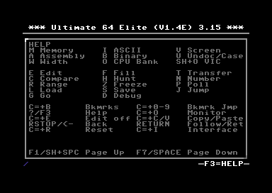

To close the monitor:

-  Press ``C=+O`` again.
-  Press ``RUN/STOP``, ``ESC``, or the C64's top-left ``←`` key when no edit operation or popup is active.

``RUN/STOP``, ``ESC`` and ``←`` are one Back action. Each press closes one active layer, such as the help, a number
expression, a popup, a command prompt or edit mode, and closes the monitor only once nothing is left. Where ``←`` is
data, in ASCII and Screen editing and in the ASCII and Screen rows of the Number popup, use ``RUN/STOP`` or ``ESC``
instead.

Two shortcuts act on the machine rather than on the view, and both work from a memory view and from edit mode:

+----------+---------------------------------------------------------------------------------------------------+
| Key      | Action                                                                                            |
+==========+===================================================================================================+
| ``C=+R`` | Reset the C64. This is the same action as the task menu's ``Reset C64``, so the on-device menu    |
|          | closes with the machine's screen where the interface is drawn there.                              |
+----------+---------------------------------------------------------------------------------------------------+
| ``C=+I`` | Swap the interface between the freeze menu and the HDMI overlay, and close the menu. The setting  |
|          | takes effect the next time the menu opens.                                                        |
+----------+---------------------------------------------------------------------------------------------------+

Neither has a confirmation. A backend that cannot reach a reset reports ``RESET UNAVAILABLE`` and leaves the machine,
the view and edit mode unchanged.

Screen Layout
-------------

The monitor screen has three fixed regions:

Header
~~~~~~

-  Shows the current view, cursor address, and active modes.
-  Mode indicators may include ``Undoc``, ``Frz``, ``Poll``, or ``EDIT``.

Body
~~~~

-  Shows the memory region around the current cursor address.
-  The active cursor position is highlighted in reverse.
-  May show popups, such as search results, load/save prompts, completion pickers, or bookmarks.

Footer
~~~~~~

-  Shows the active CPU port mapping and VIC bank. For more details, see :ref:`machine-monitor-cpu-vic-bank-display`.
-  ``CPU0``..\ ``CPU7`` identify the selected CPU memory configuration.
-  ``VIC0``..\ ``VIC3`` identify the selected VIC bank and its base address.
-  When jumping to a bookmark, the footer briefly shows bookmark information.

Example layout, with the ``Undoc``, ``Poll``, and ``EDIT`` mode indicators active in the header:

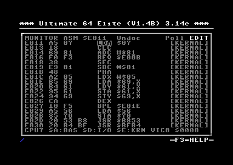

Views
-----

The monitor provides five primary views:

===== ======== === ===============================
Key   View     ID  Purpose
===== ======== === ===============================
``M`` Memory   HEX Hexadecimal byte view
``A`` Assembly ASM Disassembly and inline assembly
``B`` Binary   BIN Bit-level byte view
``I`` ASCII    ASC ASCII byte view
``V`` Screen   SCR Screen code view
===== ======== === ===============================

.. _memory--hex-view:

Memory / Hex View
~~~~~~~~~~~~~~~~~

Memory view shows raw bytes in hexadecimal together with a compact printable-character preview.

Example:

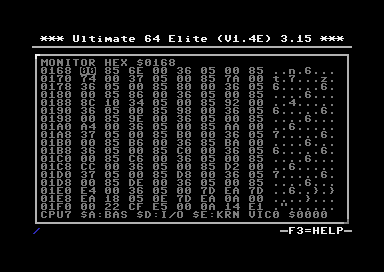

Assembly View
~~~~~~~~~~~~~

Assembly view shows decoded 6510 instructions, their instruction bytes, and the memory source used for each row.

The source tag occupies three characters inside the brackets, so the column stays aligned across bank boundaries: ``[RAM]``, ``[BAS]``, ``[CHR]``, ``[I/O]``, ``[KRN]``, and ``[CPU]`` for the memory currently visible to the CPU on an Ultimate-II+.

Example:

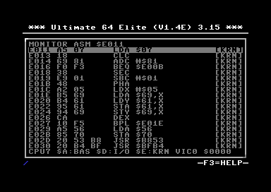

Assembly view is also a full inline assembler: in edit mode it offers opcode completion as you type. See :ref:`machine-monitor-inline-assembler`.

Data Regions
^^^^^^^^^^^^

``$D000-$DFFF`` is shown as ``DATA`` rows of two bytes each when either I/O or Character ROM is banked in. I/O reads
live registers, so decoding it would change the instruction length, and with it the address of every row below, on
each redraw. Character ROM is stable, but it holds character bitmaps that never were code. With RAM banked in, the
same addresses are disassembled normally: the rule follows the banked source, not the address range. On an
Ultimate-II+, ``$D000-$DFFF`` is always disassembled, because that backend reports one source for the whole CPU view.

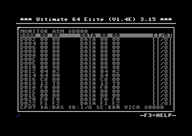

The rows are grouped from the start of the region, so where a ``DATA`` row begins does not depend on how the view
arrived there. ``$D000-$DFFF`` is 4096 bytes and divides into 2048 rows of two; a region whose length is odd ends
with a row of one byte.

A ``DATA`` row is edited in Assembly view like any other row. ``E`` enters edit mode and the cursor sits on the first
byte. Each displayed byte is its own edit position, two hex digits complete one, and ``LEFT``/``RIGHT`` step from
byte to byte and on into the row above or below. There is no opcode picker on a ``DATA`` row, because there is no
mnemonic to pick, and a letter key does nothing there. ``[I/O]`` is writable; ``[CHR]`` is ROM and refuses the write
as it does everywhere else. Editing the same bytes in Memory view with ``M`` works as before.

``DEL`` clears a ``DATA`` row's bytes to ``$00``. On a decoded instruction it still writes ``NOP``, which is what
keeps the code around it runnable; ``NOP`` means nothing in a region that is not code.

The two-byte row is how the bytes are shown, not what a range is made of. A range anchored with ``R`` on a ``DATA``
byte covers the bytes between its ends: anchoring on ``$D001``, moving right to ``$D002`` and pressing ``R`` copies
those two bytes and nothing else. A range that starts on a decoded instruction still takes that instruction whole, so
a range may cross between code and data without either end losing bytes.

Binary View
~~~~~~~~~~~

Binary view shows each byte as eight bits, using ``.`` for a cleared bit and ``*`` for a set bit. It is useful for inspecting registers, character glyphs, sprite data, and other bit-oriented memory.

Because C64 sprite data uses 3 bytes per row, binary view supports multiple ``W``\ idth modes for viewing bytes in different groupings.

The top status line shows the current byte address followed by the selected bit number, for example ``$DC00/7``. Bit 7 is the most significant bit on the left, and bit 0 is the least significant bit on the right.

Example:

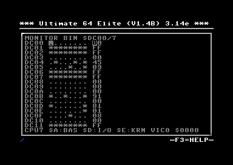

Cycling the ``W`` width mode to ``3S`` makes each row span the full 24 bits of a sprite line, so 21 consecutive rows display a whole C64 sprite as a bitmap. Here a sprite stored at ``$2400``:

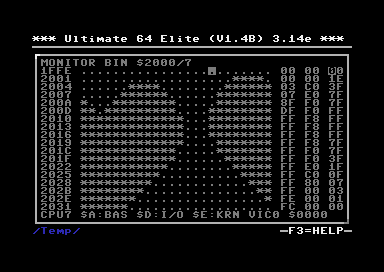

ASCII View
~~~~~~~~~~

Use ASCII view when the bytes are intended to be printable ASCII rather than C64 screen codes.

Behavior:

-  Bytes ``$20-$7E`` are shown as their normal ASCII characters.
-  All other bytes are shown as ``.``.
-  Typing a printable ASCII character writes that character's byte value.
-  Lowercase ASCII is preserved.

Example:

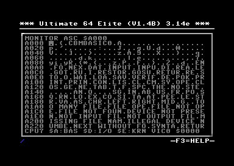

Screen View
~~~~~~~~~~~

Use Screen view when the bytes represent C64 screen codes, for example when viewing screen RAM, which by default starts at ``$0400``.

Screen view is for screen-code bytes, not PETSCII text.

The header shows the active screen charset mode:

-  ``MONITOR SCR U/G $xxxx`` for **Uppercase/Graphics**
-  ``MONITOR SCR L/U $xxxx`` for **Lowercase/Uppercase**

The active mode is changed with ``U``; see :ref:`machine-monitor-view-modifiers`.

Screen ``U/G``
^^^^^^^^^^^^^^

-  Displays ``$00`` as ``@``.
-  Displays ``$01-$1A`` as ``A-Z``.
-  Typing ``A-Z`` or ``a-z`` writes ``$01-$1A``.

Screen ``L/U``
^^^^^^^^^^^^^^

-  Displays ``$01-$1A`` as ``a-z``.
-  Displays ``$41-$5A`` as ``A-Z``.
-  Typing ``a-z`` writes ``$01-$1A``.
-  Typing ``A-Z`` writes ``$41-$5A``.

Example:

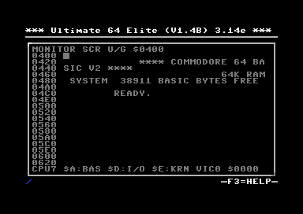

Because the monitor is rendered with the firmware UI font rather than the live C64 character set, graphics bytes are shown with readable fallback glyphs instead of exact C64 glyph shapes.

.. _machine-monitor-view-modifiers:

View Modifiers
--------------

Some keys modify the current view instead of switching to another view.

``U``: View-Specific Toggle
~~~~~~~~~~~~~~~~~~~~~~~~~~~

``U`` is context-sensitive:

+-------------+----------------------------------------------------------------------+
| View        | ``U`` behavior                                                       |
+=============+======================================================================+
| Assembly    | Toggles undocumented opcodes                                         |
+-------------+----------------------------------------------------------------------+
| Screen      | Toggles the monitor-local screen charset between ``U/G`` and ``L/U`` |
+-------------+----------------------------------------------------------------------+
| Other views | Ignored                                                              |
+-------------+----------------------------------------------------------------------+

In Assembly view, enabling undocumented opcodes affects how bytes are decoded and how assembly completion behaves.

In Screen view, ``U`` changes only the monitor-local interpretation of screen codes. It does not change the live C64 character set.

``W``: Width Mode
~~~~~~~~~~~~~~~~~

``W`` is view-dependent:

======== ======================================
View     ``W`` behavior
======== ======================================
Memory   Cycles ``8 <-> 16`` bytes per row
Binary   Cycles ``1 -> 2 -> 3 -> 3S -> 4 -> 1``
ASCII    Fixed-width, 32 bytes per row
Screen   Fixed-width, 32 bytes per row
Assembly Variable-width, 1 to 3 bytes
======== ======================================

Binary width details:

-  ``1``, ``2``, and ``3`` show one, two, or three bytes as bit fields with a trailing hex preview.
-  ``3S`` shows three bytes as one continuous 24-bit sprite-style row, with a hex preview.
-  ``4`` shows four bytes as one continuous 32-bit row without a trailing hex preview.

Navigation and Context
----------------------

-  ``J``: jump to an address.
-  ``G``: exit the monitor and execute from an address.
-  ``F1`` or ``Shift+Space``: page up.
-  ``F7`` or ``Space``: page down.
-  ``Enter``: in Assembly view, follow the target of a jumpable instruction, or return to the most recent saved source location when the current instruction is not jumpable and the follow stack is non-empty.
-  ``O``: cycle CPU port banking, ``CPU0``..\ ``CPU7``.
-  ``Shift+O``: cycle the VIC bank override.
-  ``Z``: toggle freeze when the backend supports it.
-  ``P``: toggle poll mode in the local monitor. Poll mode is unavailable over telnet.

Addresses in command prompts are hexadecimal.

Follow/Return
~~~~~~~~~~~~~

Follow code flow in the Assembly view:

-  ``Enter`` follows the resolved target when the cursor is on a jumpable instruction such as ``JMP``, ``JSR``, ``BEQ``, ``BNE``, ``BCC``, ``BCS``, ``BMI``, ``BPL``, ``BVC``, or ``BVS``.
-  ``Enter`` returns to the most recent saved source location when the current Assembly instruction is not jumpable and the follow stack is non-empty.
-  The follow stack holds up to 10 return locations. When it is full, the oldest entry is discarded and the newest 10 are kept.
-  After each successful follow or return, the bottom row shows a compact zero-based follow-stack status for about 2 seconds, for example ``F1 JMP $E000`` and ``F0 RET $A000``.

.. _machine-monitor-cpu-vic-bank-display:

CPU and VIC Bank Display
~~~~~~~~~~~~~~~~~~~~~~~~

The footer summarizes the selected CPU-visible memory configuration and VIC bank, for example ``CPU7 $A:BAS $D:I/O $E:KRN VIC0 $0000``.

``CPU0``..\ ``CPU7`` are shorthand for the three 6510 port memory-configuration bits at ``$0001``: ``LORAM``, ``HIRAM``, and ``CHAREN``.

In the normal no-cartridge configuration, the footer fields have these possible values:

====== =============== =========================
Field  Address range   Values
====== =============== =========================
``$A`` ``$A000-$BFFF`` ``BAS``, ``RAM``
``$D`` ``$D000-$DFFF`` ``I/O``, ``CHR``, ``RAM``
``$E`` ``$E000-$FFFF`` ``KRN``, ``RAM``
====== =============== =========================

======= ===========================
Value   Meaning
======= ===========================
``BAS`` BASIC ROM
``I/O`` I/O registers and Color RAM
``CHR`` Character generator ROM
``KRN`` KERNAL ROM
``RAM`` RAM
======= ===========================

``VIC0``..\ ``VIC3`` show the selected VIC bank controlled through CIA 2 port A at ``$DD00``, with base address ``$0000``, ``$4000``, ``$8000``, or ``$C000``.

Cartridges can further affect the CPU-visible memory map through the expansion-port ``GAME`` and ``EXROM`` lines.

An Ultimate-II+ has no monitor-selectable CPU bank, so its footer reports the VIC bank alone::

   CPU VIEW  VIC0 $0000

Editing
-------

All views support editing:

-  ``E``: enter edit mode.
-  ``C=+E`` or ``RUN/STOP``: leave edit mode.

Edit behavior is view-specific:

+----------+----------------------------------------------------------------------------------+
| View     | Edit behavior                                                                    |
+==========+==================================================================================+
| Memory   | Type two hex nibbles to write one byte                                           |
+----------+----------------------------------------------------------------------------------+
| ASCII    | Type printable ASCII characters directly                                         |
+----------+----------------------------------------------------------------------------------+
| Screen   | Type screen characters using the active Screen charset mode                      |
+----------+----------------------------------------------------------------------------------+
| Binary   | Type ``0`` or ``Space`` to clear the selected bit; type ``1`` or ``*`` to set it |
+----------+----------------------------------------------------------------------------------+
| Assembly | Edit instructions inline with mnemonic completion and direct operand typing      |
+----------+----------------------------------------------------------------------------------+

In edit mode, ``Space`` remains view-specific data entry and does not page.

``DEL`` is logical delete, not raw backspace:

============ =====================================================================================
View         ``DEL`` behavior
============ =====================================================================================
Memory       Writes ``$00`` and advances
ASCII/Screen Writes a space
Binary       Clears the selected bit
Assembly     Replaces the current instruction with ``NOP`` bytes; clears a ``DATA`` row to ``$00``
============ =====================================================================================

In Assembly view, if an inline edit is already active, ``DEL`` first cancels the current line edit state.

.. _machine-monitor-inline-assembler:

Inline Assembler
~~~~~~~~~~~~~~~~~

Assembly view is a full inline assembler, not just a disassembler. In edit mode, typing the first letter of a mnemonic opens an opcode completion drop-down beside the current instruction. The drop-down lists every matching opcode together with its addressing mode, and narrows as you type:

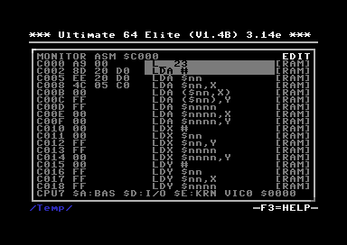

-  Each further mnemonic letter narrows the list. The drop-down header shows the typed prefix and the number of remaining matches.
-  ``Up`` and ``Down`` move through the candidates.
-  Once the three-letter mnemonic is complete, type the operand directly, for example ``#$00`` or ``$D020``.
-  ``Return`` accepts the highlighted opcode, or the operand you typed, and writes the instruction in place.
-  ``RUN/STOP`` closes the drop-down and leaves the instruction unchanged.

Undocumented opcodes appear in the drop-down only when they are enabled with ``U``; see :ref:`machine-monitor-view-modifiers`.

Selection and Clipboard
-----------------------

-  Copy the current byte with ``C=+C``.
-  Paste the clipboard at the cursor with ``C=+V``.
-  Toggle range mode with ``R``.

Range mode anchors the current address. The selected span runs from the anchor address to the current cursor address, inclusive.

While range mode is active:

-  ``C=+C`` copies the selected span.
-  Pressing ``R`` again also copies the selected span and exits range mode.

Number Tool
-----------

-  Open the number tool with ``N``.

The number tool is a compact base-conversion and overwrite popup for the current target. It shows the same value in these forms:

-  Hex
-  Decimal
-  Binary
-  ASCII
-  Screen code

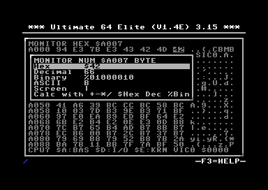

In Assembly view, the number tool targets the operand bytes of the current instruction when possible.

The ASCII and Screen rows in the number tool use the same mappings as the ASCII and Screen views.

Calculator
~~~~~~~~~~

In the Number popup, press ``+``, ``-``, ``*``, or ``/`` to open the calculator. The expression is initialized with the current value and the selected operator.

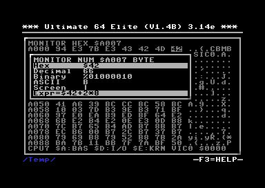

Press ``Return`` or ``=`` to evaluate the expression. Press ``RUN/STOP`` to cancel. On success, the popup returns to the compact conversion layout and refreshes all rows with the result.

Expressions may contain one or more values separated by ``+``, ``-``, ``*``, or ``/``. \* and / are evaluated before + and -. Division is unsigned integer division and truncates toward zero.

Examples:

.. code:: text

   42
   $1000+4
   $2000/16
   %1010*3
   1+2/3
   2+3*4

Formal EBNF grammar:

.. code:: ebnf

   expr     = term, { ("+" | "-"), term } ;
   term     = value, { ("*" | "/"), value } ;
   value    = hex | decimal | binary ;

   hex      = "$", hex_digits ;
   decimal  = decimal_digits ;
   binary   = "%", binary_digits ;

Memory Operations
-----------------

The monitor includes direct bulk memory commands:

+-------+----------+---------------------------------------------+-----------------------------------------------------------------------+
| Key   | Command  | Syntax                                      | Result                                                                |
+=======+==========+=============================================+=======================================================================+
| ``F`` | Fill     | ``start-end,value``                         | Fill an inclusive range with one byte                                 |
+-------+----------+---------------------------------------------+-----------------------------------------------------------------------+
| ``T`` | Transfer | ``start-end,dest[,code-start-code-end]``    | Copy a range to a destination, optionally relocating operands         |
+-------+----------+---------------------------------------------+-----------------------------------------------------------------------+
| ``C`` | Compare  | ``start-end,dest``                          | Compare a range against another location and list differing addresses |
+-------+----------+---------------------------------------------+-----------------------------------------------------------------------+
| ``H`` | Hunt     | ``start-end,bytes`` or ``start-end,"text"`` | Search for a byte sequence or quoted ASCII string                     |
+-------+----------+---------------------------------------------+-----------------------------------------------------------------------+

``Fill``, ``Transfer``, ``Compare``, ``Hunt`` and ``Save`` all treat ``start-end`` as inclusive of both ends,
including the full ``0000-FFFF`` range.

``Transfer`` takes an optional fourth field naming the range to scan for pointers into the block being copied::

   T C000-C0FF,C100,C000-C07F

Absolute, absolute-indexed and indirect operands pointing inside the copied source range are then adjusted to the
corresponding destination address. Relative branches, zero-page operands, references outside the copied range and
incomplete instructions are left unchanged. Without the fourth field, ``Transfer`` copies the bytes and changes
nothing.

The scan range is independent of the range being copied. It may be shorter than the copy, longer than it, or
somewhere else entirely, which is what lets a pointer that is not itself moving be brought with the block::

   T C000-C005,C010,C000-C008

Here the first two instructions are copied to ``$C010`` while the scan covers a third instruction that stays where it
is. An instruction wholly inside the copy is rewritten in the copy, because that is the version being relocated. An
instruction wholly outside it is rewritten where it stands. An instruction whose three bytes straddle the end of the
copy is left alone, since writing its operand would put one byte in the copy and the other in the original.

``Hunt`` prompts for a range followed by a byte sequence or quoted text:

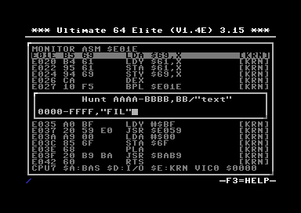

Matches are listed in a result picker:

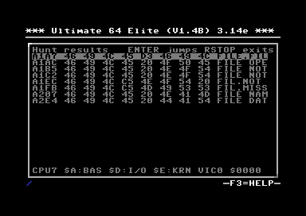

-  ``Return``: jump to the selected match.
-  ``RUN/STOP``: close the picker.

A command prompt accepts only characters that can occur in the command being entered; other keys are ignored. Parsing
and validation still happen on ``Return``.

Debugger
--------

Debug mode is layered on Assembly view. It stops the C64's own 6510, shows its registers, steps it one instruction at
a time, and stops it again at breakpoints. The rest of the monitor keeps working while Debug is active, so memory can
still be viewed and edited between steps.

The machine has no hardware breakpoints. The debugger writes a temporary ``BRK`` at the addresses that may execute
next, lets the CPU run, and puts the original bytes back when it stops. Everything it patched is restored when the
session ends, including after a timeout or a reset.

Entering and Leaving
~~~~~~~~~~~~~~~~~~~~

Press ``D`` outside Debug. The monitor switches to Assembly view and shows ``Dbg`` in the header.

Entering Debug executes nothing and does not stop the C64. No CPU state is captured yet, so the footer is blank and
the first execution command starts at the Assembly cursor address rather than where the C64 is currently executing.
To attach to running code, set a breakpoint and press ``G``.

============================= ==================================================================
Key                           Effect
============================= ==================================================================
``C=+D``                      Leave Debug, stay in the monitor
``RUN/STOP`` or ``ESC``       Leave Debug, stay in the monitor
``X`` or ``C=+O``             Leave Debug and close the monitor
``C=+R``                      Reset the machine; Debug is re-entered with no captured state
============================= ==================================================================

Debug works in UI Freeze, UI Overlay, and Telnet mode. Only one session can be active at a time across all of them.
Where another one already owns the debugger, ``D`` reports ``DEBUG IN USE``; an owner that has not been seen for
three seconds is taken over.

Reading the CPU State
~~~~~~~~~~~~~~~~~~~~~

Debug reserves the two rows above the normal footer for the CPU state:

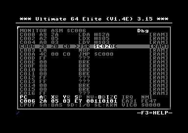

============ =========================================================
Field        Meaning
============ =========================================================
``PC``       Program counter
``AC``       Accumulator
``XR``       X register
``YR``       Y register
``SP``       Stack pointer
``NV-BDIZC`` Status register, one digit per flag
``IRQ``      RAM IRQ vector at ``$0314/$0315``
``NMI``      RAM NMI vector at ``$0318/$0319``
============ =========================================================

The instruction that runs next is bracketed in the body, for example ``>JSR $C020<``, so the cursor can move
elsewhere without losing it. A ``JSR``, an absolute ``JMP``, and a branch that will be taken show their target in the
accent colour; an ``RTS`` row shows the return address read from the live stack. A value the debugger does not know
is left blank rather than shown as zero, and the columns keep their positions.

After each step the cursor follows the new program counter and the view is scrolled so it stays visible.

Execution Commands
~~~~~~~~~~~~~~~~~~

============= =============== ================================================================================
Key           Command         Behaviour
============= =============== ================================================================================
``D``         Step Over       Executes one instruction. A ``JSR`` runs to completion and stops at the return site
``T``         Step Into       Executes one instruction. A ``JSR`` stops on the first instruction of the callee
``U``         Step Out        Runs to the caller of the subroutine the CPU is in
``G``         Go              Resumes the program and stops at the first enabled breakpoint hit
``K``         Run to cursor   Runs until the Assembly cursor address is reached
``Return``    Follow/Return   Follows a jump target, or returns from one, without executing anything
============= =============== ================================================================================

Inside Debug, ``U`` is Step Out rather than the undocumented-opcode toggle, and ``P`` is a breakpoint rather than
Poll. Every key Debug does not own keeps working, so views, bookmarks, and editing stay available.

``G`` with no enabled breakpoint hands the CPU back to full-speed execution. The on-screen monitor closes as it does
so; a Telnet session stays open on the running machine.

``G`` pressed while stopped on a breakpoint steps past that breakpoint first, so the same one does not fire again
immediately.

A run that reaches no breakpoint gives up after five seconds and reports ``DEBUG TIMEOUT``. While a run is in
progress, ``RUN/STOP``, ``ESC``, ``C=+D``, or ``C=+O`` abandons it with ``DEBUG CANCELLED``.

Step Out works after a Step Into and also after arriving inside a subroutine with ``G`` or ``K``. Where no active
call frame can be established it reports ``NOT IN SUBROUTINE``; set a breakpoint at the ``RTS`` target shown on the
row and use ``G`` instead.

Breakpoints
~~~~~~~~~~~

There are 10 breakpoint slots, numbered ``0`` to ``9``.

-  ``P`` toggles a breakpoint at the Assembly cursor address, in the memory source selected with ``O``. With all ten
   slots in use it reports ``NO FREE BRK SLOT``.
-  A breakpoint is an address plus a memory source, so ``$E000 KRN`` and ``$E000 RAM`` are separate breakpoints.
-  A row with a breakpoint shows ``[BRK0]``..\ ``[BRK9]`` before its source tag, for example ``[BRK0][BAS]``. A slot
   with a label shows the label instead, for example ``[LOOP][BAS]``.
-  Only enabled breakpoints stop execution. A disabled slot is remembered but inert.
-  Slots are held in volatile RAM. They survive ``C=+R``, leaving Debug, and closing the monitor. Powering the device
   off clears them.

``C=+P`` opens the breakpoint list:

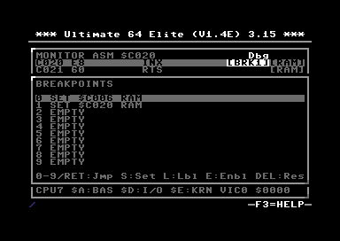

===================== ==================================================
Key                   Action
===================== ==================================================
``Up``/``Down``       Select a slot
``Return``            Jump to the selected slot
``0``..\ ``9``        Jump directly to that slot
``S``                 Store the current address into the selected slot
``L``                 Change the label, up to 4 characters
``E``                 Enable or disable the slot
``DEL``               Clear the slot
``RUN/STOP``          Close the popup
===================== ==================================================

Jumping to a slot also restores the CPU view bank the breakpoint was set in.

Two address ranges cannot hold a breakpoint or a step landing site, and using them is refused with ``PATCH FAILED``:
``$0314``-``$0319`` holds the vectors the debugger redirects, and ``$035D``-``$03FB`` holds its handler and register
store. Data kept from ``$0340`` upwards does not survive a debugging session.

A breakpoint can be valid but invisible to the running program. Setting one in a source the live banking does not map
reports ``BRK <target>, CPU <current>; not mapped now``: the breakpoint only fires once the program banks
``<target>`` in.

Where the Debugger Can Stop
~~~~~~~~~~~~~~~~~~~~~~~~~~~

Every step lands on the architecturally correct next instruction, with the registers, flags, stack pointer, and
memory effects an undebugged run would have produced. What is available depends on where the program counter is, and
on whether the debugger already holds a captured CPU state.

======================================== ============================================ =========================
Program counter is in                    Without a captured CPU state                 With a captured CPU state
======================================== ============================================ =========================
Plain RAM, or I/O space                  All commands                                 All commands
RAM under a ROM window                   Step Over only                               All commands
Visible BASIC, KERNAL, or character ROM  Step Over of a ``JSR`` only                  All commands
======================================== ============================================ =========================

To capture a CPU state, set a breakpoint and press ``G``, or Step Over a ``JSR``. From then on every command works in
every region. Where a command is refused, the status row says ``run to a breakpoint 1st``.

Messages
~~~~~~~~

============================================== ==============================================================================
Message                                        Meaning
============================================== ==============================================================================
``Step Into: run to a breakpoint 1st``         No CPU state is captured yet. Set a breakpoint and press ``G``
``UNSAFE TARGET``                              The instruction at the program counter is a ``BRK``
``UNSUPPORTED OPCODE``                         The instruction to step is an undocumented opcode
``NOT IN SUBROUTINE``                          Step Out found no active call frame
``NO FREE BRK SLOT``                           All ten breakpoint slots are in use
``PATCH FAILED``                               The address falls in a range the debugger reserves
``DEBUG TIMEOUT``                              No breakpoint was reached within the run budget
``DEBUG CANCELLED``                            A run was abandoned from the keyboard
``DEBUG NOT SUPPORTED``                        The hardware cannot do this, for example a ROM breakpoint on a cartridge
``DEBUG IN USE``                               Another front end owns the debugger
============================================== ==============================================================================

Debug Help
~~~~~~~~~~

``F3`` or ``?`` shows the Debug help screen while Debug is active. It uses the same three blocks as the ordinary
help: the Debug commands first, then the monitor commands that still work while debugging, then the keys that need
``C=`` or a named key. Keys Debug takes over are shown with their Debug meaning, so ``P`` reads as a breakpoint
rather than Poll.

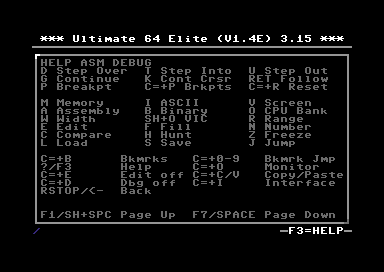

Leaving Debug and Interrupts
~~~~~~~~~~~~~~~~~~~~~~~~~~~~

Leaving Debug hands the CPU back to a live runtime, with everything the debugger patched restored. Interrupt state on
resume follows the banking of the resumed program: a program running with KERNAL mapped resumes with interrupts
enabled, so the jiffy clock, cursor, and keyboard stay alive, while a program running with KERNAL banked out resumes
with interrupts left masked, because there is no KERNAL handler for them.

To keep a deliberately disabled-interrupt state, such as a raster effect between ``SEI`` and ``CLI``, set a
breakpoint past the critical section and use ``G`` rather than leaving Debug inside it.

Hardware Support and Limits
~~~~~~~~~~~~~~~~~~~~~~~~~~~

============================================= ================================= =============================================
Capability                                    Ultimate 64                       Ultimate-II / II+ cartridge
============================================= ================================= =============================================
Breakpoints and stepping in C64 RAM           Yes                               Yes, where the code is in writable RAM
Breakpoints in BASIC, KERNAL, character ROM   Yes, volatile ROM-image patch     Not available, C64 ROM is read-only
Per-row memory source tag                     Yes                               Not available, rows are tagged ``[CPU]``
CPU bank selection with ``O``                 Yes                               Not available
============================================= ================================= =============================================

Further limits:

-  Conditional breakpoints, watchpoints, and execution history are not supported.
-  Execution stops between instructions only.
-  On the cartridge, a step is launched by pulsing the cartridge NMI line. A C64 Ultimate host does not forward that
   line to its internal 6510, so a cartridge plugged into one does not step; in a real C64 it does.

File I/O
--------

-  ``L``: load a file into memory.
-  ``S``: save memory to a file.

Files may exist directly in the Ultimate filesystem or inside a disk image such as ``.D64``.

Load
~~~~

Load is a two-step flow:

1. Pick a file.
2. Enter load parameters.

In the file picker, select an existing file by pressing ``ENTER`` on it, then choosing ``Select`` from the context-sensitive menu.

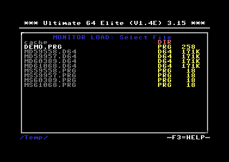

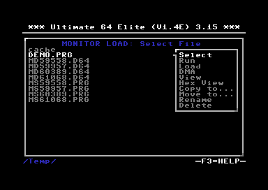

Load syntax:

.. code:: text

   [PRG|AAAA],[Offset],[Len|AUTO]

Default:

.. code:: text

   PRG,0000,AUTO

This loads the whole file to the start address stored in its first two bytes.

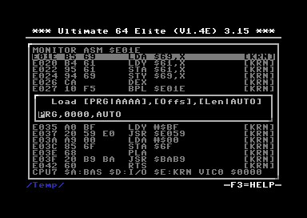

Fields:

+---------------------+---------------------------------------------------------------------------------+
| Field               | Meaning                                                                         |
+=====================+=================================================================================+
| ``PRG`` or ``AAAA`` | Use the two-byte load address from the PRG file, or load to an explicit address |
+---------------------+---------------------------------------------------------------------------------+
| ``Offset``          | Number of bytes to skip after the PRG header                                    |
+---------------------+---------------------------------------------------------------------------------+
| ``Len`` or ``AUTO`` | Load the automatically determined length, or load an explicit byte count        |
+---------------------+---------------------------------------------------------------------------------+

Examples:

+--------------------+---------------------------------------------------------+
| Input              | Meaning                                                 |
+====================+=========================================================+
| ``PRG``            | Load a PRG to its embedded load address                 |
+--------------------+---------------------------------------------------------+
| ``0801``           | Load to ``$0801``                                       |
+--------------------+---------------------------------------------------------+
| ``PRG,1000``       | Skip ``$1000`` bytes after the PRG header               |
+--------------------+---------------------------------------------------------+
| ``0801,0002,0010`` | Load ``$0010`` bytes from offset ``$0002`` to ``$0801`` |
+--------------------+---------------------------------------------------------+

Save
~~~~

Save is a two-step flow:

1. Enter the byte range to save.
2. Pick or create the destination file.

Save syntax:

.. code:: text

   0800-9FFF

The range is inclusive. Save writes a normal PRG file with a two-byte load address header.

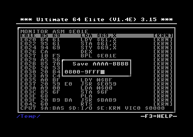

In the file picker, pick an existing file to overwrite it, or choose ``<< Create new file >>`` to write a new file:

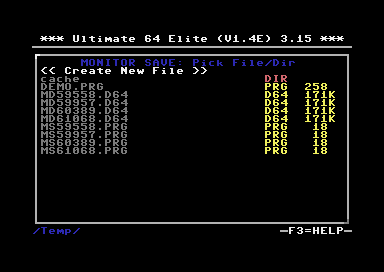

Selecting ``<< Create new file >>`` prompts for the new file name:

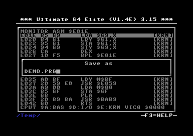

Bookmarks
---------

The monitor has 10 persistent bookmark slots.

-  List bookmarks with ``C=+B``.
-  Jump directly to a slot with ``C=+0`` .. ``C=+9``.

Each bookmark stores:

-  Label
-  Address
-  View ID
-  View width or width mode where applicable
-  CPU bank
-  VIC bank

Bookmark popup controls:

=============== =================================================
Key             Action
=============== =================================================
``Up``/``Down`` Select a slot
``Return``      Restore the selected slot
``S``           Store the current location into the selected slot
``L``           Edit the label
``DEL``         Reset the slot to its default
``0``..\ ``9``  Jump directly to that slot
=============== =================================================

Default slots are aimed at common C64 locations:

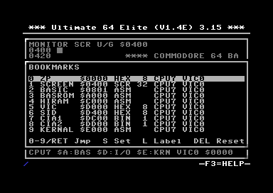

Additional Notes
----------------

Use **UI Freeze** mode when the monitor output must be captured in the video stream.

Use **UI Overlay on HDMI** mode when polling is needed to observe live changes.

To switch between UI Freeze and UI Overlay modes:

1. Exit the monitor.
2. Press ``C=+I``.
3. Reopen the monitor.
