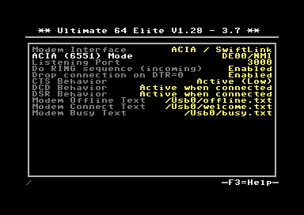

Modem support
=============

Introduction
------------

Starting from version 3.7, a lightweight modem emulation layer is provided
in the firmware of the Ultimate. This modem layer is accessible through an
emulated MOS 6551 ACIA chip. This chip was found in the SwiftLink
cartridge, as well as some other ACIA based RS-232 cartridges of the time.
This ACIA chip provides a virtual serial port to the C-64, which is accessed
through the I/O space.

The modem emulation layer bridges the ACIA chip and the LAN port. The modem
connects to a server (e.g. one that is running a bulletin board system) through the internet. 

Configuration
-------------

In order to use the modem emulation layer, the ACIA needs to be enabled in the configuration menu
of the Ultimate application. Secondly, a the terminal program needs to be used to access the serial port, e.g. CCGMS.

An example configuration could be:

**Please observe I/O range conflicts, this is *not* enforced by the Ultimate application.**

Once the ACIA chip is enabled in the I/O space, a terminal program can be started and configured. For example, the configuration of CCGMS will be shown here:

Note that CCGMS uses the NMI line, and the SwiftLink is configured at $DE00. This corresponds to the setting made in the Ultimate configuration menu.

**Again: Please observe I/O range conflicts, this is *not* enforced by the Ultimate application. If you are getting wrong characters in your terminal program, you likely have an I/O conflict. For instance, Retro Replay has registers at $DE00, and will therefore conflict with the ACIA at $DE00.**

Modem Commands
--------------

The lightweight modem emulation supports a subset of the standard Hayes modem commands. These commands start with 'AT'.

.. list-table::
 :header-rows: 1

 * - Command
   - Description
 * - ATI
   - Identify. This command prints the modem identification text message.
 * - ATZ
   - Reset. This command resets the modem. Any existing connection will be dropped.
 * - ATH
   - Hangup. This command terminates the current connection.
 * - ATD
   - Dial. With this command an outgoing connection is initiated. The 'D' should be followed by another character, usually 'T' or 'P' for tone and pulse dialing. However, the Ultimate ignores this character. The domain name follows. The port number can be specified after a colon. This is optional; when the port number is not given, the Ultimate will attempt to connect to port 80. An example of such command is: *ATDTAFTERLIFE.DYNU.COM:6400*
 * - ATA
   - Answer. This command picks up the incoming call. This is a required command when the option 'Do RING sequence' is set to 'Enabled'. If this command is not given in time, the incoming call times out after a number of rings.
 * - ATO
   - Online. Use this command to go back to an active connection, if it was interrupted by the +++ sequence.
 * - ATV
   - Verbose mode. Recognized but ignored. Usually, such a command appears in the initialization string of a terminal program, such as StrikeTerm. It is followed by a digit.
 * - ATS
   - Register Select. With this command the so called 'S'-registers can be read and set. Not all registers are supported, but some useful registers are S0 (auto answer), S1 (ring counter), S2 (escape char) and S12 (escape time). See Hayes modem specification for more details.
 * - +++
   - Escape sequence. The actual character can be set with register S2, with defaults to '+'. When three of these characters are sent to the modem, and at least S12 'jiffies' expire (by default 50, thus one second), the modem switches to command mode, but the existing connection remains active. A command such as ATH can then be given.

Incoming connections
--------------------

Incoming connections are also supported. This enables you to run a simple
server on your C64, or maybe even a BBS! In the configuration can be seen that port 3000 is selected for incoming connections. When an external node on the network attempts to connect to TCP port 3000 of the Ultimate, this is recognized as an incoming connection. Depending on the current state of the modem, the following will happen:

.. list-table::
 :header-rows: 1

 * - State
   - Behavior
 * - Offline
   - When DTR=0, it is assumed that the modem software is not running. This happens when the ACIA is not configured and thus not enabled. In this case, the connecting party will receive a message, which is defined by the file specified in the configuration (default: */Usb0/offline.txt*). If this file does not exist, the default message **Modem Software is currently not running...** is answered.
 * - Busy
   - When the modem is currently already in a call, thus the modem has an active connection, the connecting party will receive a message, which is defined by the file specified in the configuration (default: */Usb0/busy.txt*). If this file does not exist, the default message **The modem you are connecting to is currently busy.** is answered.
 * - Ready
   - The modem is configured and the software is ready to accept a call. In this case, the connecting party will receive a message, which is defined by the file specified in the configuration (default: */Usb0/connect.txt*). If this file does not exist, the default message **Welcome to the Modem Emulation Layer of the Ultimate!** is answered. Following this message the RING sequence will begin (if enabled in the configuration). This means that the terminal program will receive 'RING' messages, which it needs to answer with 'ATA' to answer.
   
Note, that when the filename is set to an empty string, the message is suppressed; thus no message is being answered to the calling party.

Handshaking
-----------
In the configuration, the state of handshake lines that the terminal program 'sees' can be set. The state of these handshake lines are set when a connection is established or terminated. At these moments, the Ultimate will read the configuration and set the handshake lines accordingly. By default CTS is always active, and DCD and DSR are only active during an active connection.

