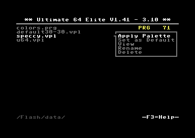
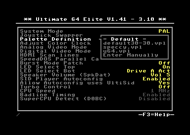

Ultimate 64 Color Palette
-------------------------

Starting from U64 core version 1.41, which comes with application firmware 3.10, the color palette has become programmable. The definition of the color palette tales place through a file with RGB values. It follows the standard that has been implemented for VICE as well, by means of .VPL files.

Loading a Palette
=================
As with many other file types, VPL files are recognized as palette files in the file browser. The context menu of a VPL file shows that it can be loaded as a palette, by showing "Apply Palette":

When using the second option, "Set as Default", the VPL file will be copied to the **/flash/data** directory. The filename -- truncated if necessary -- will be stored into the configuration. Once the VPL files are in the **/flash/data** directory, they can be selected in the configuration menu (F2), under "U64 Specific Settings":

File Format
===========
A VPL file consists of 16 valid lines with color data. Empty lines, or lines that start with '#' are ignored. A valid line has three HEX values, separated by a space. A forth value, the dither value, which is defined in VICE has no effect on the U64. Note that the lines are in the order of the Commodore color codes, thus starting with black, then white, red, cyan, and so forth. An example of a VPL file is::

  #
  # VICE Palette file
  #
  # Syntax:
  # Red Green Blue (Dither)
  #
  00 00 00 # Black
  EF EF EF # White
  8D 2F 34 # Red
  6A D4 CD # Cyan
  98 35 A4 # Purple
  4C B4 42 # Green
  2C 29 B1 # Blue
  EF EF 5D # Yellow
  98 4E 20 # Orange
  5B 38 00 # Brown
  D1 67 6D # Pink
  4A 4A 4A # Dark Grey
  7B 7B 7B # Medium Grey
  9F EF 93 # Light Green
  6D 6A EF # Light Blue
  B2 B2 B2 # Light Grey
  

