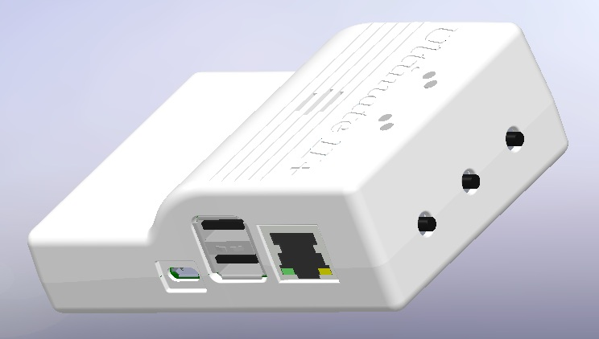
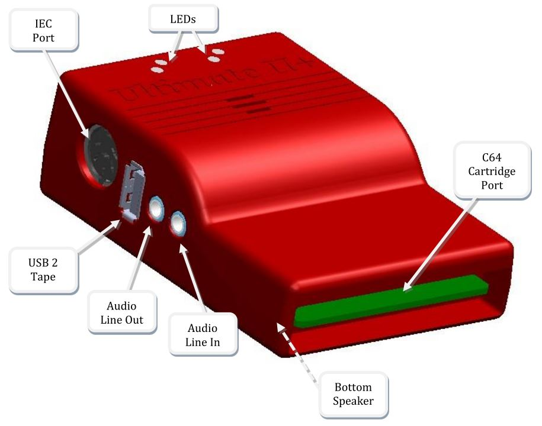

Quick guide to the Ultimate-II+
_______________________________

Thank you for purchasing the “Ultimate-II+” cartridge: The versatile
storage solution for your Commodore 64 computer. Although the
installation and use of the Ultimate-II+ are designed to be intuitive,
this quick guide shows you the basic functions.

Installation
============

1) Take a USB stick, and use a PC or Mac to transfer your favorite
   floppy disk images (.D64 or .G64 files), tape archives (.T64 files),
   tape images (.TAP files), Amiga MOD files, SID music (.SID files), or
   separate programs (.PRG files) to this USB stick.

2) Insert the USB stick into one of the available USB slots on the
   Ultimate-II+.

3) Take the Ultimate-II+, and carefully slide it into the cartridge slot
   of your C=64. Connect the supplied serial cable between the serial
   port connector to the serial port of the computer. In case you want
   to use a configuration with a real drive, connect the computer to the
   drive first and then use the feed through of the drive to attach the
   Ultimate-II+ as the last device in the chain.

Ports and buttons
=================

    

Concept of operation
====================

The main feature of the Ultimate-II+ is a cycle accurate implementation
of the Commodore 1541 Floppy Disk Drive. This part of the Ultimate-II+
cartridge thus acts exactly like a real drive. It is not any faster or
any slower than a real floppy disk drive.

Just like a real 1541 disk drive, the Ultimate-II+ needs “floppy disks”.
On the Ultimate-II+, these floppy disks are *virtual*. These virtual
disks exist in the form of a .D64 or .G64 file on a storage device, such
as the supplied USB stick. When the user selects such a file, it is
linked to the emulated drive. This process is called *‘mounting’*. After
mounting (which will take a few seconds to complete), the 1541 can
access the image file as if it was a real floppy. All standard commands
that you are familiar with while using a real CBM1541 then apply.

The Menu
========

The Ultimate-II+ provides a user friendly menu driven interface, which
can be accessed by pressing the middle button on the back of the
cartridge. Pressing this button will interrupt the currently running
program on the C=64 and show the menu. Leaving the menu will resume the
C=64 gracefully. The main two functions of the menu are: 1) file
selection, 2) configuration of the 1541 Ultimate cartridge.

The menu starts with showing the available network interfaces, and the
storage devices that are attached to the cartridge. By default, it will
only show the built-in Ethernet port. When USB-sticks are inserted, one
or more items will appear in this list. This screen is the ‘root’ of the
file system. Use the cursor keys to navigate through the file system and
select your file (disk image) to mount. The highlighted line shows the
current selection.

Use the keyboard as follows:

============= ========
Key           Function
============= ========
CRSR up/down  Move the cursor (highlighted line) up/down
CRSR left     Go one level up (leave directory or disk)
CRSR right    Go one level down (enter directory or disk)
Return        Bring up a context menu with actions to be performed on the selected item.
F1            Page up
F7            Page down
F5            Bring up a menu with actions to be performed.
F2            Enter the setup menu
F3            Shows the HELP-text
Space         Select / deselect entries in the file browser for copying.
C=C / C=V     Can be used to copy files between locations, just like in Windows.
              Be aware that file copy is a lot slower than on a modern PC.
RUN/STOP      Leave the menu.
*Quick seek:* Use the keyboard to type the name to search for. You can use ‘?’ as a wildcard.
============= ========

More about mounting disks
=========================
Remember that ‘mounting’ a disk means creating a link between the 1541
part of your ultimate cartridge, and a file on a storage device. This
means, that when the link has been established, “writes” that the 1541
performs will be written back into the disk image file as well. In this
way, the ‘real’ behavior of a floppy is emulated.

This behavior will not always be what you want. There are two options to
avoid this: ‘mount’ the floppy as read-only, or ‘mount’ the floppy in
‘unlinked’ mode. When write protected, the drive itself cannot write to
the floppy. In unlinked mode, the writes to the floppy are performed,
but do not reflect in the .D64 or .G64 file. When the storage device is
removed, the 1541 drive automatically switches to unlinked mode. Be
aware that writes to the disk will then be lost when you turn off the
machine.

LEDs
====
The Ultimate-II+ has four LEDs that are visible on the outside of the
plastic case:

a. Green: 1541 drive power

b. Red: 1541 drive status

c. Yellow: Cartridge active

d. Green: Storage activity

The drive power LED has four states:

-  Off: The drive is not powered

-  Dim: Powered, but no disk mounted

-  Half bright: Powered and disk mounted, motor off

-  Bright: Powered, disk mounted and motor running.

Cartridge Emulation
===================
Because the Ultimate-II+ will occupy your cartridge slot, a list of
popular expansions available for the C=64 are integrated into the
Ultimate-II+. These expansions include cartridges such as the Action
Replay, Retro Replay, The Final Cartridge III, Super Snapshot V5, KCS
Power Cartridge and the Epyx fastloader. In the configuration menu, even
the CBM1750/1764 RAM Expansion unit can be enabled, with expansion RAM
up to 16 MB!

Many of these cartridges have a reset button and a freezer button. This
is the function of the other two buttons on the Ultimate-II+. By
default, the left button is the freezer button, and the button on the
right is the reset-button. Through the configuration menu, the buttons
can be swapped if desired.

Configuration
=============
As mentioned above, you can enter the configuration menu by pressing
‘F2’ while you are in the menu structure. This will bring up a screen
with the following items:

-  Clock Settings

-  Audio Output Settings

-  Software IEC settings

-  C64 and cartridge settings

-  User Interface Settings

-  1541 Drive Settings

-  Network Settings

Use the UP/DOWN cursor keys to navigate and RIGHT to enter the desired
configuration screen. Once inside a settings screen, the behavior of the
keyboard is slightly different:

=============   ========
Key             Function
=============   ========
CRSR up/down    Move the cursor (highlighted line) up/down
CRSR left/right Increase or decrease a setting, cycling through the available options.
DEL             Go one level up
Return / Space  For string fields: bring up a text entry box
                For enumerated fields: bring up a context menu with the available options

Run-stop [#]_   *Leaves* the configuration menu and saves the new values.

Note that some values will only take effect after reset or a power cycle
of your C=64. However, the main menu provides a way to restart the 1541
and the C=64 with the new settings.

Ethernet
========
Some of you may be familiar with the RR-net solution that brings
Ethernet to the C-64. Currently, the built-in Ethernet port does *not*
provide RR-net compatibility. However:

The Ethernet port is used natively by the firmware. There is some
primitive support for file-transfer using FTP (needs improvement), and
it is possible to connect to the Ultimate-II+ using a VT-100 terminal
program on the Telnet port (port 23). This gives the possibility to
control the machine remotely, and swap disks without actually
interrupting the program running on the C-64.

USB support
===========
The Ultimate-II+ supports most USB sticks and Flash card readers out of
the box. It also supports USB 2.0 Hubs. It is recommended to use powered
USB hubs only (with an external power supply). USB 1.1 Hubs are *not*
supported.

There are three USB 2.0 ports available on the cartridge; two on the
right and one on the left side. Please note that the port on the left is
**not** a USB 3.0 port. Although you may use this port as a 2.0 port, it
is not USB 3.0 compliant. The extra signals on a USB 3.0 connector are
used to communicate with the tape port (see below). **Please do not
attempt to attach a USB 3.0 device to the blue USB connector on the
Ultimate-II+.** You may safely use a USB 3.0 device on the *right* side
of the cartridge.

File Systems
============
Currently, the Ultimate-II+ supports the FAT16/FAT32 file system on any
storage device, and the ISO9660/Joliet on CD/DVD ROM drives, or ISO
files. It is able to read D64 files, as well as D71 and D81 files (no
partitions), T64 files.

DMA loads
=========
The Ultimate-II+ is capable of loading files directly through the
cartridge port into the memory of your C=64. This is called DMA load.
The menu supports loading files of the .PRG type only. It doesn’t matter
if the PRG is located on the FAT/ISO file system, or inside a disk image
(.D64), or inside a tape archive (.T64). Be aware that a lot of programs
inside a .D64 file require that the rest of the disk is mounted in the
drive. For those programs, use the ‘Mount & Run’ command.

Tape Support
============
The Ultimate-II+ is capable of emulating a cassette tape deck
(CBM1530/1531). To use this function, a special adapter set connects the
Ultimate-II+ to the tape port of your C=64 computer. This tape adaptor
set can be purchased separately.

In order to play a tape, browse in the menu to a .TAP file, and press
enter and select “Play Tape” from the popup menu. This will initialize
the tape streamer from the start of the tape. Use functions in the main
menu (F5) to pause/resume playback. It is also possible to write the
.TAP file to a real tape, using a CBM1530/1531 deck.

The Ultimate-II+ can also capture tape signals into a .TAP file. The
‘F5’ menu will show you the available options.

Audio
=====
The green audio connector on the left side of your device provides a
stereo line-out signal. In the configuration menu, it can be selected
what is routed to the output channels. Available options include:

-  Stereo SID;

-  Ultimate Audio module (for playing samples);

-  Tape read/write pins (for listening to the tape beeps);

-  Drive sounds.

Technical note: The emulated stereo SID is taking the CPU writes from
the cartridge slot. Unfortunately, there is no way to tell whether the
access is made to the I/O region ($D400-$D7FF), or to the RAM below. The
necessary signal to differentiate between the two accesses is simply not
available on the cartridge port. For this reason, when software uses the
RAM in this area, it is possible that you will hear unintended clicks
and pops, or even notes.

The blue line-in connector is not yet used at this point.

Ultimate Audio module
---------------------
The Ultimate Audio module provides 8 simultaneous sampling voices. This
module is utilized as part of the Ultimate-II+ firmware for playing
Amiga MOD files. This option is available in the context menu in the
file browser.

If you like to do some programming yourself using this sampler, you can
enable this module in configuration menu. It then appears in the I/O
region. The programming interface is fully documented. Documentation can
be downloaded from the official website:

http://1541ultimate.net/content/download/ultimate_audio_v0.2.pdf

Alternate ROMs
==============
The Ultimate-II+ allows you to use other ROMs for both the emulated 1541
drive, as well as the built-in Kernal ROM of your machine. These ROMs
are resident (remembered) by the Ultimate-II+ once they are loaded from
the file system.

In order to use an alternate ROM, browse in the file system to the
binary ROM file that you like to use. The file should have the ‘.bin’ or
‘.rom’ extension. When you press enter, and the file is of the correct
size, the option will appear: “Use as..”. Kernal ROMs should be exactly
8K, and drive ROMs should be exactly 16K or 32K.

NOTE: When you use an invalid file as Kernal replacement, the C64 will
no longer boot. However, even when the C64 gives a black screen, you can
still enter the configuration menu in order to disable the Kernal
replacement option.

Software IEC
==============
The Software-IEC module is a serial bus service that can be enabled in
the configuration menu. This module provides two additional devices on
the Commodore serial bus; the IEC bus:

-  Virtual drive that gives direct access to the Ultimate-II+ file
   system;

-  A virtual printer

Printer
-------
The virtual printer is a valuable contribution created by René Garcia.
It takes printer commands from the Commodore 64, and creates a black and
white image of the printed graphics and text. This image is then saved
to the USB flash drive. The full documentation of the printer emulation
and all of its capabilities and options is available here:

http://1541ultimate.net/content/download/mps_printer_emulation.pdf

Virtual drive
-------------
The virtual drive can only be used to access files of the file system,
through the OPEN/CLOSE commands on the IEC bus. By default, the path of
the IEC drive is ‘/Usb0’, which is the top most USB connector on the
right of the unit. This default path can be changed in the configuration
menu. When the USB drive contains a program ‘TEST.PRG’, it can be loaded
with the basic command LOAD"TEST.PRG",10. Similarly, you can save your
programs with the SAVE command. When loading the directory (LOAD
"$",10), the path will be shown as disk name.

The command channel 15, can currently only be used to change the current
directory. Just like on modern systems, “..” is the parent directory and
“/” is the root directory:

OPEN 15,10,15,"CD:/USB1/MYPROGRAMS":CLOSE 15

At this point, the virtual drive is not JiffyDOS compliant.

Ultimate Command Interface
==========================
Since some time, it has become possible to control the Ultimate-II+
programmatically through the I/O port of the C64, thus from a program
that runs on the machine. This is useful for many things; for example it
can be used to access the file system much faster than through the
serial bus. But it can also be used to load files from the file system
into REU memory for example. The set of commands grows over time and
will provide more and more powerful features.

Documentation of the interface itself is available here:

http://1541ultimate.net/content/download/command_interface_v1.0.pdf

Accessing the file system is done through the “DOS” target, which is
documented here:

http://1541ultimate.net/content/download/ultimate_dos_v1.0.pdf

Real Time Clock
===============
For getting correct time stamps on the files that are created on the USB
pen drives, the Ultimate-II+ offers a real time clock (RTC) function.
This RTC can be set through the configuration menu.

The RTC is powered by a CR2032 battery, which is located inside of the
unit. Calculations show that the lifetime of this battery is several
years.

Social Media
============
For quick answers to many questions regarding your device, you may be
interested to join the the Facebook group “1541 Ultimate”.

Firmware Updates
================
In order to update the firmware, you will need a file with the “.U2P”
extension. Such a file can be found in the ‘.zip’ archives found in the
download section of the http://1541ultimate.net website, after logging
on to the site.

Procedure: Use the Ultimate-II+ file browser to find the .U2P file.
Press ENTER, and the option “Run Update” will appear. Select this option
and follow the instructions, if any. After running an update, the unit
will reset itself completely after about a minute, without any
notification. This is normal behavior.

When, for some reason, the update has failed and corrupted the Flash
chip; you can start the “Recovery Mode”, by holding the middle button
while powering on the unit. In the recovery mode, not all features are
available, but the “Run Update” feature should work.

Disclaimer
==========
The ‘firmware’ on your Ultimate-II+ board consists of a rather large
number of functional parts that all work together. Although an insane
number of hours have been put into testing and improving the firmware
and software, I am very certain that it still has bugs. Some testing
work still needs to be done. The device will be improved further as time
passes. Check the download section at the website for the newest
firmware version. We believe in the end this will sure be the ‘ultimate’
storage solution for your 8-bit Commodore computer.

Known issues
============
-  The processing speed of the Ultimate-II+ is currently (V3.2) still
   quite a bit lower than the Ultimate-II. This is because the
   Ultimate-II+ platform does not have instruction/data caches still on
   its embedded processor. The lower speed may cause some situations in
   which the unit appears to hang, while it is just busy. For example,
   when the unit is trying to find a free sector on a large USB stick
   (and note: even 8 GB is already huge!), it may take up to half a
   minute or so, before the first file can be written, or the first
   directory can be created. Similarly, when using the printer
   emulation, the conversion from a bitmap image to a PNG file can take
   quite some time. This may be solved in a future software upgrade.

Other issues can be found (and reported) here:

http://1541ultimate.net/content/index.php?option=com_issueform&Itemid=24

.. [1]
   On VT-100, use backspace instead of RUN STOP
