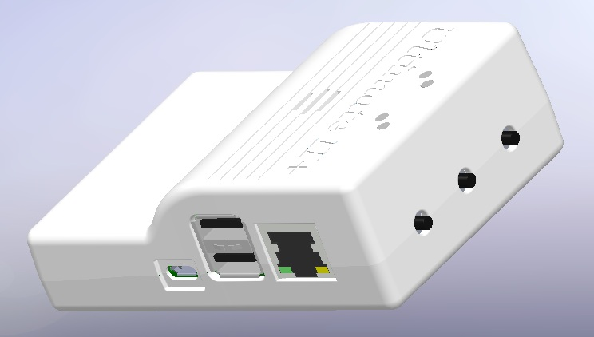
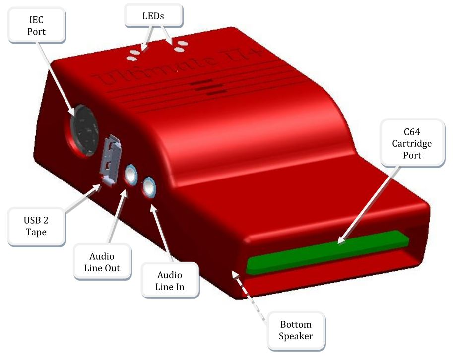

Kurzanleitung für das Ultimate-II+
____________________________________

Vielen Dank für den Kauf des „Ultimate-II+“-Moduls: der vielseitigen
Speicherlösung für Ihren Commodore-64-Computer. Obwohl Installation und
Verwendung des Ultimate-II+ möglichst intuitiv gestaltet sind, zeigt
diese Kurzanleitung die grundlegenden Funktionen.

Installation
============

1) Nehmen Sie einen USB-Stick und übertragen Sie mit einem PC oder Mac
   Ihre bevorzugten Disketten-Images (.D64- oder .G64-Dateien),
   Tape-Archive (.T64-Dateien), Tape-Images (.TAP-Dateien), Amiga-MOD-Dateien,
   SID-Musik (.SID-Dateien) oder einzelne Programme (.PRG-Dateien) auf
   diesen USB-Stick.

2) Stecken Sie den USB-Stick in einen der verfügbaren USB-Anschlüsse des
   Ultimate-II+.

3) Nehmen Sie das Ultimate-II+ und schieben Sie es vorsichtig in den
   Modulschacht Ihres C=64. Verbinden Sie das mitgelieferte serielle
   Kabel zwischen dem Anschluss des seriellen Ports und dem seriellen
   Port des Computers. Falls Sie eine Konfiguration mit einem echten
   Laufwerk verwenden möchten, verbinden Sie zuerst den Computer mit dem
   Laufwerk und nutzen Sie dann den Durchschleifanschluss des Laufwerks,
   um das Ultimate-II+ als letztes Gerät in der Kette anzuschließen.

Anschlüsse und Tasten
=====================

Funktionsprinzip
================

Das Hauptmerkmal des Ultimate-II+ ist eine taktgenaue Implementierung
des Commodore-1541-Diskettenlaufwerks. Dieser Teil des Ultimate-II+-Moduls
verhält sich daher genau wie ein echtes Laufwerk. Es ist weder schneller
noch langsamer als ein echtes Diskettenlaufwerk.

Genau wie ein echtes 1541-Diskettenlaufwerk benötigt das Ultimate-II+
„Disketten“. Auf dem Ultimate-II+ sind diese Disketten *virtuell*. Diese
virtuellen Disketten liegen in Form einer .D64- oder .G64-Datei auf
einem Speichermedium vor, zum Beispiel auf einem USB-Stick. Wenn der
Benutzer eine solche Datei auswählt, wird sie mit dem emulierten
Laufwerk verknüpft. Dieser Vorgang wird *„mounten“* genannt. Nach dem
Mounten (was einige Sekunden dauern kann) kann das 1541 auf die
Image-Datei zugreifen, als wäre sie eine echte Diskette. Danach gelten
alle Standardbefehle, die Sie vom Einsatz einer echten CBM1541 kennen.

Falls erforderlich, kann das Laufwerk auch in den 1571- oder 1581-Modus
geschaltet werden. Das geschieht automatisch, wenn die entsprechenden
Dateitypen ausgewählt werden: Wenn Sie eine .D71- / .G71-Datei mounten,
wird der Benutzer aufgefordert, den Betriebsmodus auf 1571 zu ändern.
Entsprechend wechselt das Laufwerk bei .D81-Dateien in den 1581-Modus.

Das Menü
========

Das Ultimate-II+ bietet eine benutzerfreundliche, menügesteuerte
Oberfläche, die durch Drücken der mittleren Taste auf der Rückseite des
Moduls aufgerufen werden kann. Durch Drücken dieser Taste wird das
aktuell auf dem C=64 laufende Programm unterbrochen und das Menü
angezeigt. Beim Verlassen des Menüs wird der C=64 ordnungsgemäß
fortgesetzt. Die beiden Hauptfunktionen des Menüs sind:
1) Dateiauswahl, 2) Konfiguration des 1541-Ultimate-Moduls.

Zu Beginn zeigt das Menü Speichermedien an, die intern vorhanden oder an
das Modul angeschlossen sind, gefolgt von den verfügbaren
Netzwerkschnittstellen. Wenn USB-Sticks eingesteckt sind, erscheinen ein
oder mehrere Einträge in dieser Liste. Dieser Bildschirm ist das
„Wurzelverzeichnis“ des Dateisystems. Verwenden Sie die Cursortasten, um
durch das Dateisystem zu navigieren und Ihre Datei (Disk-Image) zum
Mounten auszuwählen. Die hervorgehobene Zeile zeigt die aktuelle
Auswahl.

Verwenden Sie die Tastatur wie folgt:

============= ========
Taste         Funktion
============= ========
CRSR hoch/runter  Bewegt den Cursor (hervorgehobene Zeile) nach oben/unten
CRSR links    Eine Ebene nach oben (Verzeichnis oder Disk verlassen)
CRSR rechts   Eine Ebene nach unten (Verzeichnis oder Disk betreten)
Return        Öffnet ein Kontextmenü mit Aktionen für den ausgewählten Eintrag.
F1            Seite nach oben
F7            Seite nach unten
F5            Öffnet ein Menü mit ausführbaren Aktionen.
F2            Öffnet das Einstellungsmenü
F3            Zeigt den Hilfetext
F4            Zeigt die aktuelle Systemkonfiguration
Leertaste     Markiert / demarkiert Einträge im Dateibrowser zum Kopieren.
C=C / C=V     Kann zum Kopieren von Dateien zwischen Orten verwendet werden,
              ähnlich wie unter Windows.
              Beachten Sie, dass das Kopieren von Dateien deutlich langsamer
              ist als auf einem modernen PC.
RUN/STOP      Verlässt das Menü.
*Schnellsuche:* Geben Sie über die Tastatur einen Namen zum Suchen ein.
              Sie können „?“ als Platzhalter verwenden.
============= ========

Mehr zum Mounten von Disketten
==============================
Denken Sie daran, dass das „Mounten“ einer Diskette bedeutet, eine
Verknüpfung zwischen dem 1541-Teil Ihres Ultimate-Moduls und einer Datei
auf einem Speichermedium herzustellen. Das bedeutet, dass nach dem
Herstellen dieser Verknüpfung auch „Schreibvorgänge“, die das 1541
ausführt, in die Disk-Image-Datei zurückgeschrieben werden. Auf diese
Weise wird das „echte“ Verhalten einer Diskette emuliert.

Dieses Verhalten ist nicht immer erwünscht. Es gibt zwei Möglichkeiten,
dies zu vermeiden: die Diskette schreibgeschützt zu „mounten“ oder sie
im „unlinked“-Modus zu „mounten“. Ist sie schreibgeschützt, kann das
Laufwerk selbst nicht auf die Diskette schreiben. Im unlinked-Modus
werden Schreibvorgänge zwar ausgeführt, aber nicht in die .D64- oder
.G64-Datei übernommen. Wird das Speichermedium entfernt, schaltet das
1541-Laufwerk automatisch in den unlinked-Modus. Beachten Sie, dass
Schreibvorgänge auf die Disk dann verloren gehen, wenn Sie den Rechner
ausschalten.

LEDs
====
Das Ultimate-II+ besitzt vier LEDs, die außen am Kunststoffgehäuse
sichtbar sind:

a. Grün: Laufwerksstromversorgung

b. Rot: Laufwerksstatus

c. Gelb: Modul aktiv

d. Grün: Speicheraktivität

Die LED für die Laufwerksstromversorgung hat vier Zustände:

-  Aus: Das Laufwerk ist nicht mit Strom versorgt

-  Gedimmt: Stromversorgung vorhanden, aber keine Disk gemountet

-  Halbhell: Stromversorgung vorhanden und Disk gemountet, Motor aus

-  Hell: Stromversorgung vorhanden, Disk gemountet und Motor läuft

Modul-Emulation
===============
Da das Ultimate-II+ Ihren Modulschacht belegt, kann eine Liste
beliebter Erweiterungen für den C=64 konfiguriert werden. Denken Sie an
Erweiterungen wie Action Replay, Retro Replay, The Final Cartridge III,
Super Snapshot V5, KCS Power Cartridge, den Epyx-Fastloader und viele
mehr. Im Konfigurationsmenü kann sogar die CBM1750/1764-RAM-Erweiterung
aktiviert werden, mit Erweiterungsspeicher bis zu 16 MB!

Informationen zur Einrichtung der Modul-Emulation finden Sie in diesem
Abschnitt :doc:`über Module <howto/cartridges>`.

Viele dieser Module besitzen eine Reset- und eine Freezer-Taste. Dies
ist die Funktion der beiden anderen Tasten am Ultimate-II+. Standardmäßig
ist die linke Taste die Freezer-Taste und die rechte Taste die
Reset-Taste. Im Konfigurationsmenü können die Tasten bei Bedarf
vertauscht werden.

Konfiguration
=============
Wie oben erwähnt, können Sie das Konfigurationsmenü durch Drücken von
„F2“ innerhalb der Menüstruktur aufrufen. Dadurch erscheint ein
Bildschirm mit den folgenden Punkten:

-  Audio-Ausgabe-Einstellungen
-  Uhr-Einstellungen
-  Speicherkonfiguration
-  Modul- und ROM-Einstellungen
-  Benutzeroberflächen-Einstellungen
-  C64- und Modul-Einstellungen
-  Laufwerk-A-Einstellungen
-  Laufwerk-B-Einstellungen
-  Software-IEC-Einstellungen
-  Kassetten-Einstellungen
-  Drucker-Einstellungen
-  Modem-Einstellungen
-  Ethernet-Einstellungen
-  WiFi-Einstellungen (nur für U2+L)
-  Netzwerk-Einstellungen

Verwenden Sie die Cursor-Tasten HOCH/RUNTER zum Navigieren und RECHTS,
um den gewünschten Konfigurationsbildschirm zu öffnen. Sobald Sie sich
in einem Einstellungsbildschirm befinden, verhält sich die Tastatur
etwas anders:

===============   ========
Taste             Funktion
===============   ========
CRSR hoch/runter  Bewegt den Cursor (hervorgehobene Zeile) nach oben/unten
\+ / \-           Erhöht oder verringert eine Einstellung und durchläuft die verfügbaren Optionen.
DEL               Eine Ebene nach oben
Return / Leertaste Für Zeichenkettenfelder: öffnet ein Texteingabefeld
                  Für Aufzählungsfelder: öffnet ein Kontextmenü mit den verfügbaren Optionen
Run-stop [#1]_    *Verlässt* das Konfigurationsmenü und speichert die neuen Werte.
===============   ========

Beachten Sie, dass einige Werte erst nach einem Reset oder dem Aus- und
Einschalten Ihres C=64 wirksam werden. Das Hauptmenü bietet jedoch eine
Möglichkeit, das 1541 und den C=64 mit den neuen Einstellungen neu zu
starten.

.. rubric:: Fußnoten
.. [#1] Auf VT-100 stattdessen Backspace statt RUN STOP verwenden

Ethernet
========
Einige von Ihnen kennen vielleicht die RR-net-Lösung, die Ethernet zum
C-64 bringt. Der eingebaute Ethernet-Port bietet derzeit *keine*
RR-net-Kompatibilität. Allerdings gilt:

Der Ethernet-Port (und die WiFi-Schnittstelle beim U2+L mit installiertem
WiFi-Modul) wird nativ von der Firmware verwendet. Es gibt eine gewisse
primitive Unterstützung für Dateiübertragungen per FTP, und es ist
möglich, sich mit einem VT-100-Terminalprogramm über den Telnet-Port
(Port 23) mit dem Ultimate-II+ zu verbinden. Dadurch lässt sich die
Maschine fernsteuern und es können Disketten gewechselt werden, ohne das
laufende Programm auf dem C-64 tatsächlich zu unterbrechen. Zusätzlich
kann das Netzwerk verwendet werden, um per Webbrowser auf das Modul
zuzugreifen und Befehle über die HTTP-basierte :doc:`API <api/api_calls>`
zu senden.

Modem-Unterstützung
===================
Ab Version 3.7 bietet die Firmware des Ultimate eine leichtgewichtige
Modem-Emulationsschicht. Diese Modemschicht ist über einen emulierten
MOS-6551-ACIA-Chip zugänglich. Dieser Chip kam im SwiftLink-Modul sowie
in einigen anderen ACIA-basierten RS-232-Modulen der damaligen Zeit zum
Einsatz.

Die Modem-Emulationsschicht verbindet den ACIA-Chip mit dem LAN-Port.
Das Modem verbindet sich über das Internet mit einem Server (zum Beispiel
einem Bulletin-Board-System). Um dies zu nutzen, muss das Modem sowohl
im Konfigurationsmenü der Ultimate-Anwendung als auch im Terminalprogramm,
zum Beispiel CCGMS, aktiviert werden. Das Modem reagiert auf Befehle wie
"ATDT", gefolgt vom Domainnamen, gefolgt von einem Doppelpunkt und der
Portnummer. Zum Beispiel:

ATDTAFTERLIFE.DYNU.COM:6400

Eingehende Verbindungen werden ebenfalls unterstützt. Dadurch können Sie
einen einfachen Server auf Ihrem C64 oder vielleicht sogar ein BBS
betreiben!

USB-Unterstützung
=================
Das Ultimate-II+ unterstützt die meisten USB-Sticks und Flash-Kartenleser
direkt. USB-2.0-Hubs werden ebenfalls unterstützt. Es wird empfohlen,
nur aktive USB-Hubs zu verwenden (mit externer Stromversorgung).
USB-1.1-Hubs werden *nicht* unterstützt.

Am Modul stehen drei USB-2.0-Ports zur Verfügung; zwei auf der rechten
und einer auf der linken Seite. Bitte beachten Sie, dass der Anschluss
auf der linken Seite **kein** USB-3.0-Port ist. Obwohl Sie diesen
Anschluss als 2.0-Port verwenden können, ist er nicht USB-3.0-konform.
Die zusätzlichen Signale eines USB-3.0-Steckers werden zur Kommunikation
mit dem Kassettenport verwendet (siehe unten). **Bitte versuchen Sie
nicht, ein USB-3.0-Gerät an den blauen USB-Anschluss des Ultimate-II+
anzuschließen.** Sie können ein USB-3.0-Gerät auf der *rechten* Seite
des Moduls gefahrlos verwenden.

Dateisysteme
============
Derzeit unterstützt das Ultimate-II+ auf beliebigen Speichermedien die
Dateisysteme FAT16/FAT32 und exFAT sowie ISO9660/Joliet auf CD/DVD-ROM-Laufwerken
oder in ISO-Dateien. Es kann D64-Dateien ebenso lesen wie D71-, D81-Dateien
(ohne Partitionen) und DNP-Dateien, einschließlich Unterverzeichnissen,
sowie T64-Dateien.

DMA-Ladevorgänge
================
Das Ultimate-II+ ist in der Lage, Dateien direkt über den Modulport in
den Speicher Ihres C=64 zu laden. Dies wird DMA-Load genannt. Das Menü
unterstützt nur das Laden von Dateien des Typs .PRG. Dabei spielt es
keine Rolle, ob sich die PRG auf dem FAT/ISO-Dateisystem, innerhalb
eines Disk-Images (.D64) oder in einem Tape-Archiv (.T64) befindet.
Beachten Sie, dass viele Programme innerhalb einer .D64-Datei verlangen,
dass der Rest der Disk im Laufwerk gemountet ist. Verwenden Sie für
solche Programme den Befehl „Mount & Run“.

Wichtig! Da der DMA-Load ein Stück Software auf dem C64 benötigt, wird
zum Ausführen des DMA ein spezielles „Loader-Cartridge“ aktiviert.
Dadurch wird das konfigurierte Modul effektiv *deaktiviert*, sodass Sie
die Speedloader-Fähigkeiten verlieren. Wenn Sie das nicht möchten,
können Sie mit aktivem Modul zur BASIC-Eingabeaufforderung gehen und
dann im Menü bei der .PRG-Datei „DMA“ auswählen. Dadurch wird das Modul
nicht aufgerufen, sondern es wird lediglich versucht, das Programm in
den Speicher zu laden. Das funktioniert allerdings nicht bei allen PRGs.

Tape-Unterstützung
==================
Das Ultimate-II+ kann ein Kassettenlaufwerk (CBM1530/1531) emulieren.
Um diese Funktion zu nutzen, verbindet ein spezielles Adapterset das
Ultimate-II+ mit dem Kassettenport Ihres C=64-Computers. Dieses
Kassetten-Adapterset ist separat erhältlich.

Um ein Band abzuspielen, navigieren Sie im Menü zu einer .TAP-Datei,
drücken Sie Enter und wählen Sie im Popup-Menü „Play Tape“. Dadurch wird
der Tape-Streamer vom Anfang des Bandes initialisiert. Verwenden Sie die
Funktionen im Hauptmenü (F5), um die Wiedergabe anzuhalten bzw.
fortzusetzen. Es ist auch möglich, die .TAP-Datei mit einem CBM1530/1531-
Laufwerk auf ein echtes Band zu schreiben.

Das Ultimate-II+ kann außerdem Kassettensignale in eine .TAP-Datei
aufzeichnen. Das „F5“-Menü zeigt Ihnen die verfügbaren Optionen.

Audio
=====
Der grüne Audio-Anschluss auf der linken Seite Ihres Geräts stellt ein
Stereo-Line-Out-Signal bereit. Im Konfigurationsmenü kann ausgewählt
werden, was auf die Ausgabekanäle geroutet wird. Zu den verfügbaren
Optionen gehören:

-  Stereo SID;

-  Ultimate-Audio-Modul (zum Abspielen von Samples);

-  Tape-Lese-/Schreibpins (zum Anhören der Kassetten-Signale);

-  Laufwerksgeräusche.

Technischer Hinweis: Der emulierte Stereo-SID übernimmt die CPU-Schreibzugriffe
vom Modulport. Leider gibt es keine Möglichkeit festzustellen, ob der
Zugriff auf den I/O-Bereich ($D400-$D7FF) oder auf den darunterliegenden
RAM erfolgt. Das notwendige Signal zur Unterscheidung dieser beiden
Zugriffe ist am Modulport schlicht nicht verfügbar. Deshalb kann es
vorkommen, dass Sie unbeabsichtigte Klicks, Knackser oder sogar Töne
hören, wenn Software den RAM in diesem Bereich verwendet.

Der blaue Line-In-Anschluss kann verwendet werden, um externes Audio mit
dem Ausgang des Ultimate-II+-Moduls zu mischen. Die separaten linken und
rechten Eingänge finden sich im Konfigurationsmenü des Audio-Mixers.

Ultimate-Audio-Modul
--------------------
Das Ultimate-Audio-Modul stellt 8 gleichzeitige Sampling-Stimmen bereit.
Dieses Modul wird von der Firmware des Ultimate-II+ unter anderem zum
Abspielen von Amiga-MOD-Dateien genutzt. Diese Option ist im Kontextmenü
des Dateibrowsers verfügbar.

Wenn Sie selbst etwas mit diesem Sampler programmieren möchten, können
Sie das Modul im Konfigurationsmenü aktivieren. Es erscheint dann im
I/O-Bereich. Die Programmierschnittstelle ist vollständig dokumentiert.
Die Dokumentation kann von der offiziellen Website heruntergeladen werden:

https://github.com/GideonZ/1541ultimate/blob/master/doc/ultimate_audio_v0.2.pdf

Alternative ROMs
================
Das Ultimate-II+ erlaubt die Verwendung anderer ROMs sowohl für das
emulierte 1541-Laufwerk als auch für das eingebaute Kernal-ROM Ihres
Rechners. Diese ROMs bleiben im Ultimate-II+ resident (also gespeichert),
sobald sie aus dem Dateisystem geladen wurden.

Um ein alternatives ROM zu verwenden, navigieren Sie im Dateisystem zu
der binären ROM-Datei, die Sie verwenden möchten. Die Datei sollte die
Erweiterung „.bin“ oder „.rom“ besitzen. Wenn Sie Enter drücken und die
Datei die richtige Größe hat, erscheint die Option „Use as..“. Kernal-ROMs
müssen genau 8 KB groß sein, Laufwerks-ROMs genau 16 KB oder 32 KB.

HINWEIS: Wenn Sie eine ungültige Datei als Kernal-Ersatz verwenden,
startet der C64 nicht mehr. Selbst wenn der C64 nur noch einen schwarzen
Bildschirm zeigt, können Sie weiterhin das Konfigurationsmenü aufrufen,
um die Kernal-Ersatzoption zu deaktivieren.

Software IEC
============
Das Software-IEC-Modul ist ein serieller Busdienst, der im
Konfigurationsmenü aktiviert werden kann. Dieses Modul stellt zwei
zusätzliche Geräte am Commodore-Serienbus, dem IEC-Bus, bereit:

-  Ein virtuelles Laufwerk, das direkten Zugriff auf das Dateisystem des
   Ultimate-II+ bietet;

-  Einen virtuellen Drucker

Drucker
-------
Der virtuelle Drucker ist ein wertvoller Beitrag von René Garcia. Er
übernimmt Druckerbefehle vom Commodore 64 und erzeugt daraus ein
schwarzweißes Bild der gedruckten Grafik und des Textes. Dieses Bild
wird anschließend auf dem USB-Flash-Laufwerk gespeichert. Die vollständige
Dokumentation der Druckeremulation mit all ihren Fähigkeiten und Optionen
ist hier verfügbar:

https://github.com/GideonZ/1541ultimate/blob/master/doc/ultimate_printer.pdf

Virtuelles Laufwerk
-------------------
Das virtuelle Laufwerk kann nur verwendet werden, um über die OPEN/CLOSE-
Befehle auf dem IEC-Bus auf Dateien des Dateisystems zuzugreifen.
Standardmäßig lautet der Pfad des IEC-Laufwerks „/Usb0“, also der
oberste USB-Anschluss auf der rechten Seite des Geräts. Dieser Standardpfad
kann im Konfigurationsmenü geändert werden. Wenn das USB-Laufwerk ein
Programm „TEST.PRG“ enthält, kann es mit dem BASIC-Befehl LOAD"TEST.PRG",10
geladen werden. Entsprechend können Sie Ihre Programme mit dem SAVE-
Befehl speichern. Beim Laden des Verzeichnisses (LOAD "$",10) wird der
Pfad als Diskname angezeigt.

Der Befehlskanal 15 kann derzeit nur verwendet werden, um das aktuelle
Verzeichnis zu ändern. Genau wie auf modernen Systemen steht „..“ für
das übergeordnete Verzeichnis und „/“ für das Wurzelverzeichnis:

OPEN 15,10,15,"CD:/USB1/MYPROGRAMS":CLOSE 15

Beachten Sie, dass das SoftwareIEC seit Version 3.11 auch das JiffyDOS-
Protokoll unterstützt. Kompatibilität der Befehle mit CMD-HD und SD2IEC
ist für Firmware 3.15 geplant.

Ultimate-Befehlsschnittstelle
=============================
Seit einiger Zeit ist es möglich, das Ultimate-II+ programmgesteuert
über den I/O-Port des C64 zu steuern, also aus einem Programm heraus,
das auf dem Rechner läuft. Das ist für viele Dinge nützlich; zum Beispiel
kann damit deutlich schneller auf das Dateisystem zugegriffen werden als
über den seriellen Bus. Es kann aber auch verwendet werden, um Dateien
aus dem Dateisystem zum Beispiel in den REU-Speicher zu laden. Der
Befehlssatz wächst im Laufe der Zeit und stellt immer mehr leistungsfähige
Funktionen bereit.

Die Dokumentation der Schnittstelle und der Befehlsziele ist hier
verfügbar:

:doc:`Dokumentation der Command Interface <uci/index>`.

Echtzeituhr
===========
Damit Dateien, die auf USB-Sticks erstellt werden, korrekte Zeitstempel
erhalten, bietet das Ultimate-II+ eine Echtzeituhrfunktion (RTC). Diese
RTC kann über das Konfigurationsmenü eingestellt werden.

Die RTC wird von einer CR2032-Batterie versorgt, die sich im Inneren des
Geräts befindet. Berechnungen zeigen, dass diese Batterie mehrere Jahre
lang hält.

Soziale Medien
==============
Für schnelle Antworten auf viele Fragen zu Ihrem Gerät könnte es für Sie
interessant sein, der Facebook-Gruppe „Ultimate 64“ beizutreten.

Firmware-Updates
================
Zum Aktualisieren der Firmware benötigen Sie eine Datei mit der Endung
„.U2P“ bzw. „.U2L“ für das Ultimate-II+L. Eine solche Datei finden Sie
in den „.zip“-Archiven im Download-Bereich der Website
http://ultimate64.com, nachdem Sie sich dort angemeldet haben.

Vorgehensweise: Verwenden Sie den Dateibrowser des Ultimate-II+, um die
.U2P- / .U2L-Datei zu finden. Drücken Sie ENTER; dann erscheint die
Option „Run Update“. Wählen Sie diese Option aus und folgen Sie den
Anweisungen, falls welche angezeigt werden. Nach dem Ausführen eines
Updates setzt sich das Gerät nach etwa einer Minute ohne weitere
Benachrichtigung vollständig zurück. Das ist normales Verhalten.

Falls das Update aus irgendeinem Grund fehlgeschlagen ist und den
Flash-Chip beschädigt hat, können Sie den „Recovery Mode“ starten, indem
Sie beim Einschalten des Geräts die mittlere Taste gedrückt halten. Im
Recovery Mode stehen nicht alle Funktionen zur Verfügung, aber die
Funktion „Run Update“ sollte arbeiten. (Nicht verfügbar auf U2+L!)

Haftungsausschluss
==================
Die „Firmware“ auf Ihrer Ultimate-II+-Platine besteht aus einer recht
großen Anzahl funktionaler Teile, die alle zusammenarbeiten. Obwohl
unglaublich viele Stunden in das Testen und Verbessern der Firmware und
Software investiert wurden, bin ich mir sehr sicher, dass sie immer noch
Fehler enthält. Einige Tests müssen noch durchgeführt werden. Das Gerät
wird im Laufe der Zeit weiter verbessert. Prüfen Sie den Download-Bereich
der Website auf die neueste Firmware-Version. Wir glauben, dass dies am
Ende tatsächlich die „ultimative“ Speicherlösung für Ihren 8-Bit-
Commodore-Computer sein wird.

Bekannte Probleme
=================
-  Die Verarbeitungsgeschwindigkeit des Ultimate-II+ ist derzeit (V3.10)
   noch deutlich geringer als die des Ultimate-II. Das liegt daran, dass
   die Ultimate-II+-Plattform auf ihrem eingebetteten Prozessor noch
   keine Befehls-/Datencaches besitzt. Die geringere Geschwindigkeit kann
   in manchen Situationen dazu führen, dass das Gerät scheinbar hängt,
   obwohl es nur beschäftigt ist. Zum Beispiel kann beim Einsatz der
   Druckeremulation die Umwandlung eines Bitmap-Bildes in eine PNG-Datei
   recht lange dauern. Dies könnte in einem zukünftigen Software-Upgrade
   behoben werden.

Weitere Probleme werden auf GitHub gemeldet und gepflegt:

https://github.com/GideonZ/1541ultimate/issues
