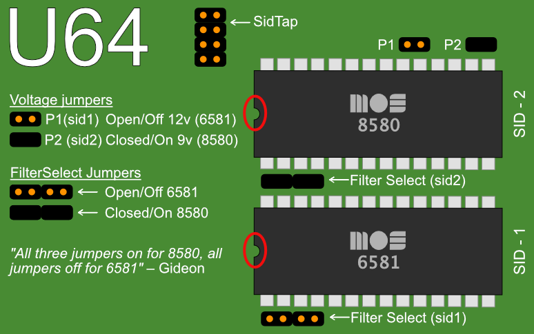

Getting Started
===============

What do I need to get started?

Prerequisites
-------------

- Ultimate 64 motherboard
- Power adapter 12V DC (included)
- A case to put your Ultimate 64 in
- A C64 keyboard
- HDMI cable or standard C64 video cable
- USB Pen drive
- Kernal ROM (extract from your Commodore 64 or download online)
- Basic ROM (extract from your Commodore 64 or download online)
- Char ROM (extract from your Commodore 64 or download online)

Optional
........
- One or two SID chips
- Keyboard risers (for the C64C model case)

Installing
----------

Mounting the Ultimate 64 in a Case
..................................

If you have a spare Commodore 64C case, or bought a new case (which is 
the C64C model as well), you will need keyboard risers. Some of these have
loose metal keyboard risers already in them, others have them mounted with pop
rivets to a metal shield. If you have the latter, it is recommended to drill
the pop rivets to get the risers loose, otherwise they will interfere with
the keyboard connector on the Ultimate 64.

A few C64C have the keyboard clipped onto the top of the case. For those you
don't need keyboard risers.

*If you buy a new case online, be aware that you will need a keyboard as well.*

If you have an older case (the breadbin model), the keyboard is mounted in the
top of the case, and therefore you don't need keyboard risers.

#. Mount the risers to your keyboard. The left can be farthest to the edge, but
   the right riser you have to mount a bit to the left of the right edge, so it 
   won't interfere with the keyboard connector.
#. There are some places online where you can find risers that are supposed to
   fit perfectly with the Ultimate 64. Here is one model that should work: 
   https://www.thingiverse.com/thing:3051450 You can 3D-print them yourself or
   ask someone to do it for you. These can be screwed directly onto the bottom
   of the case as well.
#. Set the keyboard aside for now.
#. Now gently slide the Ultimate 64 board in your case, and fit it to the right
   side of the case first. The joystick connectors should slide in easy.
#. Push it gently against the back of the case, and let the connectors on the back
   of the board fit through the holes.
#. Adjust the board so you can see the mounting holes on the bottom of the case
   through the Ultimate 64 board mounting holes.
#. Fasten the board with suitable screws. Don't tighten too much.
#. Put the keyboard in the case, and connect it to the connector to the right.
   It will only fit one way, as there are a key pin on the connector.
#. Attach the top of the case.

Accessories
...........

If you have a 3D printer, or you know someone who has, you can find many nice
accessories at thingiverse. Here are a few of them:

- `Ultimate64 Keyboard Mounting Brackets <https://www.thingiverse.com/thing:3051450>`_
- `Ultimate64 & C64 Reloaded power connector cover <https://www.thingiverse.com/thing:2882271>`_
- `Ultimate64 Multi-Button (Power Button) cap <https://www.thingiverse.com/thing:2881034>`_
- `Ultimate64 board support clips <https://www.thingiverse.com/thing:2882274>`_

Commercially available kits
...........................
If you do not have a 3D printer yourself, you may also want to take a look at these kits that
are available from Corei64 by Thomas Christoph, or the Pixelwizard Retro Shop from Thomas Koch. Both offer professional kits that make mounting of the U64
easy. Both shops have put special pages together, just for the U64, where the items are listed:

- `All Ultimate64 accessories from Corei64 <https://corei64.com/shop/index.php?route=product/search&search=ultimate%2064>`_
- `All Ultimate64 accessories from Pixelwizard <https://shop.pixelwizard.eu/en/commodore-c64/ultimate-64/>`_

- `Installation kit for 64C Corei64 <https://corei64.com/shop/index.php?route=product/product&path=65_92&product_id=195>`_
- `Installation kit for 64C Pixelwizard <https://shop.pixelwizard.eu/en/3d-printed-replacement-parts/55/ultimate-64-keyboard-mount-set-for-c64c-case?c=35>`_

- `Installation kit for breadbin Corei64 <https://corei64.com/shop/index.php?route=product/product&path=65_92&product_id=202>`_

- `New C64C cases in different colors Pixelwizard <https://shop.pixelwizard.eu/en/commodore-c64/cases/>`_

Other installation accessories, stickers and batches are available at https://www.corei64.com/shop/ or at https://shop.pixelwizard.eu/en

Connecting your Ultimate 64
...........................

Connect your Ultimate 64 to the wall and your TV/monitor. If you start with
HDMI, your TV/monitor have to be DVI capable over HDMI. You can change this to
HDMI later.

Flashing ROM
............

Before you can use your Ultimate 64, you have to flash your Kernal and Basic ROM 
to the Ultimate 64 (keep in mind that some alternative kernal ROM's removed tape routines).
Power on and wait for picture, where it explains how to do.

Basically you stick your USB drive in the back of the Ultimate 64 and push shortly on the power button
to bring up the Menu.

The ROMs has to have the suffix ``.bin`` or ``.rom``, as in mykernal.bin, mybasic.bin, mychar.bin.

#. Browse to your Kernal ROM image and press Enter.
#. Choose ``Flash as Orig. Kernal ROM``.
#. Browse to your Basic ROM image and press Enter.
#. Choose ``Flash as Orig. Basic ROM``.
#. Browse to your Character ROM image and press Enter.
#. Choose ``Flash as Orig. Character ROM``.
#. Push ``F5`` and choose ``Reboot C64``.

Real SID on Board revisions 1.1, 1.2 and 1.2a
.............................................

If you're installing real SID chips, you have to set the jumpers accordingly.
If you don't have or don't want to install SID chips you can use the built in
'UltiSID'.

::

    Voltage Jumpers:
    P1: SID 1 Voltage
    P2: SID 2 Voltage
    On/Closed: 9V (8580)
    Off/Open: 12V (6581)

    Filter Select Jumpers:
    On/Closed: 8580
    Off/Open: 6581

In Firmware revisions before V1.22, it is required to set your SID types in the Ultimate-II+ menu:

| ``Short press on power button``
| ``F2``
| ``U64 specific settings``
| Set your types at
| ``SID in socket 1``
| and
| ``SID in socket 2``

Setting the SID type in the configuration enables the bus access to the chip,
and also allows the auto-configurator to choose the right chip when playing
a SID tune with the provided player from Wilfred Bos.

Real SID on Board revisions 1.3 (U64 Elite) and 1.4
...................................................

The newer board revisions are jumperless. This means that both the voltage as well as the filter caps are selected automatically, based on the inserted SID type. For this, firmware V1.22 or later is *required*. *Do not downgrade to earlier versions on jumperless boards!*

In order to make sure that 8580 chips are never given a higher voltage than they can handle, the socket gets disabled automatically whenever an 6581 chip (which needs 12V) is detected for the first time. When the popup appears "SID changed", enter the configuration menu, and enable the socket in which the 6581 resides:

| ``Short press on power button``
| ``F2``
| ``SID Sockets Configuration``
| Enable the sockets with options:
| ``SID in socket 1``
| and
| ``SID in socket 2``

Once the chip in the socket is recognized as 6581 AND the socket is enabled, the 12V is applied. 

Pull Down Resistor
__________________

Note that in the original schematics of the C64, a so called "pull-down" resistor of 1 kΩ is placed from the audio output pin to ground. This resistor is present on the 6581-based boards, but absent on the 8580-based boards. On the jumperless U64 boards this resistor is also enabled and disabled automatically. However, you may override this in the same configuration menu. The influence is limited.

