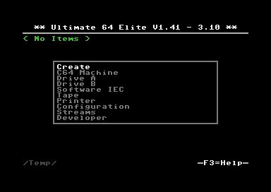

User Interface
==============

The Ultimate-64 provides a user friendly menu driven interface, which
can be accessed by pressing the multi button (power) briefly.

There are two modes in which this user interface can operate:

1. Freeze mode
2. Overlay mode

In Freeze mode, pressing the power button briefly will
interrupt the currently running program on the C=64 and
show the menu. Leaving the menu will resume the C=64 gracefully.
This mode of operation works on both PAL and HDMI outputs.

In Overlay mode, pressing the power button briefly will show
the menu in an overlayed area on the screen. The C=64 will
simply continue running, but the keyboard is switched over
to the Ultimate application, as long as this overlay screen
is visible. Pressing run-stop in the file browser, or pressing
the power button again briefly will make the overlay disappear.

The user interface has three main functions:

1. File browser
2. Configuration of the Ultimate 64 (F2)
3. Tool menu (F5)

File browser
~~~~~~~~~~~~

.. figure:: ../ultimate64-manual.assets/1536790041641.png
   :alt: 

The menu starts with showing the available network interfaces, and the
storage devices that are attached to the cartridge. By default, it will
only show the built-in Flash drive, a RAM disk for temporary file storage
and the built-in Ethernet port. When USB-sticks are inserted, one
or more items will appear in this list. This screen is the 'root' of the
file system.

.. figure:: ../ultimate64-manual.assets/1536790123244.png
   :alt: 

Use the cursor keys to navigate through the file system and select your
file (disk image) to mount. The highlighted line shows the current
selection.

F2 - configuration menu
~~~~~~~~~~~~~~~~~~~~~~~

.. figure:: ../ultimate64-manual.assets/1536790555692.png
   :alt: 

Use the UP/DOWN cursor keys to navigate and RIGHT to enter the desired
configuration screen. Once inside a settings screen, the behavior of the
keyboard is slightly different:

+-----------------------------------+-----------------------------------+
| Key                               | Function                          |
+===================================+===================================+
| CRSR up/down                      | Move the cursor (highlighted      |
|                                   | line) up/down                     |
+-----------------------------------+-----------------------------------+
| `+` / `-`                         | Increase or decrease a setting,   |
|                                   | cycling through the available     |
|                                   | options.                          |
+-----------------------------------+-----------------------------------+
| DEL / CRSR left                   | Go one level up                   |
+-----------------------------------+-----------------------------------+
| Return / Space                    | For string fields: bring up a     |
|                                   | text entry box For enumerated     |
|                                   | fields: bring up a context menu   |
|                                   | with the available options        |
+-----------------------------------+-----------------------------------+
| Run-stop                          | *Leave* the configuration menu.   |
+-----------------------------------+-----------------------------------+

Note that some values will only take effect after reset or a power cycle
of your C=64. However, the main menu provides a way to restart the 1541
and the C=64 with the new settings.

F5 - Tool / Command menu
~~~~~~~~~~~~~~~~~~~~~~~~

The purpose of the tool menu is to command the Ultimate application to do something
that is not related to the selected entry in the file browser menu. For instance, creating
a new disk image or directory is such an 'action' that can be performed using the
tool menu. Some options might appear / disappear, or be greyed out depending on the
state of the
application, or based on whether the current file browser directory is writable.
For instance, ``Create Directory`` is available only when the file browser is in
a location were directories can be created.

More information about each of the available options can be found in the description of
the Ultimate Application itself, with all of its features.

The Joystick switch on Ultimate 64 Elite boards
~~~~~~~~~~~~~~~~~~~~~~~~~~~~~~~~~~~~~~~~~~~~~~~

The Ultimate 64 Elite bords have the additional feature to swap the joystick ports. 
This feature is useful when playing different games, each one expecting the joystick
on a different port. If you have only one joystick plugged in, you can use it to change 
the port at a time.
To change the port first press the power button. Now the file selection screen will pop up.
now press the Commodore key and the "J" key on the keyboard. The Ultimate 64 Elite now will
automatically close the menu and jump back to your C64 screen. Repeat the steps above to 
again switch the port.
