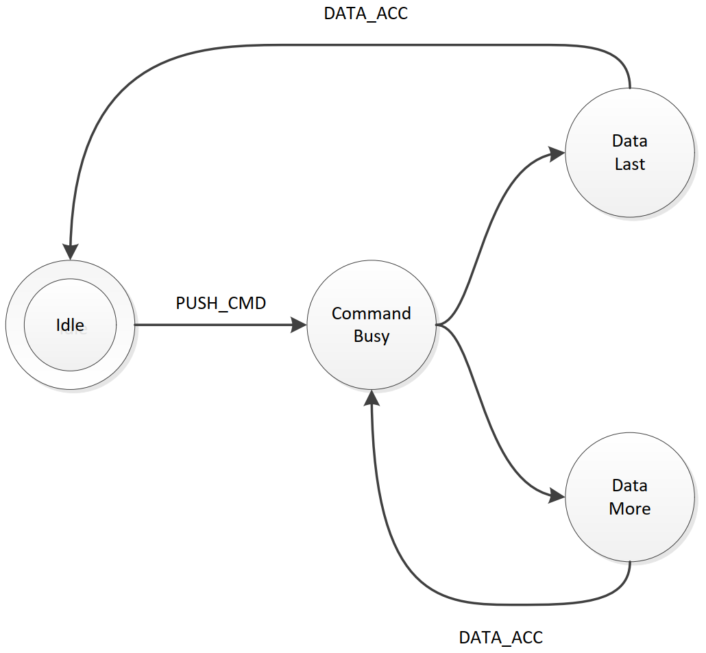

Core UCI Architecture
=====================

*Source basis: Ultimate Command Interface – Register API*

Introduction
------------

The ‘Ultimate command interface’ is a feature for the Ultimate based
products, ranging from 1541 Ultimate-II all the way to the Commodore 64
Ultimate. It implements a way to communicate to the Ultimate management
application programmatically from the Commodore 64, through the
cartridge port I/O registers.

The ‘Ultimate command interface’ is the communication layer between the
C64 on one side and functional modules of the Ultimate management
application on the other side. Such a functional module takes a command,
and returns data and status back to the user program on the C64.

There are various ‘command targets’, such as Ultimate DOS, Network,
Module Control, SoftIEC Bypass and the new HTTP client, as per firmware
version 3.15.

The ‘Ultimate command interface’ feature is accessible from the
cartridge I/O range. In this manual, the programming API is described.

Overview
--------

The transport layer of the Ultimate-II Command Interface makes use of a
register interface which is accessible through the cartridge port of the
C64. The registers are mapped into I/O space, at the address $DF1B up to
$DF1F, masking the last five registers of the RAM Expansion Unit (REU).
Mapping this small 5-byte block into the I/O space is optional, and
needs to be turned on in the ‘Command Interface’ configuration menu.

Register Overview
-----------------

The following table shows the four registers and their meaning.

+-----------------------+-----------------------+-----------------------+
| **Address**           | **Description**       | **Default**           |
+=======================+=======================+=======================+
| $DF1B                 | SoftwareIEC Bus ID    |                       |
|                       | (Read)                |                       |
+-----------------------+-----------------------+-----------------------+
| $DF1C                 | Control register      |                       |
|                       | (Write)               |                       |
+-----------------------+-----------------------+-----------------------+
| $DF1C                 | Status register       | $00                   |
|                       | (Read)                |                       |
+-----------------------+-----------------------+-----------------------+
| $DF1D                 | Command data register |                       |
|                       | (Write)               |                       |
+-----------------------+-----------------------+-----------------------+
| $DF1D                 | Identification        | $C9                   |
|                       | register (Read)       |                       |
+-----------------------+-----------------------+-----------------------+
| $DF1E                 | Response Data         |                       |
|                       | register (Read only)  |                       |
+-----------------------+-----------------------+-----------------------+
| $DF1F                 | Status Data register  |                       |
|                       | (Read only)           |                       |
+-----------------------+-----------------------+-----------------------+

Communication Protocol Basics
-----------------------------

The communication protocol is based on a state machine with four states:

- Idle
- Command Busy
- Data Last (last block)
- Data More (more data pending)

The transition through these states takes place in an interaction
between the C64 user software and the software running on the
Ultimate. The state that the communication protocol is in can be read
from the Status register at $DF1C.

Transfer command
~~~~~~~~~~~~~~~~

When the protocol is in idle state (see paragraph 2.4.2 for the state
encoding), the Ultimate is ready to receive a new command. This is done
by writing the command byte by byte into the command data register at
$DF1D. Then, the command is pushed into the Ultimate by writing a ‘1’ to
the control bit ‘PUSH_CMD’, in the control register. This will cause a
state transition to “Command Busy”.

Ultimate processes command
~~~~~~~~~~~~~~~~~~~~~~~~~~

As soon as the Ultimate has decided how to respond to this command, it
will prepare the data and status reply, and cause the state machine to
move to one of the two data states: ‘Data Last’, or ‘Data More’.

Reading the reply
~~~~~~~~~~~~~~~~~

The user software can now read both data and status from the respective
registers $DF1E and $DF1F. Whether there is data or status available can
be seen from the upper two bits of the status register. These bits will
be ‘1’ when there is still more data to be read, and ‘0’ otherwise.

Release: Accept data
~~~~~~~~~~~~~~~~~~~~

As soon as the software has read all the data (or decides not to do so),
the C64 should write a ‘1’ to the register bit ‘DATA_ACC’, to indicate
that all data was accepted. If this was the last data block, this causes
the state machine to go back to the idle state, or else, the state
returns to “Command Busy”.

State machine
~~~~~~~~~~~~~

The following diagram shows the state machine:

   Basic Protocol State Machine

Note: Setting the ‘ABORT’ bit, does not directly influence the state
machine. It is handled by the Ultimate software, which will in turn
reset the state machine to idle eventually.

Register details
----------------

Control register
~~~~~~~~~~~~~~~~

The control register contains the following bits:

.. list-table::
   :header-rows: 1

   * - Bit 7
     - Bit 6
     - Bit 5
     - Bit 4
     - Bit 3
     - Bit 2
     - Bit 1
     - Bit 0
   * - DMA
     - TRIGGER
     - IRQ
     - reserved
     - CLR_ERR
     - ABORT
     - DATA_ACC
     - PUSH_CMD

PUSH_CMD: Writing a ‘1’ to this register bit causes the command that was
written to the command data register to be pushed into the software of
the Ultimate.

DATA_ACC: Writing a ‘1’ to this register bit tells the communication
layer that all data from the Ultimate was accepted. This is
automatically ignored when the communication controller is not in one of
the two data states. Writing to this bit also causes the transfer of the
data/status queues to be aborted and reset. Thus, the data response and
status response queues will be empty after writing this bit.

ABORT: Writing a ‘1’ to this register sets the ‘abort’ flag in the
communication controller. This bit is polled by the Ultimate software.
When it finds this bit set, the current communication is aborted, and
the state machine is forced back to the idle state.

CLR_ERR: Pushing a command to the Ultimate when the communication layer
is not in idle mode, causes a state error flag to be set. See status
register. Write a ‘1’ to CLR_ERR to clear this error condition.

IRQ: (Starting from firmware V3.15): Setting this bit to ‘1’ enables the
interrupt generation for the completion of the command. This allows the
software to do other things than to wait for the state bits to
transition to the data state. This bit is automatically cleared when the
response queues are read or when the DATA_ACC bit is set. Whether the
Command Interface is generating an interrupt or not is reflected by bit
7 of the identification byte. Normally this reads $C9; when an IRQ is
active it reads $49, with bit 7 cleared.

TRIGGER: When this bit is set to ‘1’ when the command is pushed, the
Ultimate will enter DMA mode as soon as $FF00 is written. DMA mode is
released when the command is done.

DMA: When this bit is set to ‘1’ when the command is pushed, the
Ultimate will enter DMA mode immediately. DMA mode is released when the
command is done.

Status register
~~~~~~~~~~~~~~~

The status register contains the following bits:

.. list-table::
   :header-rows: 1

   * - Bit 7
     - Bit 6
     - Bit 5
     - Bit 4
     - Bit 3
     - Bit 2
     - Bit 1
     - Bit 0
   * - DATA_AV
     - STAT_AV
     - STATE
     - STATE
     - ERROR
     - ABORT_P
     - DATA_ACC
     - CMD_BUSY

CMD_BUSY: This bit indicates that there is a pending command in the
command memory.

DATA_ACC: This bit reflects the condition that the user has told the
Ultimate that it accepted the data.

ABORT_P: This bit reflects the state of the internal abort flag. When
this bit is ‘1’, the Ultimate still has to handle the abort request.

ERROR: When this bit is ‘1’, the user tried to send a command to the
Ultimate while it was not in idle state.

STATE: These two bits encode the protocol state:

- 00: Idle
- 01: Command Busy
- 10: Data Last
- 11: Data More

STAT_AV: When this bit is ‘1’, there is status data available from the
status queue, accessible through the status data register ($DF1F).

DATA_AV: When this bit is ‘1’, there is response data available from the
data queue, accessible through the response data register ($DF1E).

Queues
------

As previously described, there are three byte-queues that the Ultimate
Command Interface uses:

- Command queue
- Response Data queue
- Status queue

The sizes of these queues are important to note, since they define the
maximum transfer size per command. The command queue size is 896 bytes
($380), the response data queue is also 896 bytes ($380), and the status
queue is 256 bytes ($100).

On top of the transport layer, there is light weight dispatcher. This
dispatcher sends the command from the user software to a functional
module in the Ultimate management application. The first byte of the
command is determines the destination. Such a destination is called a
‘target’.

Initially, in version 2.6 of the Ultimate firmware, there is only one
functional target: “Ultimate-DOS”. Two instances of this DOS are located
at targets 1 and 2. See the documentation of this target to obtain more
information on the commands this target implements. Later versions add
more targets to enrich the functionality with network access, and much
more.
