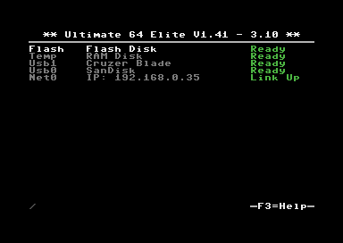
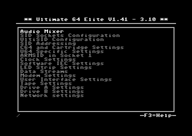

.. _header-n619:

Guide to the Ultimate-64
========================

.. figure:: ultimate64-manual.assets/1536833702202.png
   :alt: 

**The project**

I started the project some years ago, but never designed
production-ready hardware for it. I picked up the pieces and merged it
with the latest Ultimate-II+ code. This combination was prototyped on a
product from Technolution B.V. (the company I work for); a product that
uses an Altera (=Intel) FPGA and has DVI output as well as USB ports.
Using a USB keyboard, I managed to type on this "thing" and load some
demos from the 'Ultimate' drive. Many demos and games seemed to work
flawlessly. From there, I decided I should first create the hardware
platform with all the required I/O, such that I could do better tests.
The result of this is shown in the 3D model above.

.. _header-n628:

Basic operation
---------------

.. _header-n629:

MultiButton
~~~~~~~~~~~

The Ultimate-64 has one button on the side of the board, which is placed
on the original position of the power button.

This button is called the MultiButton, because it handles several
functions.

\ **Power on button**\ 

Press the button briefly to switch on the machine,

**Power off button**

Press the button for 3-5 seconds to switch off the machine.

**Reset button**

Press the button for 1-2 seconds to reset the machine.

**Menu button**

Press the button briefly to enter the File Selection menu.

.. _header-n641:

Menus
-----

The Ultimate-64 provides a user friendly menu driven interface, which
can be accessed by pressing the multi button (power) briefly. Pressing
this button will interrupt the currently running program on the C=64 and
show the menu. Leaving the menu will resume the C=64 gracefully.

The main two functions of the menu are:

1. File selection

2. Configuration of the Ultimate 64

3. Tool menu

.. _header-n651:

File selection menu
~~~~~~~~~~~~~~~~~~~

The menu starts with showing the available network interfaces, and the
storage devices that are attached to the cartridge. By default, it will
only show the built-in Ethernet port. When USB-sticks are inserted, one
or more items will appear in this list. This screen is the ‘root’ of the
file system.

.. figure:: ultimate64-manual.assets/1536790123244.png
   :alt: 

Use the cursor keys to navigate through the file system and select your
file (disk image) to mount. The highlighted line shows the current
selection.

.. _header-n659:

F2 - configuration menu
~~~~~~~~~~~~~~~~~~~~~~~

Use the UP/DOWN cursor keys to navigate and RIGHT to enter the desired
configuration screen. Once inside a settings screen, the behavior of the
keyboard is slightly different:

+-----------------------------------+-----------------------------------+
| Key                               | Function                          |
+===================================+===================================+
| CRSR up/down                      | Move the cursor (highlighted      |
|                                   | line) up/down                     |
+-----------------------------------+-----------------------------------+
| CRSR left/right                   | Increase or decrease a setting,   |
|                                   | cycling through the available     |
|                                   | options.                          |
+-----------------------------------+-----------------------------------+
| DEL                               | Go one level up                   |
+-----------------------------------+-----------------------------------+
| Return / Space                    | For string fields: bring up a     |
|                                   | text entry box For enumerated     |
|                                   | fields: bring up a context menu   |
|                                   | with the available options        |
+-----------------------------------+-----------------------------------+
| Run-stop                          | *Leaves* the configuration menu   |
|                                   | and saves the new values.         |
+-----------------------------------+-----------------------------------+

Note that some values will only take effect after reset or a power cycle
of your C=64. However, the main menu provides a way to restart the 1541
and the C=64 with the new settings.

.. _header-n685:

U64 Specific Settings
^^^^^^^^^^^^^^^^^^^^^

.. _header-n686:

HDMI Scan lines
'''''''''''''''

This setting emulates the well know scanlines of that where visible on
CRT (old) display.

   You mentioned 576p... that seems like about twice the number of lines
   needed. What do you do with the other lines?

   Every line is drawn twice. The second line that the Ultimate64
   outputs is either a dimmer version of the previous line, or a full
   brightness line. The dim line gives an awesome CRT effect, while the
   exact copy of the previous line gives a crisp solid image.

**Values:**

-  **Disabled ( default )**

-  Enabled

.. _header-n701:

Digital Video Mode
''''''''''''''''''

DVI

HDMI

.. _header-n705:

SpeedDOS Parallel Cable
'''''''''''''''''''''''

**Values:**

-  **Disabled ( default )**

-  Enabled

.. _header-n713:

SID in Socket 1 & 2
'''''''''''''''''''

None

6581

8580

SIdFX

fpgaSID

.. _header-n720:

SID Player Autoconfig
'''''''''''''''''''''

**Values:**

-  **Disabled ( default )**

-  Enabled

.. _header-n729:

Allow Autoconfig uses EmuSid
''''''''''''''''''''''''''''

No

Yes

.. _header-n733:

SID Socket 1 & 2 Address
''''''''''''''''''''''''

$D400-$D7FF

$D400-$D5FF

$D600-$D7FF

$D400-$D4FF

$D500-$D5FF

$D600-$D6FF

$D700-$D7FF

$D400

$D420

$D440

$D480

$D500

$D600

$D700

$DE00

$DE20

$DE40

$DE60

.. _header-n753:

Paddle Override
'''''''''''''''

**Values:**

-  **Disabled ( default )**

-  Enabled

.. _header-n761:

Ext StereoSID addrline
''''''''''''''''''''''

A5

A8

.. _header-n765:

UltiSID 1 & 2 Address
^^^^^^^^^^^^^^^^^^^^^

$D400-$D7FF

$D400-$D5FF

$D600-$D7FF

$D400-$D4FF

$D500-$D5FF

$D600-$D6FF

$D700-$D7FF

$D400

$D420

$D440

$D480

$D500

$D600

$D700

$DE00

$DE20

$DE40

$DE60

.. _header-n785:

Adjust Color Clock
''''''''''''''''''

With this settings the color clock pulses can be controlled.

Value range:*\* between -100 ~ +100 ppm

**Default value: 0**

.. _header-n792:

Analog Video
''''''''''''

The analog video output ( DIN plug ) can be set to 2 different modes:

-  CVBS + SVideo *This is the same output that the original Commodore 64
   uses.*

-  RGB This is a U64 setting which outputs the video in separate
   signals. These signals are Red,Green and Blue, these can be used to
   make a video cable to scart.

-  

**Default value: CVBS + SVideo**

.. _header-n803:

Chroma Delay
''''''''''''

With this settings the Chroma ( color ) data can be delayed. This can be
helpfull if there is some bleach in the color output.

Value range:*\* between -3 & +3

**Default value: 0**

.. _header-n809:

Volume settings
'''''''''''''''

The volume for each audio output can be set to a value between **-42dB
and +6dB**, or it can turned **off**.

**Default value: 0dB**

\ **This can be applied to the following settings:**\ 

-  Vol EmuSid1 *Volume of EmuSid1*

-  Vol EmuSid2 *Volume of EmuSid2*

-  Vol Socket 1 *Volume of SID in socket 1*

-  Vol Socket 2 *Volume of SID in socket 2*

-  Vol Sampler L *Left output volume of the DA converter ( soundcard ),
   for example the mod files player*

-  Vol Sampler R *Right output volume of the DA converter ( soundcard ),
   for example the mod files player*

-  Vol Drive 1 *Output volume for "1541" drive 1, this is the sound you
   hear when loading or saving data on the drive*

-  Vol Drive 2 *Output volume for "1541" drive 2, this is the sound you
   hear when loading or saving data on the drive*

-  Vol Tape Read *Output volume for "Tape" drive , this is the sound you
   hear when loading data from the drive*

-  Vol Tape Write *Output volume for "Tape" drive , this is the sound
   you hear when loading data to the drive*

.. _header-n837:

Panning settings
''''''''''''''''

The panning for each audio output can be set to a value in the range
Left1 ~ Right5.

**Values:**

-  Left range: 1~5

-  Centre

-  Right range: 1~5

**Default value: Centre**

\ **This can be applied to the following settings**\ 

-  Pan EmuSid1 *Panning of EmuSid1*

-  Pan EmuSid2 *Panning of EmuSid2*

-  Pan Socket 1 *Panning of SID in socket 1*

-  Pan Socket 2 *Panning of SID in socket 2*

-  Pan Sampler L *Left Panning of the DA converter ( soundcard ), for
   example the mod files player*

-  Pan Sampler R *Right Panning of the DA converter ( soundcard ), for
   example the mod files player*

-  Pan Drive 1 *Panning for "1541" drive 1, this is the sound you hear
   when loading or saving data on the drive*

-  Pan Drive 2 *Panning for "1541" drive 2, this is the sound you hear
   when loading or saving data on the drive*

-  Pan Tape Read *Panning for "Tape" drive , this is the sound you hear
   when loading data from the drive*

-  Pan Tape Write *Panning for "Tape" drive , this is the sound you hear
   when loading data to the drive*

.. _header-n873:

Clock Settings
^^^^^^^^^^^^^^

The U64 has a internal clock that is powered with a battery to keep
track of the date & time.

With this setting the following values can be changed:

-  Year

-  Month

-  Day

-  Hours

-  Minutes

-  Seconds

-  Correction *This corrects the deviation of the internal clock (RTC)*

.. _header-n895:

Software IEC Settings
^^^^^^^^^^^^^^^^^^^^^

IEC Drive and printer

Soft Drive Bus ID

Default Path

Printer Bus ID

Printer output file

Printer output type

Printer ink density

Printer Emulation

Printer Commodore charset

Printer Epson charset

Printer IBM table 2

.. _header-n908:

C64 and cartridge settings
^^^^^^^^^^^^^^^^^^^^^^^^^^

Cartridge

Final Cartrdige 3 Mode

Fast Reset

Alternate Kernal

Alternate Basic

Alternate Chargen

RAM Expansion Unit

REU Size

REU Preload

REU Preload Image

REU Preload Offset

Map Ultimate Audio $DF20-DFFF

DMA Load Mimics ID

Command Interface

UltiDOS: Allow SetDate

.. _header-n925:

User Interface Settings
^^^^^^^^^^^^^^^^^^^^^^^

Interface Type

Background color

Border color

Foreground color

Selected Item color

Selected Backgr ( Overlay )

Home Directory

Enter Home on Startup

.. _header-n935:

Tape Settings
^^^^^^^^^^^^^

Tape playback Rate

.. _header-n938:

1541 Drive A & B Settings
^^^^^^^^^^^^^^^^^^^^^^^^^

1541 Drive Bus ID

1541 ROM Select

1541 RAM BOard

1541 Disk swap delay

1541 Resets when C64 resets

1541 Freezes in menu

GCR Save Align Tracks

.. _header-n948:

Network settings
^^^^^^^^^^^^^^^^

Use DHCP

Static IP

Static Netmask

Static Gateway

Host Name

.. _header-n955:

F5 - Tool menu
~~~~~~~~~~~~~~

.. figure:: ultimate64-manual.assets/1536790603560.png
   :alt: 

.. _header-n957:

Ultimate64 features
-------------------

.. _header-n959:

More about mounting disks
~~~~~~~~~~~~~~~~~~~~~~~~~

   Remember that ‘mounting’ a disk means creating a link between the
   1541 part of your ultimate cartridge, and a file on a storage device.
   This means, that when the link has been established, “writes” that
   the 1541 performs will be written back into the disk image file as
   well. In this way, the ‘real’ behavior of a floppy is emulated.

   This behavior will not always be what you want. There are two options
   to avoid this: ‘mount’ the floppy as read-only, or ‘mount’ the floppy
   in ‘unlinked’ mode. When write protected, the drive itself cannot
   write to the floppy. In unlinked mode, the writes to the floppy are
   performed, but do not reflect in the .D64 or .G64 file. When the
   storage device is removed, the 1541 drive automatically switches to
   unlinked mode. Be aware that writes to the disk will then be lost
   when you turn off the machine.

.. _header-n964:

HDMI port
~~~~~~~~~

.. figure:: ultimate64-manual.assets/1536831620353.png
   :alt: 

The HDMI port can be connected to a modern display ( eg. television ),
so you can use the Ultimate-64 in the future.

Resolution of the HDMI output

The output resolution is 720 x 576 at 50 Hz (for the PAL version), also
noted as 576p50. This is a standard resolution that all HDMI capable
screens are supposed to support, according to the CEA-861 standard.
However, to meet the exact timing of a C64, the timing parameters of
this video mode are slightly modified. I have not come across screens
that do not accept the generated HDMI signal.

Frame delays of the digital HDMI port

None. There is no frame buffer, so there is no need to worry. Some
screens, tho, especially non-gaming screens may introduce some latency.
I observed this with a 4K screen that actually resampled the output to
just 30Hz. I am pretty sure displays do not have this problem.

Because there is no frame buffer, scrollers and such are perfectly
smooth. If the TV renders the image at the speed it is sent over the
HDMI link everything will be smooth.

If HDMI is used for output, there is also output generated on the PAL
output ( display connector ).

In the configuration menu you can change several setting regarding this
port.

-  U64 Specific Settings

   -  HDMI Scan lines

-  User Interface Settings

   -  Interface Type ( overlay mode )

.. _header-n992:

Ethernet port
~~~~~~~~~~~~~

.. figure:: ultimate64-manual.assets/1536831652781.png
   :alt: 

The ethernet port can be connected to a switch ( or hub ) to communicate
with the Ultimate-64 over your own network.

In the configuration menu ( Network settings ) you can change several
setting regarding this port.

   Some of you may be familiar with the RR-net solution that brings
   Ethernet to the C-64. Currently, the built-in Ethernet port does
   *not* provide RR-net compatibility. However:

   The Ethernet port is used natively by the firmware. There is some
   primitive support for file-transfer using FTP (needs improvement),
   and it is possible to connect to the Ultimate-II+ using a VT-100
   terminal program on the Telnet port (port 23). This gives the
   possibility to control the machine remotely, and swap disks without
   actually interrupting the program running on the C-64.

.. _header-n1004:

USB support
~~~~~~~~~~~

.. figure:: ultimate64-manual.assets/1536831561900.png
   :alt: 

The Ultimate-64 supports most USB sticks and Flash card readers out of
the box. It also supports USB 2.0 Hubs. It is recommended to use powered
USB hubs only (with an external power supply). USB 1.1 Hubs are *not*
supported.

There are three USB 2.0 ports available on the board; two on the back
and one on the "internal" side of the board/case.

   Please note that the port on the left is **not** a USB 3.0 port.
   Although you may use this port as a 2.0 port, it is not USB 3.0
   compliant. The extra signals on a USB 3.0 connector are used to
   communicate with the tape port (see below). **Please do not attempt
   to attach a USB 3.0 device to the blue USB connector on the
   Ultimate-II+.** You may safely use a USB 3.0 device on the *right*
   side of the cartridge.

.. _header-n1015:

File Systems
~~~~~~~~~~~~

   Currently, the Ultimate-II+ supports the FAT16/FAT32 file system on
   any storage device, and the ISO9660/Joliet on CD/DVD ROM drives, or
   ISO files. It is able to read D64 files, as well as D71 and D81 files
   (no partitions), T64 files.

.. _header-n1019:

Supported file-types
~~~~~~~~~~~~~~~~~~~~

The Ultimate-64 can open / mount several file-types:

-  PRG

-  D64

.. _header-n1027:

DMA loads
~~~~~~~~~

   The Ultimate-II+ is capable of loading files directly through the
   cartridge port into the memory of your C=64. This is called DMA load.
   The menu supports loading files of the .PRG type only. It doesn’t
   matter if the PRG is located on the FAT/ISO file system, or inside a
   disk image (.D64), or inside a tape archive (.T64). Be aware that a
   lot of programs inside a .D64 file require that the rest of the disk
   is mounted in the drive. For those programs, use the ‘Mount & Run’
   command.

.. _header-n1032:

Tape Support
~~~~~~~~~~~~

   The Ultimate-64 is capable of emulating a cassette tape deck
   (CBM1530/1531).

   In order to play a tape, browse in the menu to a .TAP file, and press
   enter and select “Play Tape” from the popup menu. This will
   initialize the tape streamer from the start of the tape. Use
   functions in the main menu (F5) to pause/resume playback. It is also
   possible to write the .TAP file to a real tape, using a CBM1530/1531
   deck.

   The Ultimate-64 can also capture tape signals into a .TAP file. The
   ‘F5’ menu will show you the available options.

.. _header-n1039:

Joystick ports
~~~~~~~~~~~~~~

Joystick

Mouse

Paddles

Light(pen/gun)

.. _header-n1046:

Cartridge support
~~~~~~~~~~~~~~~~~

.. _header-n1048:

Cartridge slot
^^^^^^^^^^^^^^

.. _header-n1050:

Cartridge Emulation
^^^^^^^^^^^^^^^^^^^

   Because the Ultimate-II+ will occupy your cartridge slot, a list of
   popular expansions available for the C=64 are integrated into the
   Ultimate-II+. These expansions include cartridges such as the Action
   Replay, Retro Replay, The Final Cartridge III, Super Snapshot V5, KCS
   Power Cartridge and the Epyx fastloader. In the configuration menu,
   even the CBM1750/1764 RAM Expansion unit can be enabled, with
   expansion RAM up to 16 MB!

   Many of these cartridges have a reset button and a freezer button.
   This is the function of the other two buttons on the Ultimate-II+. By
   default, the left button is the freezer button, and the button on the
   right is the reset-button. Through the configuration menu, the
   buttons can be swapped if desired.

..

   -  Does the Ultimate 64 support external cartridges?

      -  Yes, the cartridge port is fully supported.

   -  So I an insert an Ultimate-II+ module and have an awesome system?
      :-)

      -  You could, but you don't need to. The Ultimate-II+ is fully
         integrated into the Ultimate-64 board.

   -  Oh, but how is this possible? You mentioned I can use external
      carts?

      -  You could see it as a port extender. Obviously, you cannot use
         the same features of the expanded port at the same time. But,
         you can, for example, use the REU from the build-in
         Ultimate-II+ function, together with an external music
         cartridge, or utility cartridge that allows some registers at
         $DF00. And of course, when you turn off all cartridge emulation
         features of the Ultimate-II+, the cartridge port is free to
         use.

.. _header-n1074:

Ultimate Audio module
~~~~~~~~~~~~~~~~~~~~~

   The Ultimate Audio module provides 8 simultaneous sampling voices.
   This module is utilized as part of the Ultimate-64 firmware for
   playing Amiga MOD files. This option is available in the context menu
   in the file browser.

   If you like to do some programming yourself using this sampler, you
   can enable this module in configuration menu. It then appears in the
   I/O region. The programming interface is fully documented.
   Documentation can be downloaded from the official website:

   http://1541ultimate.net/content/download/ultimate_audio_v0.2.pdf

.. _header-n1081:

Alternate ROMs
~~~~~~~~~~~~~~

In order to use an alternate ROM, browse in the file system to the
binary ROM file that you like to use. The file should have the ‘.bin’ or
‘.rom’ extension. When you press enter, and the file is of the correct
size, the option will appear: “Use as..”. Kernal ROMs should be exactly
8K, and drive ROMs should be exactly 16K or 32K.

NOTE: When you use an invalid file as Kernal replacement, the C64 will
no longer boot. However, even when the C64 gives a black screen, you can
still enter the configuration menu in order to disable the Kernal
replacement option.

.. _header-n1088:

Software IEC
~~~~~~~~~~~~

   The Software-IEC module is a serial bus service that can be enabled
   in the configuration menu. This module provides two additional
   devices on the Commodore serial bus; the IEC bus:

   -  Virtual drive that gives direct access to the Ultimate-II+ file
      system;

   -  A virtual printer

.. _header-n1097:

Printer
~~~~~~~

   The virtual printer is a valuable contribution created by René
   Garcia. It takes printer commands from the Commodore 64, and creates
   a black and white image of the printed graphics and text. This image
   is then saved to the USB flash drive. The full documentation of the
   printer emulation and all of its capabilities and options is
   available here:

   http://1541ultimate.net/content/download/mps_printer_emulation.pdf

.. _header-n1102:

Virtual drive
~~~~~~~~~~~~~

   The virtual drive can only be used to access files of the file
   system, through the OPEN/CLOSE commands on the IEC bus. By default,
   the path of the IEC drive is ‘/Usb0’, which is the top most USB
   connector on the right of the unit. This default path can be changed
   in the configuration menu. When the USB drive contains a program
   ‘TEST.PRG’, it can be loaded with the basic command
   LOAD”TEST.PRG”,10. Similarly, you can save your programs with the
   SAVE command. When loading the directory (LOAD “$”,10), the path will
   be shown as disk name.

   The command channel 15, can currently only be used to change the
   current directory. Just like on modern systems, “..” is the parent
   directory and “/” is the root directory:

   OPEN 15,10,15,”CD:/USB1/MYPROGRAMS”:CLOSE 15

   At this point, the virtual drive is not JiffyDOS compliant.

.. _header-n1112:

Ultimate Command Interface
~~~~~~~~~~~~~~~~~~~~~~~~~~

   Since some time, it has become possible to control the Ultimate-64
   programmatically through the I/O port of the C64, thus from a program
   that runs on the machine. This is useful for many things; for example
   it can be used to access the file system much faster than through the
   serial bus. But it can also be used to load files from the file
   system into REU memory for example. The set of commands grows over
   time and will provide more and more powerful features.

   Documentation of the interface itself is available here:

   http://1541ultimate.net/content/download/command_interface_v1.0.pdf

   Accessing the file system is done through the “DOS” target, which is
   documented here:

   http://1541ultimate.net/content/download/ultimate_dos_v1.0.pdf

.. _header-n1122:

Tape Support
~~~~~~~~~~~~

   The Ultimate-64 is capable of emulating a cassette tape deck
   (CBM1530/1531).

   In order to play a tape, browse in the menu to a .TAP file, and press
   enter and select “Play Tape” from the popup menu. This will
   initialize the tape streamer from the start of the tape. Use
   functions in the main menu (F5) to pause/resume playback. It is also
   possible to write the .TAP file to a real tape, using a CBM1530/1531
   deck.

   The Ultimate-64 can also capture tape signals into a .TAP file. The
   ‘F5’ menu will show you the available options.

.. _header-n1129:

Real Time Clock
~~~~~~~~~~~~~~~

.. figure:: ultimate64-manual.assets/1536831734242.png
   :alt: 

For getting correct time stamps on the files that are created on the USB
pen drives, the Ultimate-II+ offers a real time clock (RTC) function.
This RTC can be set through the configuration menu.

The RTC is powered by a CR2032 battery, which is located inside of the
unit. Calculations show that the lifetime of this battery is several
years.

.. _header-n1136:

Video connector
~~~~~~~~~~~~~~~

The 8-pin DIN ( video ) connector can output several different output
signals, for each output you need a special assembled cable.

Output signals

-  Composite ( CVBS ) ( PAL )

-  S-Video ( PAL )

-  RGB ( PAL )

The Composite and S-Video cables are the same as you use for the
original Commodore 64.

NTSC

NTSC will work on all modern screens because they support 576p for PAL
as well as 480p for NTSC.

Full NTSC compatibility will be implemented in the near future, the
hardware can handle this without problems. It will be an software
(firmware) update, so a setting will come available in the configuration
menu.

   -  Is the tape port supported?

      -  Yes.

<<<<<<< HEAD
   -  How do I connect the Ultimate-II+ tape adapter then?
=======
.. figure:: ultimate64-manual.assets/1536832941336.png
   :alt: 
>>>>>>> parent of 064f948... Reference to SID file changed

      -  You don't need to. The emulated tape drive automatically
         'connects' to the tape pins when playing TAP files.

   -  How about the User Port? On the picture it seems that the User
      port is no more.. Boo hoo!

      -  You're right, the User Port is no longer avaiable at the
         original position. However, all signals from the User Port are
         available from a pin-header on the board. It is therefore
         possible to create an extension cable that brings out the user
         port.

   -  So, as the Ultimate-II+ is integrated, it comes with the emulated
      floppy drive, correct?

      -  Yes, that is correct.

   -  And, I don't need to connect an external IEC cable to make use of
      this drive?

      -  No, that is no longer required, because it is all inside of one
         chip.

   -  Does the board have Ethernet?

      -  Yes, just like the Ultimate-II+, the Ultimate 64 will also have
         an Ethernet port. Even more so, the plan is to release a
         version with WiFi as well at a modest higher price.

   -  Buttons? The Ultimate-II+ had buttons, but they seem to have
      gotten lost.. How do I...?

      -  Relax.. There is still one button, in the place of the original
         power switch. This momentary switch is used to turn on the
         power and get into the Ultimate menu. Reset and freeze are
         implemented by holding the button and/or hitting the RESTORE
         key. You can turn off the machine from a menu option, or hold
         the button for 4 seconds..

.. _header-n1197:

SID Chips
~~~~~~~~~

.. figure:: assets\1537992647546.png
   :alt: 

The Ultimate-64 does have support for 2 REAL SID chips that can be
placed in the SID-1 & SID-2 sockets.

**THE REAL THING!**

Audio purists want REAL chips because the those chips are analog, they
sound warmer (fatter) than an FPGA emulated SID.

It supported both 6581 as well as 8580 chips. The voltage for these
chips is set by jumpers, as well as the external filter components.

It is not software controlled because the chips can not switched on the
fly.

SID output on HDMI

The output of both SID chips are digitized on the board and the digital
samples are merged with video into the HMDI stream.

**NO AUDIO ?**

The Ultimate-64 has an internal SID FPGA SID emulation onboard which can
generate the audio signal, so it works fine without REAL SID chips. So
if you do not have REAL SID chips, you stil have audio.

.. _header-n1214:

User port
~~~~~~~~~

.. _header-n1217:

Installation
------------

.. _header-n1218:

U64 mainboard
~~~~~~~~~~~~~

.. _header-n1220:

Firmware Updates
----------------

Supported files types

.. _header-n1223:

Disclaimer
----------

The ‘firmware’ on your Ultimate-64 board consists of a rather large
number of functional parts that all work together. Although an insane
number of hours have been put into testing and improving the firmware
and software, I am very certain that it still has bugs. Some testing
work still needs to be done. The device will be improved further as time
passes. Check the download section at the website for the newest
firmware version. We believe in the end this will sure be the ‘ultimate’
replacement for your 8-bit Commodore 64 computer.

.. _header-n1226:

Social Media
~~~~~~~~~~~~

For quick answers to many questions regarding your device, you may be
interested to join the the Facebook group “1541 Ultimate”.

.. _header-n1229:

Known issues
------------

-

 **Notes van Gideon**

https://1541u-documentation.readthedocs.io/en/latest/

Volgens mij is er per menu item een aantal dingen belangrijk. Een
algemene beschrijving, wat doet het, wat kun je er mee, een
gebruiksvoorbeeld, en wat zijn de eventuele beperkingen En eventueel
referenties naar de externe manuals, zoals bijvoorbeeld van de cartridge
ROMs. Of manual van de REU, etc.
